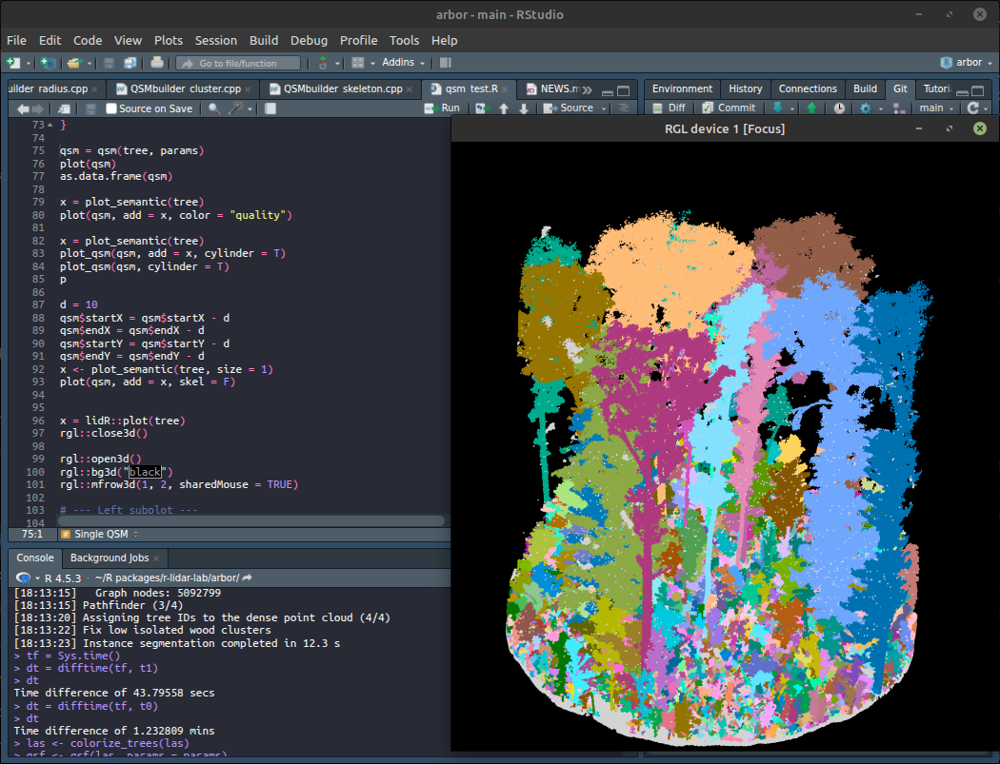
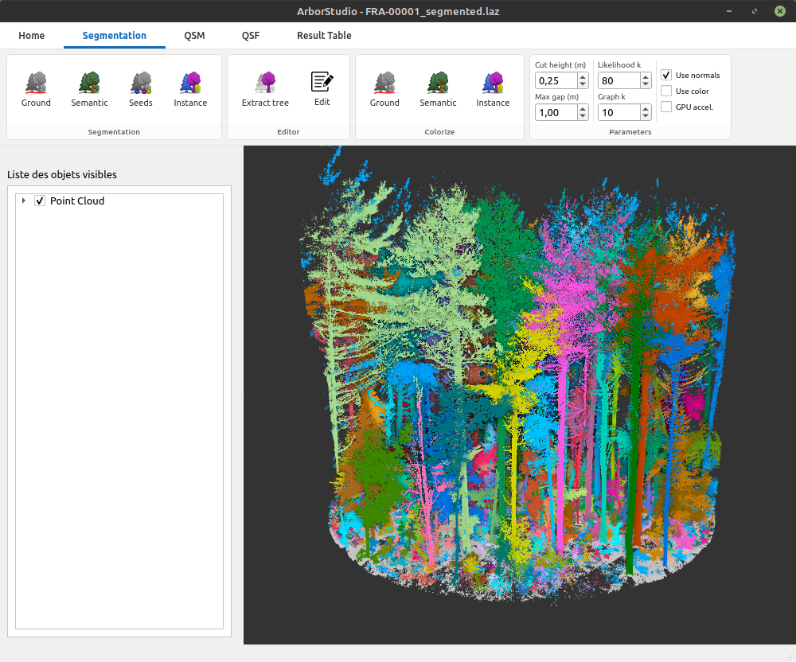

# What is Arbor?

## Arbor C++ Library

Arbor is an open-source standalone C++ library designed for processing mobile laser scanning data in forestry applications. To make it accessible and user-friendly, the core library is wrapped in convenient APIs. Arbor currently provides one public API, the R package described in this book, with another API actively under development.

The C++ library is licensed under the **GNU General Public License v3 (GPL-3)**. Anyone is free to use, study, modify, and integrate Arbor into their own software, as long as that software also complies with the terms of the GPL-3.

<!--::: {.callout-warning}
We provide **0 free help and 0 free support** to third parties who want to integrate the C++ library directly into their own software. This type of integration work is only available through our paid consulting and custom development services (see the *Economic Model* section in the Preface).
:::-->

## Arbor R Package

You are currently reading the documentation for Arbor’s R interface. Using Arbor in R is straightforward and requires little to no programming experience. However, users who are comfortable working with code can leverage the full flexibility of the package to build custom workflows and applications.

The Arbor R package is free and open source under the **GNU General Public License v3 (GPL-3)**.

{width=500px}

## Arbor Studio

ArborStudio is a desktop application with a graphical user interface designed for users who prefer a drag-and-drop workflow: load files, click a few buttons, and generate outputs without writing code.

But ArborStudio is much more than a simple GUI. It is also an interactive editor that allows manual correction of classifications using tools specifically designed for forestry workflows. Users can inspect point clouds, manually reassign points to the correct trees, refit QSMs, and use other specialized editing tools.

**ArborStudio is currently under active development** and is not yet publicly available. It may or may not be released as open source. Depending on the level of community interest and financial support for ArborStudio’s development, the software may eventually be released either for free or under a commercial license.

Regardless of the business model chosen for ArborStudio, the core Arbor engine will remain fully free and open source.

{width=500px}

The video below presents an early prototype of ArborStudio and its ability to quickly and easily perform manual instance corrections.



<!--
## Comparison

```{=html}
<style>
  .arb-cmp {
    font-family: 'DM Sans', 'Segoe UI', system-ui, sans-serif;
    margin: 2em 0 2.4em;
    --arb-forest:  #1a2e1e;
    --arb-moss:    #3d6b45;
    --arb-sage:    #6a9b72;
    --arb-mist:    #c4d9c7;
    --arb-amber:   #c8833a;
    --arb-amberlt: #e8a85a;
    --arb-cream:   #faf8f4;
    --arb-gray:    #7a8a7c;
    --arb-graylt:  #e2e8e3;
    --arb-ink:     #1e2820;
  }

  /* ── cards ── */
  .arb-cards {
    display: grid;
    grid-template-columns: 1fr 1fr;
    gap: 16px;
    margin-bottom: 20px;
  }
  @media (max-width: 560px) { .arb-cards { grid-template-columns: 1fr; } }

  .arb-card {
    border-radius: 10px;
    padding: 24px 26px 22px;
    position: relative;
  }
  .arb-card.arb-free {
    background: #fff;
    border: 1.5px solid var(--arb-graylt);
    box-shadow: 0 2px 12px rgba(0,0,0,.05);
  }
  .arb-card.arb-studio {
    background: var(--arb-forest);
    border: 1.5px solid #2d4a33;
    box-shadow: 0 6px 24px rgba(26,46,30,.3);
    color: var(--arb-mist);
  }
  .arb-card.arb-studio::before {
    content: '';
    position: absolute;
    inset: 0;
    border-radius: 10px;
    background: radial-gradient(ellipse 70% 55% at 95% 0%, rgba(200,131,58,.18) 0%, transparent 60%);
    pointer-events: none;
  }

  .arb-badge {
    display: inline-block;
    font-size: 10px;
    letter-spacing: .1em;
    text-transform: uppercase;
    padding: 2px 9px;
    border-radius: 100px;
    margin-bottom: 14px;
    font-weight: 600;
  }
  .arb-free  .arb-badge { background: var(--arb-graylt); color: var(--arb-gray); }
  .arb-studio .arb-badge { background: rgba(200,131,58,.22); color: var(--arb-amberlt); border: 1px solid rgba(200,131,58,.35); }

  .arb-name {
    font-size: 1.3rem;
    font-weight: 700;
    letter-spacing: -.02em;
    margin-bottom: 5px;
    line-height: 1;
  }
  .arb-free   .arb-name { color: var(--arb-forest); }
  .arb-studio .arb-name { color: #fff; }

  .arb-tagline {
    font-size: .82rem;
    font-weight: 300;
    line-height: 1.5;
    margin-bottom: 16px;
  }
  .arb-free   .arb-tagline { color: var(--arb-gray); }
  .arb-studio .arb-tagline { color: var(--arb-mist); }

  .arb-price {
    font-size: 1.6rem;
    font-weight: 700;
    letter-spacing: -.03em;
    margin-bottom: 16px;
  }
  .arb-free   .arb-price { color: var(--arb-forest); }
  .arb-studio .arb-price { color: var(--arb-amberlt); }
  .arb-price span { font-size: .75rem; font-weight: 400; letter-spacing: 0; margin-left: 4px; }
  .arb-free   .arb-price span { color: var(--arb-gray); }
  .arb-studio .arb-price span { color: var(--arb-mist); }

  .arb-feats { list-style: none; padding: 0; margin: 0; display: flex; flex-direction: column; gap: 7px; }
  .arb-feats li { display: flex; align-items: flex-start; gap: 8px; font-size: .82rem; line-height: 1.4; }
  .arb-free   .arb-feats li { color: #3a4a3c; }
  .arb-studio .arb-feats li { color: var(--arb-mist); }

  .arb-ic {
    flex-shrink: 0;
    width: 16px; height: 16px;
    border-radius: 50%;
    display: flex; align-items: center; justify-content: center;
    margin-top: 1px;
  }
  .arb-ic-ok  { background: rgba(61,107,69,.13); }
  .arb-ic-ok  svg { color: var(--arb-moss); }
  .arb-studio .arb-ic-ok  { background: rgba(200,131,58,.2); }
  .arb-studio .arb-ic-ok  svg { color: var(--arb-amberlt); }
  .arb-ic-no  { background: rgba(0,0,0,.04); }
  .arb-ic-no  svg { color: #c0c8c2; }

  /* ── table ── */
  .arb-table {
    width: 100%;
    border-collapse: separate;
    border-spacing: 0;
    border-radius: 10px;
    overflow: hidden;
    font-size: .83rem;
    box-shadow: 0 2px 16px rgba(0,0,0,.06);
  }
  .arb-table th, .arb-table td {
    padding: 10px 18px;
    text-align: left;
    border-bottom: 1px solid #f0f4f1;
  }
  .arb-table thead th {
    background: var(--arb-forest);
    color: var(--arb-mist);
    font-size: .72rem;
    letter-spacing: .09em;
    text-transform: uppercase;
    font-weight: 600;
    border-bottom: none;
  }
  .arb-table thead th:nth-child(2) { background: #243c28; }
  .arb-table thead th:nth-child(3) { background: #243c28; }
  .arb-table thead th:nth-child(2),
  .arb-table thead th:nth-child(3) { text-align: center; width: 19%; }
  .arb-table thead th:nth-child(3) { color: var(--arb-amberlt); }

  .arb-table .arb-cat td {
    background: #f5f8f5;
    color: var(--arb-moss);
    font-size: .68rem;
    letter-spacing: .1em;
    text-transform: uppercase;
    font-weight: 700;
    padding: 7px 18px;
    border-top: 1px solid var(--arb-graylt);
    border-bottom: none;
  }
  .arb-table tbody tr:not(.arb-cat) td { background: #fff; vertical-align: middle; }
  .arb-table tbody tr:not(.arb-cat):last-child td { border-bottom: none; }
  .arb-table tbody tr:not(.arb-cat) td:first-child { color: #3a4a3c; }
  .arb-table tbody tr:not(.arb-cat) td:not(:first-child) { text-align: center; }

  .arb-chk svg { color: var(--arb-moss); width: 17px; height: 17px; }
  .arb-x   svg { color: #d0d9d2;         width: 15px; height: 15px; }
  .arb-pill {
    display: inline-block;
    font-size: .7rem;
    letter-spacing: .05em;
    padding: 2px 8px;
    border-radius: 100px;
    white-space: nowrap;
  }
  .arb-pill-g  { background: rgba(61,107,69,.1);  color: var(--arb-moss); }
  .arb-pill-a  { background: rgba(200,131,58,.12); color: var(--arb-amber); }

  /* ── note ── */
  .arb-note {
    margin-top: 14px;
    padding: 13px 16px;
    background: #f5f8f5;
    border-left: 3px solid var(--arb-sage);
    border-radius: 0 6px 6px 0;
    font-size: .8rem;
    color: var(--arb-gray);
    line-height: 1.55;
  }
  .arb-note strong { color: var(--arb-forest); }
</style>

<div class="arb-cmp">


  <div class="arb-cards">
    <div class="arb-card arb-free">
      <span class="arb-badge">Open Source</span>
      <div class="arb-name">Arbor R Package</div>
      <p class="arb-tagline">Scriptable, flexible, and completely free. For users comfortable working with code.</p>
      <div class="arb-price">Free <span>forever · open source</span></div>
      <ul class="arb-feats">
        <li><span class="arb-ic arb-ic-ok"><svg viewBox="0 0 14 14" fill="none" stroke="currentColor" stroke-width="2.2" stroke-linecap="round" stroke-linejoin="round"><polyline points="2 7 5.5 11 12 3"/></svg></span>Full Arbor engine via R API</li>
        <li><span class="arb-ic arb-ic-ok"><svg viewBox="0 0 14 14" fill="none" stroke="currentColor" stroke-width="2.2" stroke-linecap="round" stroke-linejoin="round"><polyline points="2 7 5.5 11 12 3"/></svg></span>Mobile &amp; terrestrial LiDAR</li>
        <li><span class="arb-ic arb-ic-ok"><svg viewBox="0 0 14 14" fill="none" stroke="currentColor" stroke-width="2.2" stroke-linecap="round" stroke-linejoin="round"><polyline points="2 7 5.5 11 12 3"/></svg></span>Custom pipelines &amp; workflows</li>
        <li><span class="arb-ic arb-ic-no"><svg viewBox="0 0 14 14" fill="none" stroke="currentColor" stroke-width="2" stroke-linecap="round"><line x1="3" y1="7" x2="11" y2="7"/></svg></span>No graphical interface</li>
        <li><span class="arb-ic arb-ic-no"><svg viewBox="0 0 14 14" fill="none" stroke="currentColor" stroke-width="2" stroke-linecap="round"><line x1="3" y1="7" x2="11" y2="7"/></svg></span>No interactive editor</li>
      </ul>
    </div>
    <div class="arb-card arb-studio">
      <span class="arb-badge">Desktop App</span>
      <div class="arb-name">Arbor Studio</div>
      <p class="arb-tagline">Drag-and-drop desktop app with interactive editing. No code required.</p>
      <div class="arb-price">TBA <span>pricing to be announced</span></div>
      <ul class="arb-feats">
        <li><span class="arb-ic arb-ic-ok"><svg viewBox="0 0 14 14" fill="none" stroke="currentColor" stroke-width="2.2" stroke-linecap="round" stroke-linejoin="round"><polyline points="2 7 5.5 11 12 3"/></svg></span>Everything in Arbor R</li>
        <li><span class="arb-ic arb-ic-ok"><svg viewBox="0 0 14 14" fill="none" stroke="currentColor" stroke-width="2.2" stroke-linecap="round" stroke-linejoin="round"><polyline points="2 7 5.5 11 12 3"/></svg></span>Graphical drag-and-drop interface</li>
        <li><span class="arb-ic arb-ic-ok"><svg viewBox="0 0 14 14" fill="none" stroke="currentColor" stroke-width="2.2" stroke-linecap="round" stroke-linejoin="round"><polyline points="2 7 5.5 11 12 3"/></svg></span>Interactive point cloud editor</li>
        <li><span class="arb-ic arb-ic-ok"><svg viewBox="0 0 14 14" fill="none" stroke="currentColor" stroke-width="2.2" stroke-linecap="round" stroke-linejoin="round"><polyline points="2 7 5.5 11 12 3"/></svg></span>Manual tree classification &amp; QSM refitting</li>
        <li><span class="arb-ic arb-ic-ok"><svg viewBox="0 0 14 14" fill="none" stroke="currentColor" stroke-width="2.2" stroke-linecap="round" stroke-linejoin="round"><polyline points="2 7 5.5 11 12 3"/></svg></span>Memory-optimised for large datasets</li>
        <li><span class="arb-ic arb-ic-ok"><svg viewBox="0 0 14 14" fill="none" stroke="currentColor" stroke-width="2.2" stroke-linecap="round" stroke-linejoin="round"><polyline points="2 7 5.5 11 12 3"/></svg></span>Early access to unreleased features</li>
      </ul>
    </div>
  </div>


  <table class="arb-table">
    <thead><tr>
      <th>Feature</th>
      <th>Arbor R</th>
      <th>Arbor Studio</th>
    </tr></thead>
    <tbody>
      <tr class="arb-cat"><td colspan="3">Interface &amp; Workflow</td></tr>
      <tr><td>Graphical user interface</td>
        <td><span class="arb-x"><svg viewBox="0 0 14 14" fill="none" stroke="currentColor" stroke-width="2" stroke-linecap="round"><line x1="3.5" y1="3.5" x2="10.5" y2="10.5"/><line x1="10.5" y1="3.5" x2="3.5" y2="10.5"/></svg></span></td>
        <td><span class="arb-chk"><svg viewBox="0 0 14 14" fill="none" stroke="currentColor" stroke-width="2.2" stroke-linecap="round" stroke-linejoin="round"><polyline points="2 7 5.5 11 12 3"/></svg></span></td>
      </tr>
      <tr><td>Drag-and-drop file loading</td>
        <td><span class="arb-x"><svg viewBox="0 0 14 14" fill="none" stroke="currentColor" stroke-width="2" stroke-linecap="round"><line x1="3.5" y1="3.5" x2="10.5" y2="10.5"/><line x1="10.5" y1="3.5" x2="3.5" y2="10.5"/></svg></span></td>
        <td><span class="arb-chk"><svg viewBox="0 0 14 14" fill="none" stroke="currentColor" stroke-width="2.2" stroke-linecap="round" stroke-linejoin="round"><polyline points="2 7 5.5 11 12 3"/></svg></span></td>
      </tr>
      <tr><td>Scripting &amp; programmatic API</td>
        <td><span class="arb-chk"><svg viewBox="0 0 14 14" fill="none" stroke="currentColor" stroke-width="2.2" stroke-linecap="round" stroke-linejoin="round"><polyline points="2 7 5.5 11 12 3"/></svg></span></td>
        <td><span class="arb-x"><svg viewBox="0 0 14 14" fill="none" stroke="currentColor" stroke-width="2" stroke-linecap="round"><line x1="3.5" y1="3.5" x2="10.5" y2="10.5"/><line x1="10.5" y1="3.5" x2="3.5" y2="10.5"/></svg></span></td>
      </tr>
      <tr><td>Custom workflow building</td>
        <td><span class="arb-chk"><svg viewBox="0 0 14 14" fill="none" stroke="currentColor" stroke-width="2.2" stroke-linecap="round" stroke-linejoin="round"><polyline points="2 7 5.5 11 12 3"/></svg></span></td>
        <td><span class="arb-chk"><svg viewBox="0 0 14 14" fill="none" stroke="currentColor" stroke-width="2.2" stroke-linecap="round" stroke-linejoin="round"><polyline points="2 7 5.5 11 12 3"/></svg></span></td>
      </tr>

      <tr class="arb-cat"><td colspan="3">Processing</td></tr>
      <tr><td>Mobile &amp; terrestrial LiDAR</td>
        <td><span class="arb-chk"><svg viewBox="0 0 14 14" fill="none" stroke="currentColor" stroke-width="2.2" stroke-linecap="round" stroke-linejoin="round"><polyline points="2 7 5.5 11 12 3"/></svg></span></td>
        <td><span class="arb-chk"><svg viewBox="0 0 14 14" fill="none" stroke="currentColor" stroke-width="2.2" stroke-linecap="round" stroke-linejoin="round"><polyline points="2 7 5.5 11 12 3"/></svg></span></td>
      </tr>
      <tr><td>QSM (quantitative structure modelling)</td>
        <td><span class="arb-chk"><svg viewBox="0 0 14 14" fill="none" stroke="currentColor" stroke-width="2.2" stroke-linecap="round" stroke-linejoin="round"><polyline points="2 7 5.5 11 12 3"/></svg></span></td>
        <td><span class="arb-chk"><svg viewBox="0 0 14 14" fill="none" stroke="currentColor" stroke-width="2.2" stroke-linecap="round" stroke-linejoin="round"><polyline points="2 7 5.5 11 12 3"/></svg></span></td>
      </tr>
      <tr><td>Memory-optimised engine for large datasets</td>
        <td><span class="arb-x"><svg viewBox="0 0 14 14" fill="none" stroke="currentColor" stroke-width="2" stroke-linecap="round"><line x1="3.5" y1="3.5" x2="10.5" y2="10.5"/><line x1="10.5" y1="3.5" x2="3.5" y2="10.5"/></svg></span></td>
        <td><span class="arb-chk"><svg viewBox="0 0 14 14" fill="none" stroke="currentColor" stroke-width="2.2" stroke-linecap="round" stroke-linejoin="round"><polyline points="2 7 5.5 11 12 3"/></svg></span></td>
      </tr>

      <tr class="arb-cat"><td colspan="3">Interactive Editing</td></tr>
      <tr><td>Point cloud inspector</td>
        <td><span class="arb-x"><svg viewBox="0 0 14 14" fill="none" stroke="currentColor" stroke-width="2" stroke-linecap="round"><line x1="3.5" y1="3.5" x2="10.5" y2="10.5"/><line x1="10.5" y1="3.5" x2="3.5" y2="10.5"/></svg></span></td>
        <td><span class="arb-chk"><svg viewBox="0 0 14 14" fill="none" stroke="currentColor" stroke-width="2.2" stroke-linecap="round" stroke-linejoin="round"><polyline points="2 7 5.5 11 12 3"/></svg></span></td>
      </tr>
      <tr><td>Manual tree classification correction</td>
        <td><span class="arb-x"><svg viewBox="0 0 14 14" fill="none" stroke="currentColor" stroke-width="2" stroke-linecap="round"><line x1="3.5" y1="3.5" x2="10.5" y2="10.5"/><line x1="10.5" y1="3.5" x2="3.5" y2="10.5"/></svg></span></td>
        <td><span class="arb-chk"><svg viewBox="0 0 14 14" fill="none" stroke="currentColor" stroke-width="2.2" stroke-linecap="round" stroke-linejoin="round"><polyline points="2 7 5.5 11 12 3"/></svg></span></td>
      </tr>
      <tr><td>Point reassignment between trees</td>
        <td><span class="arb-x"><svg viewBox="0 0 14 14" fill="none" stroke="currentColor" stroke-width="2" stroke-linecap="round"><line x1="3.5" y1="3.5" x2="10.5" y2="10.5"/><line x1="10.5" y1="3.5" x2="3.5" y2="10.5"/></svg></span></td>
        <td><span class="arb-chk"><svg viewBox="0 0 14 14" fill="none" stroke="currentColor" stroke-width="2.2" stroke-linecap="round" stroke-linejoin="round"><polyline points="2 7 5.5 11 12 3"/></svg></span></td>
      </tr>
      <tr><td>Interactive QSM refitting</td>
        <td><span class="arb-x"><svg viewBox="0 0 14 14" fill="none" stroke="currentColor" stroke-width="2" stroke-linecap="round"><line x1="3.5" y1="3.5" x2="10.5" y2="10.5"/><line x1="10.5" y1="3.5" x2="3.5" y2="10.5"/></svg></span></td>
        <td><span class="arb-chk"><svg viewBox="0 0 14 14" fill="none" stroke="currentColor" stroke-width="2.2" stroke-linecap="round" stroke-linejoin="round"><polyline points="2 7 5.5 11 12 3"/></svg></span></td>
      </tr>

      <tr class="arb-cat"><td colspan="3">Features &amp; Access</td></tr>
      <tr><td>Stable released features</td>
        <td><span class="arb-chk"><svg viewBox="0 0 14 14" fill="none" stroke="currentColor" stroke-width="2.2" stroke-linecap="round" stroke-linejoin="round"><polyline points="2 7 5.5 11 12 3"/></svg></span></td>
        <td><span class="arb-chk"><svg viewBox="0 0 14 14" fill="none" stroke="currentColor" stroke-width="2.2" stroke-linecap="round" stroke-linejoin="round"><polyline points="2 7 5.5 11 12 3"/></svg></span></td>
      </tr>
      <tr><td>Early access to unreleased features</td>
        <td><span class="arb-x"><svg viewBox="0 0 14 14" fill="none" stroke="currentColor" stroke-width="2" stroke-linecap="round"><line x1="3.5" y1="3.5" x2="10.5" y2="10.5"/><line x1="10.5" y1="3.5" x2="3.5" y2="10.5"/></svg></span></td>
        <td><span class="arb-chk"><svg viewBox="0 0 14 14" fill="none" stroke="currentColor" stroke-width="2.2" stroke-linecap="round" stroke-linejoin="round"><polyline points="2 7 5.5 11 12 3"/></svg></span></td>
      </tr>
      <tr><td>License</td>
        <td><span class="arb-pill arb-pill-g">Open source</span></td>
        <td><span class="arb-pill arb-pill-a">Commercial (TBA)</span></td>
      </tr>
    </tbody>
  </table>
</div>
```
-->
