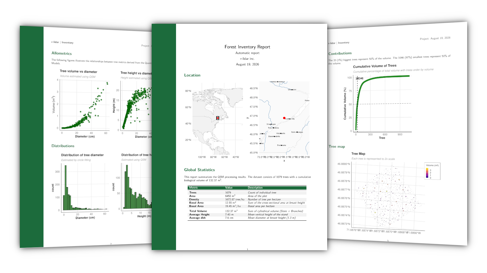

# Appendix C - Command Line Tools {.unnumbered}

The `arbor` package comes with command line tools that we are using to run arbor via a terminal. These tools are mainly dedicated to our own usage and are subject to modification without prior modification. But since it is part of the package, reader will find quick documentation below.

## Installation

Run `arbor::install_cmd_tools()`. The behavior of the function is OS dependent. It has been tested on Linux only. If Windows or MacOS users find troubleshoorting please contact us.

- Linux/MacOS: it creates a symlink pointing to the utilities so that the shipped utilities become in your PATH
- Windows: it creates a `.bat` file that is supposed to be in you path 

To test if it is type in a terminal

```bash
arbor --help
```

## Segment module

This module segment the scene (ground, semantic, instance) and produce a DTM, and `scene_segmented.laz`

```bash
arbor segment scene.laz
```

To see the avaible options

```bash
arbor segment --help
```

## QSF module

This module creates the 3D model of the forest. The input is the output of the previous module. It creates a folder `qsm/` and inside this directory, one or several sub-directories depending on the output format desired.

```bash
arbor qsf scene_segmented.laz
```

To see the avaible options

```bash
arbor qsf --help
```

## Report module

The report module generates a pdf that summarizes the scene (volume, basal area, distribution, tree map). The input is the directory produced by the `qsf` module

```bash
arbor report qsm/qsm/
```

{.no-shadow}