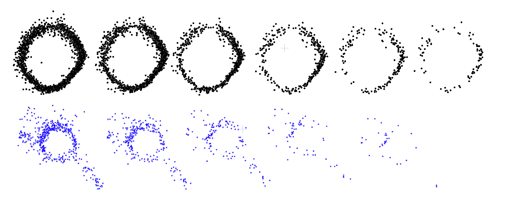
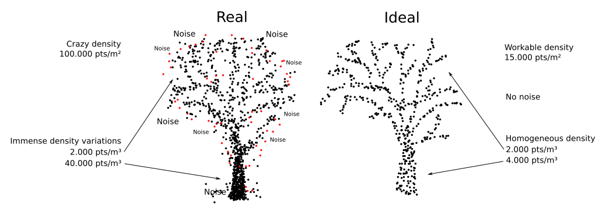
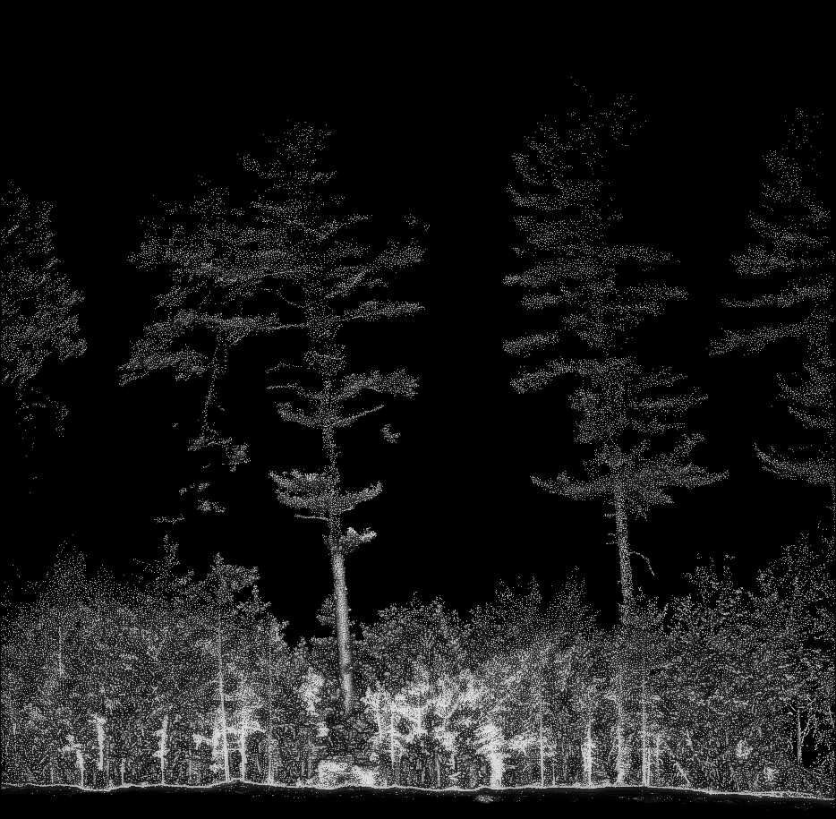
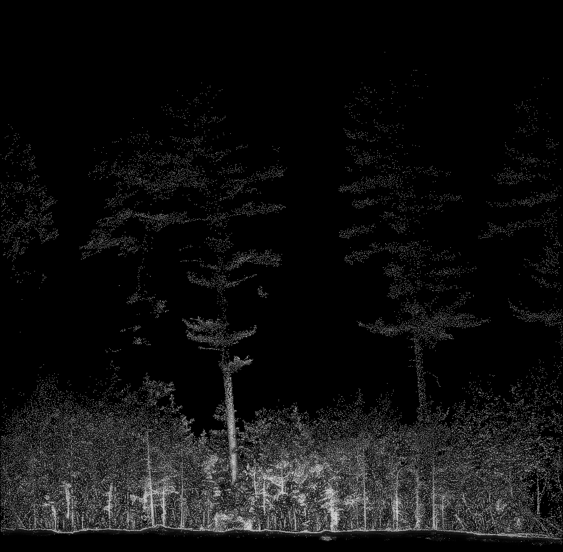
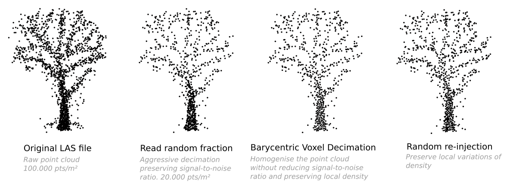
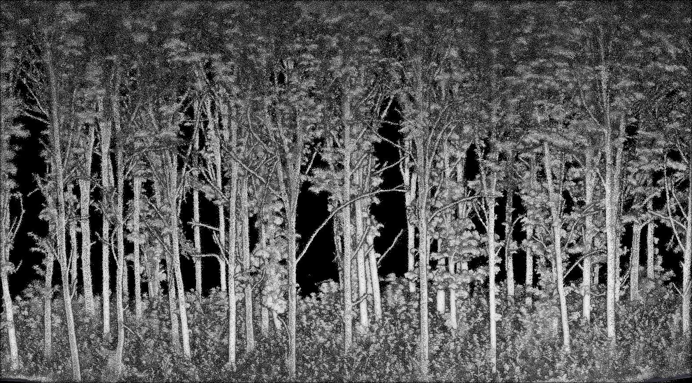

# Data Decimation {#sec-decimation}

```{r echo = F}
random_sampling <- function(df, n) {
  df[sample(nrow(df), n), ]
}

grid_sampling <- function(df, cell_size) {
  df$gx <- floor(df$x / cell_size)
  df$gy <- floor(df$y / cell_size)
  
  # One random point per grid cell
  sampled <- df[!duplicated(with(df, paste(gx, gy))), ]
  sampled[, c("x", "y")]
}

poisson_sampling <- function(df, r, max_iter = 10000) {
  pts <- df[sample(nrow(df), 1), , drop = FALSE]
  for (i in seq_len(max_iter)) {
    candidate <- df[sample(nrow(df), 1), , drop = FALSE]
    d <- sqrt((candidate$x - pts$x)^2 + (candidate$y - pts$y)^2)
    if (all(d > r)) {
      pts <- rbind(pts, candidate)
    }
  }
  pts
}
```

## Summary

Ground-based laser scanners (MLS, TLS) produce point clouds that are heavy, noisy, and unevenly sampled, the worst combination for point cloud processing. To make computation feasible and results consistent, we need to aggressively decimate our data before any analysis.

::: {.callout-note}
TL;DR: The main message of this chapter is: use our decimation process. Do not apply 1 cm voxel decimation, and do not process the full point cloud.
:::

<!--
- **More points ≠ more accuracy.** Even 1% of the original points is enough to reliably measure tree diameter. Redundant points waste memory and time without adding information.
- **Random sampling** reduces data volume but does not homogenize density and hurts already sparse regions.
- **Spatial sampling** (voxel, Poisson) homogenizes density but amplifies noise, an already critical problem with MLS data.

Our solution is a three-step hybrid: random decimation at read time → Barycentric Voxel Decimation (BVD) → random re-injection of discarded points.
The resulting point cloud is compact, reasonably homogeneous, local variation of density are preserved and noise is not amplified too much. This homogenization is what makes Arbor effectively robust and parameterless.
-->


## Why Decimate at All?

Three reasons drive aggressive decimation:

1. **Computability**: reduce RAM consumption to avoid overflow.
2. **Speed**: keep runtimes in the range of minutes on a laptop.
3. **Consistency**: most point cloud algorithms are sensitive to local density. Bringing every dataset to the same target density eliminates the need to re-tune parameters per dataset. Arbor is **parameterless** because every dataset is prepared in the same way, resulting in a roughly conform point spacing  


The third point is often overlooked but is of major importance.


### More Points Is Not More Accuracy

This is counter-intuitive but important: more points does not means more accuracy but it's definitely synonymous with runtime blow-up and crazy RAM consumption. The figure below shows trunk slices at various decimation levels: from 50% down to 1% of the original point cloud.



Using RANSAC circle fitting, measured tree diameter remains stable from the full point cloud all the way down to 99% decimation. **One percent of the points is still sufficient to measure a tree reliably**.

```{r, echo = F, warning = F, fig.height=3, fig.width=3}
#| fig-cap: "DBH measured as a function of decimation. The percentages correspond to the proportion of points remaining after subsampling."
# Parameters
fs = list.files("data/chap_data", full.names = TRUE, pattern = "ring")
nrep = 25  # number of repetitions for each file

# Run multiple RANSACs per file
ans = sapply(fs, function(f)
{
  las = lidR::readLAS(f)
  p = as.matrix(sf::st_coordinates(las))
  
  # Repeat nrep times
  radii = replicate(nrep, {
    c = arbor:::fit_circloid_cpp(p, tolerance = 0.02, complexity = 1)
    c$radius * 2  # diameter
  })
  
  # Return summary stats
  c(mean = mean(radii),
    sd   = sd(radii),
    lwr  = quantile(radii, 0.05),
    upr  = quantile(radii, 0.95))
})

ans = t(ans)
colnames(ans) = c("mean", "sd", "lwr", "upr")

fs = list.files("data/chap_data", full.names = TRUE, pattern = "circle")

# Run multiple RANSACs per file
ans2 = sapply(fs, function(f)
{
  las = lidR::readLAS(f)
  p = as.matrix(sf::st_coordinates(las))
  
  # Repeat nrep times
  radii = replicate(nrep, {
    c = arbor:::fit_circloid_cpp(p, tolerance = 0.03, complexity = 1)
    c$radius * 2  # diameter
  })
  
  # Return summary stats
  c(mean = mean(radii),
    sd   = sd(radii),
    lwr  = quantile(radii, 0.05),
    upr  = quantile(radii, 0.95))
})

ans2 = t(ans2)
colnames(ans2) = c("mean", "sd", "lwr", "upr")
# Decimation percentages
p = c(1, 3, 6, 12.5, 25, 50)
p2 = c(3, 6, 12.5, 25, 50)

# Convert to cm
r = ans * 100
r2 = ans2 * 100
# Plot mean ± 95% CI
par(mar = c(4.5,4,1,1))
plot(p, r[,"mean"], ylab = "Diameter (cm)", xlab = "Points (%)", pch = 16, ylim = c(5, 30))
arrows(p, r[,"lwr"], p, r[,"upr"], angle = 90, code = 3, length = 0.05)
lines(p, r[,"mean"], lwd = 2)
points(p2, r2[,"mean"],, col = "blue", pch = 19)
arrows(p2, r2[,"lwr"], p2, r2[,"upr"], angle = 90, code = 3, length = 0.05, col = "blue")
lines(p2, r2[,"mean"], lwd = 2, col = "blue")
```

This holds because MLS sensors cannot locate a target within better than 2 or 4 cm. Additional points carry no new information, only redundancy. Redundancy is expensive in storage and computation.

This confirms that we don’t need an indecent amount of points to process ground-based point clouds and make reliable measurements with proper methods. Even 1% of the points is sufficient to measure a tree! That said, we do not process just 1% of the data. Upper canopy points are far sparser than trunk points, so we typically retain 20–30% of the original cloud, around 25% for MLS and up to 50% for TLS, to preserve enough detail throughout the full vertical profile.


<!-- ## About Noise

Mobile laser scanners are big noise producers, and this is even worse in forest contexts, with all the intricate vegetation made of tiny and fluffy objects that push the sensor to its limits. Noise is a nightmare, enhanced by the fact that mobile laser scanners, in forests, produce extremely uneven point densities because we are sampling from the ground while upper objects are further and often obscured.

Mobile laser point clouds are thus terrible, as they combine virtually all the problems we face in point cloud processing: insanely heavy data, uneven sampling, and a signal-to-noise ratio off the charts. We can't imagine anything worse than a mobile laser point cloud from a software development point of view!



So, we need to prepare the data to tackle theses problems. Spoiler: we can't! But we can try to improve. Reducing the density to make things computable is easy, we can simply decimate the point cloud. Homogenization is complex and not fully solvable. Noise reduction is virtually impossible because of the non-homogeneous dataset. This chapter explains our best strategy to prepare the data.


| Problem         | Goal                          |
|-----------------|--------------------------------|
| Data reduction  | Computability                  |
| Noise removal   | Accuracy and algorithm stability |
| Homogenization  | Parameter stability            |

: We have basically 3 problems to tackle.
-->

<!--
## More points for more accuracy?

In this book, we will aggressively decimate our point clouds, because more points is not synonymous with more accuracy, but it's definitely synonymous with runtime blow-up and crazy RAM consumption.

At r-lidar, we're working on a laptop. Our code and tools are designed to run on normal computers in decent time (few minutes) in order to be usable in production.


::: {.callout-note}
From our experience many users are not comfortable with thrwoing away their precious data. The following section aims to convince the reader that more points are often useless, and even harmful. If you're already convinced, feel free to skip it.
:::

The image below shows two 10 cm-thick slices of trees with DBHs of 25 cm and 18 cm. The first slice represents a **50% decimation** of the original point cloud, while the last slice represents a **1% decimation**. The intermediate slices correspond to 25%, 12.5%, 6.125%, and 3% decimation, respectively.  

For the blue tree, we stopped at **3% decimation** because the lower-quality data left nothing at 1%. The blue slice also includes pieces of branches to simulate poor trunk isolation.


At what level of decimation does it become impossible to determine that these tree measure 18 and 25 cm? Let’s find out!  

We use a **RANSAC circle-fitting** approach. Because RANSAC is inherently random (it stands for *RANdom SAmple Consensus*), we run each DBH measurement 25 times to estimate an approximate 95% confidence interval.  

Our observations show that, from the full point cloud down to **99% (!!)** decimation, the measured tree diameter remains consistent.

This confirms that we don't need an indecent amount of points to process ground-based point clouds and make reliable measurements with proper methods. Even **1% of the points** is sufficient to measure a tree!

Of course, trunks at DBH are particularly well sampled. The point density higher up in the canopy is much lower. Keeping only 1% of the point cloud would remove almost all upper canopy points. This is true, and this is why **we are not** processing just 1% of the points, but typically something closer to 15-30% depending on the original density. In MLS 25% is a good trade-off: it preserves enough detail while strongly thinning the data. In TLS we can preserve up to 50%.

::: {.callout-note}
## I'm not convinced!
What about branches? They are sparsely sampled. Removing points could remove details and prevent measuring branch diameters. We shouldn't decimate so aggressively! 
:::

This concern is understandable but not correct. Depending on the device quality, any hard target has a thickness in the point cloud. The noise is more or less uniformly distributed (not Gaussian). This means that, beyond a certain target size, which depends on the sensor accuracy, there is no longer any way to measure anything precisely. The blobs of points all look the same, regardless of the true object size.

Below is a simulation of circular cross-sections of objects with various radii, using sensors with uniform noise levels of 4 cm (standard MLS) and 2 cm (high-quality MLS), respectively. We can decimate as aggressively as we want for very small objects, **they are not directly measurable anyway**.


```{r echo=F, fig.height=4, fig.width=16}
noisy_circle <- function(n = 1000, R = 10, noise = 4, type = c("uniform", "gaussian")) {
  type <- match.arg(type)
  theta <- runif(n, 0, 2*pi)
  x <- R * cos(theta)
  y <- R * sin(theta)
  if (type == "gaussian") {
    x <- x + rnorm(n, 0, noise)
    y <- y + rnorm(n, 0, noise)
  } else {
    x <- x + runif(n, -noise, noise)
    y <- y + runif(n, -noise, noise)
  }
  data.frame(x = x, y = y)
}

# Radii to test
radii <- c(20, 15, 10, 8, 7, 6, 5, 4, 3, 2, 1, 0.5)
noise <- 4
offset <- 40

# Define colors
cols <- lidR::height.colors(length(radii))

# Compute total x range
xlim <- c(-10, (length(radii)-1)*offset + max(radii) + 1)
ylim <- c(-max(radii)-2, max(radii)+2)

# Initialize plot with axes, box, and labels
plot(NA, xlim = xlim, ylim = ylim, asp = 1,
     xlab ="", ylab ="",
     main = NULL,
     frame.plot = FALSE, axes = FALSE)

# Draw each circle
for (i in seq_along(radii)) {
  pts <- noisy_circle(200, R = radii[i], noise = noise)
  pts$x <- pts$x + (i-1)*offset
  points(pts$x, pts$y, col = cols[i], pch = 19, cex = 0.25)
  # Add a clean label above each cluster
  text((i-1)*offset, max(pts$y) + 5, labels = paste0("R = ", radii[i], " cm"), cex = 1)
}
```

```{r echo=F, fig.height=4, fig.width=16}
noisy_circle <- function(n = 1000, R = 10, noise = 4, type = c("uniform", "gaussian")) {
  type <- match.arg(type)
  theta <- runif(n, 0, 2*pi)
  x <- R * cos(theta)
  y <- R * sin(theta)
  if (type == "gaussian") {
    x <- x + rnorm(n, 0, noise*0.7)
    y <- y + rnorm(n, 0, noise*0.7)
  } else {
    x <- x + runif(n, -noise/2, noise/2)
    y <- y + runif(n, -noise/2, noise/2)
  }
  data.frame(x = x, y = y)
}

# Radii to test
radii <- c(20, 15, 10, 8, 7, 6, 5, 4, 3, 2, 1, 0.5)
noise <- 2
offset <- 40

# Define colors
cols <- lidR::height.colors(length(radii))

# Compute total x range
xlim <- c(-10, (length(radii)-1)*offset + max(radii) + 1)
ylim <- c(-max(radii)-2, max(radii)+2)

# Initialize plot with axes, box, and labels
plot(NA, xlim = xlim, ylim = ylim, asp = 1,
     xlab ="", ylab ="",
     main = NULL,
     frame.plot = FALSE, axes = FALSE)

# Draw each circle
for (i in seq_along(radii)) {
  pts <- noisy_circle(200, R = radii[i], noise = noise)
  pts$x <- pts$x + (i-1)*offset
  points(pts$x, pts$y, col = cols[i], pch = 19, cex = 0.25)
  # Add a clean label above each cluster
  text((i-1)*offset, max(pts$y) + 5, labels = paste0("R = ", radii[i], " cm"), cex = 1)
}
```

::: {.callout-note}
## I'm still not convinced!

Why do researchers and practitioners sample so many points? We always target the maximum number of points to get more details.
:::

The obsession with point density is often unfounded. More points only improve precision if they are accurate and the sensor produces minimal noise. If a sensor cannot locate a target within 2–4 cm, adding more points does not provide additional information, it only creates **redundancy**.  

Redundancy comes at a high cost, requiring significant storage and computational resources. With one-millimeter precision, zero-noise sensor, and millions of points, we could reconstruct every detail of the bark at the expense of extremely expensive computations. In contrast, with noisy points and 2-4 cm precision, we can reconstruct the tree diameter reasonably well with moderate computational requirements if we remove redundancy.

**As a conclusion, our pipeline aggressively decimates the point cloud to compute faster, and this does not affect accuracy.**
-->

## Choosing a Decimation Method

Three main options exist: **random**, **voxel**, and **Poisson** sampling.

### Random Sampling

Random sampling is non-spatial: it removes points uniformly at random, preserving the original density distribution, including its noise. Isolated noise points have the same chance of being discarded as any other point. The signal-to-noise ratio is therefore unchanged after random decimation. This is a desirable property.

Its weakness: it cannot homogenize an unevenly sampled point cloud preserving the huge vertical variations.

### Spatial Sampling (Voxel and Poisson)

Spatial sampling methods, on the other hand, homogenizes point spacing. Unlike random sampling an isolated noise point as 100% chance to be retained. If there is an isolated noise point somewhere, it will be retained by construction. Spatial methods are excellent at homogenizing the point cloud and preserving poorly sampled details, but they also amplify noise by design.

That last property is also their flaw: spatial sampling amplifies noise, which is exactly what we cannot afford.

### Spatial vs. Random

In Arbor, we are capable of segmenting very small branches and saplings lost in the noise that are geometrically undetectable (e.g., too small and too noisy to fit any cylinder). To do so, we track local high densities. In order to track local high density, we need to preserve these local density variations. However, a weakness of spatial sampling is that it can easily loose density variations.


To compare we created a semi-realistic simulation of a tiny branch in a noisy foliage below. Visually in the raw point cloud, we are able to detect and track the branch based on local density variations. After random sampling (70% of points removed), the branch is still clearly present in the point cloud. After spatial sampling (only ~50% of points removed), the branch's existence is far less obvious, and the data-to-noise ratio has increased significantly.


```{r echo = F, fig.height=3, fig.width=11}
#| fig-cap: "From left to right: raw data, random sampling (removing 70%), voxel sampling (removing 50%), and Poisson sampling (removing 50%), demonstrating how spatial sampling can amplify noise."
par(mfrow = c(1, 4),    # 1 row, 3 columns
    mar = c(2, 2, 2, 1)) # small margins
x = runif(250, -15, 15)
y = runif(250, -15, 15)
bx = runif(300, -15,15)
by = 0.8*bx+rnorm(300, 0,2)
x = c(x, bx)
y = c(y, by)

pts = data.frame(x,y)
rnd = random_sampling(pts, 250)
gri = grid_sampling(pts, 0.9)
poi = poisson_sampling(pts, 0.7)

plot(pts, axes = FALSE, xlab = "", ylab = "", frame.plot = TRUE)
plot(rnd, axes = FALSE, xlab = "", ylab = "", frame.plot = TRUE)
plot(gri, axes = FALSE, xlab = "", ylab = "", frame.plot = TRUE)
plot(poi, axes = FALSE, xlab = "", ylab = "", frame.plot = TRUE)
```

Ultimately, it is very easy to completely lose a feature with spatial sampling, whereas it is essentially impossible with random sampling, because the noise ratio remains stable. The simulated figures below are close to what really happens within the foliage. Applying a spatial sampling retains **all** the noisy foliage points while loosing some details in branches (which are already not detailed at all).

```{r echo = F, fig.height=3, fig.width=11}
#| fig-cap: "From left to right: raw data, random sampling, voxel sampling, and Poisson sampling, demonstrating how easily features can be lost through spatial sampling and noise amplification."

par(mfrow = c(1, 4),    # 1 row, 3 columns
    mar = c(2, 2, 2, 1)) # small margins
x = runif(250, -15, 15)
y = runif(250, -15, 15)
bx = runif(400, -15,15)
by = 0.8*bx+rnorm(400, 0,2)
x = c(x, bx)
y = c(y, by)

pts = data.frame(x,y)
rnd = random_sampling(pts, 100)
gri = grid_sampling(pts, 1.5)
poi = poisson_sampling(pts, 1.4)

plot(pts, axes = FALSE, xlab = "", ylab = "", frame.plot = TRUE)
plot(rnd, axes = FALSE, xlab = "", ylab = "", frame.plot = TRUE)
plot(gri, axes = FALSE, xlab = "", ylab = "", frame.plot = TRUE)
plot(poi, axes = FALSE, xlab = "", ylab = "", frame.plot = TRUE)
```

This is a serious problem of spatial sampling no matter which method is used (the worst being to retain the center of the voxel as a point). Arbor leverage local variations of density to track and disentangle branches that otherwise would not detectable with pure geometric analysis. We need to preserve density variation. Thus we need random sampling!

<!--## Decimation algorithm chosen

Now that we know we want to decimate, we need to choose how to do it. We basically have three main choices: Random, Voxel, and Poisson. Random sampling is a non-spatial approach. Voxel and Poisson sampling are spatial sampling methods.

### Random vs. Spatial 

Let's simulate some data. Below, on the left we have a pure 4 cm uniform noise for a 15 cm tree cylinder. This is not realistic. Real noise is more like the figure on the right.

```{r echo = F}
noisy_noisy_circle = function(n = 1000, R = 10, noise = 4, type = c("uniform", "gaussian")) {
  a = noisy_circle(n, R, noise, type = "gaussian")
  b = noisy_circle(n/6, R, noise, type)
  rbind(a,b)
}

random_sampling <- function(df, n) {
  df[sample(nrow(df), n), ]
}

grid_sampling <- function(df, cell_size) {
  df$gx <- floor(df$x / cell_size)
  df$gy <- floor(df$y / cell_size)
  
  # One random point per grid cell
  sampled <- df[!duplicated(with(df, paste(gx, gy))), ]
  sampled[, c("x", "y")]
}

poisson_sampling <- function(df, r, max_iter = 10000) {
  pts <- df[sample(nrow(df), 1), , drop = FALSE]
  for (i in seq_len(max_iter)) {
    candidate <- df[sample(nrow(df), 1), , drop = FALSE]
    d <- sqrt((candidate$x - pts$x)^2 + (candidate$y - pts$y)^2)
    if (all(d > r)) {
      pts <- rbind(pts, candidate)
    }
  }
  pts
}

noi = noisy_circle(R = 15, noise = 3)
pts = noisy_noisy_circle(R = 15, noise = 3)
rnd = random_sampling(pts, 500)
gri = grid_sampling(pts, 1)
poi = poisson_sampling(pts, 0.5)
```

```{r echo = F, fig.height=3, fig.width=5.6}
par(mfrow = c(1, 2),    # 1 row, 3 columns
    mar = c(2, 2, 2, 1)) # small margins
plot(noi, asp = 1,
     xlab ="", ylab ="", ylim = c(-20,20),
     main = NULL,
     frame.plot = T, axes = T, cex = 0.5)
plot(pts, asp = 1,
     xlab ="", ylab ="", ylim = c(-20,20),
     main = NULL,
     frame.plot = T, axes = T, cex = 0.5)
```

Below is the result of Random, Voxel, and Poisson sampling. Random sampling preserves the original distribution of the noise. Noise points can be removed randomly, and their overall ratio is maintained. Some noise points are retained (sadly), some are removed, and we end up with a distribution that is essentially the same as the original.

Spatial sampling methods, on the other hand, try to retain as many points as possible. If there is an isolated noise point somewhere, it will be retained by construction. Spatial methods are excellent at homogenizing the point cloud and preserving details, but they also **enhance noise by design**.

At r-lidar, we believe that, as long as mobile scanners remain big noise producers, it is better to use Random sampling, with all its defaults and weaknesses. At least this way, **noise is not amplified**.

```{r echo = F, fig.height=4, fig.width=11}
#| fig-cap: "From left to rigth: ramdom sampling, voxel sampling, poisson sampling getting rid of approximatively the same ratio of points"
par(mfrow = c(1, 3),    # 1 row, 3 columns
    mar = c(2, 2, 2, 1)) # small margins
plot(rnd, asp = 1,
     xlab ="", ylab ="",
     main = "Ramdom",
     frame.plot = T, axes = T)

plot(gri, asp = 1,
     xlab ="", ylab ="",
     main = "Voxel",
     frame.plot = T, axes = T)

plot(poi, asp = 1,
     xlab ="", ylab ="",
     main = "Poisson",
     frame.plot = T, axes = T)
```

To convince the reader even more, here is a (somehow) realistic simulation of a tiny branch in a noisy foliage. In the raw point cloud, we are able to detect the branch (though not measure it). Detection is possible on a density basis. After random sampling (70% of points removed), the branch is still clearly present. After spatial sampling (only ~50% of points removed), the branch's existence is far less obvious, and the data-to-noise ratio has increased significantly.


```{r echo = F, fig.height=3, fig.width=11}
#| fig-cap: "From left to right: raw data, random sampling (removing 70%), voxel sampling (removing 50%), and Poisson sampling (removing 50%), demonstrating how spatial sampling can amplify noise."
par(mfrow = c(1, 4),    # 1 row, 3 columns
    mar = c(2, 2, 2, 1)) # small margins
x = runif(250, -15, 15)
y = runif(250, -15, 15)
bx = runif(300, -15,15)
by = 0.8*bx+rnorm(300, 0,2)
x = c(x, bx)
y = c(y, by)

pts = data.frame(x,y)
rnd = random_sampling(pts, 250)
gri = grid_sampling(pts, 0.9)
poi = poisson_sampling(pts, 0.7)

plot(pts)
plot(rnd)
plot(gri)
plot(poi)
```

Ultimately, it is very easy to completely lose a feature with spatial sampling, whereas it is essentially impossible with random sampling, because the noise ratio remains stable. The simulated figures below are close to what really happens within the foliage. Applying a spatial sampling retains **all** the noisy foliage points while loosing some details in branches (which are already not detailed at all).

```{r echo = F, fig.height=3, fig.width=11}
#| fig-cap: "From left to right: raw data, random sampling, voxel sampling, and Poisson sampling, demonstrating how easily features can be lost through spatial sampling and noise amplification."

par(mfrow = c(1, 4),    # 1 row, 3 columns
    mar = c(2, 2, 2, 1)) # small margins
x = runif(250, -15, 15)
y = runif(250, -15, 15)
bx = runif(400, -15,15)
by = 0.8*bx+rnorm(400, 0,2)
x = c(x, bx)
y = c(y, by)

pts = data.frame(x,y)
rnd = random_sampling(pts, 100)
gri = grid_sampling(pts, 1.5)
poi = poisson_sampling(pts, 1.4)

plot(pts)
plot(rnd)
plot(gri)
plot(poi)
```

Spatial methods, particularly Poisson sampling, are by far better at preserving details in the point cloud. Yet, this is **not** the method retained for `Arbor`, because spatial sampling methods tend to enhance noise. And noise is a critical enemy in MLS processing.


-->

But spatial sampling also has advantages. We must weigh the pros and cons. The table below summarizes the trade-off:

| Problem              | Random Sampling       | Spatial Sampling       |
|----------------------|-----------------------|------------------------|
| Data reduction       | ✅                    | 🔶 limited             |
| Noise                | 🔶 neutral            | ❌ amplifies noise      |
| Homogenization       | 🔶 no effect          | ✅                     |
| Sparse region preservation | ❌            | ✅                     |


<!-- Near the apex of trees or in the higher layers of vegetation, especially within multilayered forests, we often encounter very sparse sampling. There is **no redundancy**. Without redundancy, random sampling performs poorly: applying a random decimation removes so many points that meaningful processing becomes almost impossible.

{width=400px}

{width=400px}

{width=400px}-->

No single method solves all problems. We need both.

## Our Hybrid Approach

We developed a **hybrid approach**. We do not claim it is the best solution, but it offers a practical trade-off that:

- works reasonably fast,
- provides decent results at the end of the pipeline,
- and performs consistently across datasets.

We combine three steps:

| Step                  | Purpose                                         |
|-----------------------|-------------------------------------------------|
| Random sampling       | Aggressive data reduction at read time          |
| Barycentric Voxel Decimation (BVD) | Homogenization without amplifying noise |
| Random re-injection (~10%) | Restore local density variations        |

The idea is to first apply a random decimation at **read time** such as 70% of the point are not even loaded in memory

**BVD** differs from standard voxel decimation: instead of keeping a random point per voxel or worse, the voxel center, it retains the point closest to the barycenter of all points within the voxel i.e., the point located where local density is highest. This achieves homogenization while limiting the noise amplification that makes standard spatial sampling problematic. We call it *density-preserving spatial sampling*.

The final re-injection step brings back a small fraction of discarded points to recover density variation that BVD have smoothed away.



This pipeline is a practical compromise, not a perfect solution. It is fast enough to run on full MLS datasets, produces consistent results, and avoids the noise amplification that disqualifies pure spatial sampling.


<!-- ### Trade-off

In conclusion, to run our pipeline, users **must** aggressively decimate their point clouds. We want to avoid applying pure spatial sampling because it retains too much points and increases the noise-to-signal ratio, producing a point cloud that is both too dense and too noisy. However, pure random sampling does not homogenize density and removes too much data in regions without redundancy.

| Problem              | Random Sampling            | Spatial Sampling             |
|----------------------|:---------------------------|:-----------------------------|
| Data reduction       | ✅                         | 🔶 (limited)                 |
| Noise removal        | 🔶 (no effect)             | ❌ (noise enhancer)          |
| Homogenization       | 🔶 (no effect)              | ✅                           |
| Preserve low density | ❌                         | ✅                           |

: We are trying to tackle several problems, but no single tool can solve them all.

We developed a **hybrid approach**. We do not claim it is the best solution, but it offers a practical trade-off that:

- works reasonably fast (try applying Poisson sampling to a full MLS dataset, just for fun...),
- provides decent results at the end of the pipeline,
- and performs consistently across datasets.

The idea is to first apply a random decimation at read time. We read only a random fraction of the point cloud to greatly reduce memory load and computation time. 

Then we apply a Barycentric Voxel Decimation (BVD). While typical voxel decimation retains either a random point or, worse, the voxel centroid, BVD retains the point closest to the barycenter of the points within each voxel. This ensures that for each voxel we keep a point located where the local density is highest, thereby reducing the noise amplification effect of spatial sampling while still homogenizing the point cloud. We could call BVD a *density preserving spatial sampling*. A spatial sampling that homogenize the point cloud with a reduced tendency to enhance noise.

Finally, we re-inject a random subset (about 10%) of the points discarded by BVD to restore some of the local density potentially lost during BVD.

This is effectively a hybrid approach that provides a reasonable compromise. It is far from perfect, but in the absence of better alternatives, this custom decimation method produces satisfying results.

| Step              | Goal                                   |
|-------------------|----------------------------------------|
| Random sampling   | Aggressive data reduction               |
| BVD               | Homogenization without enhancing noise  |
| Random re-injection | Re-enhance local density variations     |


--> 

## Data Loading

This brings us to the first line of code for loading the data:

```r
las <- readTLS(file, select = "xyz", filter= "-keep_random_fraction 0.25")
las <- hybrid_homogeneization(las)
```

Using `readTLS()` is recommended. It sorts the point cloud so that points that are spatially close are also stored close together in memory. This significantly improves computation time by reducing L1 cache misses and pointer indirection (technical details appreciated by computer enthusiasts).

The fraction of points to retain depends on the original point cloud, but **25%** is a good starting point. The function `hybrid_homogeneization()` then aims to homogenize the data as effectively as possible.  When the forest is well sampled up to the canopy top, we can be more aggressive and discard more points. However, if the scene suffers from very low sampling near the apexes, it may be better to retain more points before applying spatial sampling. Remember, no solution is perfect, all are **trade-offs**.

<!--::: {.callout-note}
Homogenization using a spatial approach (hybrid, in this case) is **crucial**! It ensures that any dataset, no matter where it comes from, ends up with approximately the same point spacing. This is a key principle of `Arbor`.  

`Arbor` is **parameterless** because every dataset is prepared in the same way, resulting in a roughly conform point spacing  

In point cloud processing, algorithm parameters strongly depend on local density. By homogenizing the point clouds, we ensure that parameter tuning is unnecessary.
:::
-->





## Our Recommendations

Loading only 25% of a point cloud still means storing 75% of unnecessary data. It also requires reading and decompressing gigabytes of data for nothing, which is both time-consuming and cumbersome.

We recommend randomly decimating the original point cloud by 50% into a new file, then deleting the original file (since it will likely never be processable anyway) and working only with the pre-decimated file.

By subsequently reading only 40-50% of this pre-decimated file, you can significantly reduce storage requirements and processing time.

## Code

### Function List

- `readTLS()`: read LAS/LAZ file and perform on-the-fly random decimation without loading any useless point in memory
- `hybrid_homogeneization()`: performs a custom homogenization with re-injection of random points to preserve local variations of density

### Full Code

```r
library(lidR)
library(arbor)

params <- arbor_parameters_default
filter <- "-keep_random_fraction 0.25"

las <- readTLS(file, select = "xyz", filter = filter)
las <- hybrid_homogeneization(las)
```
