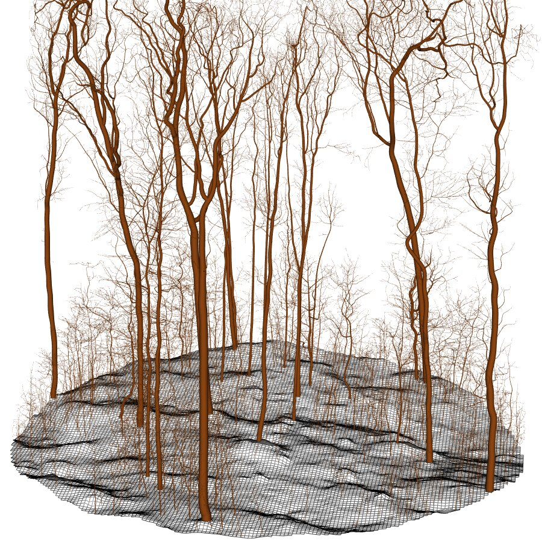
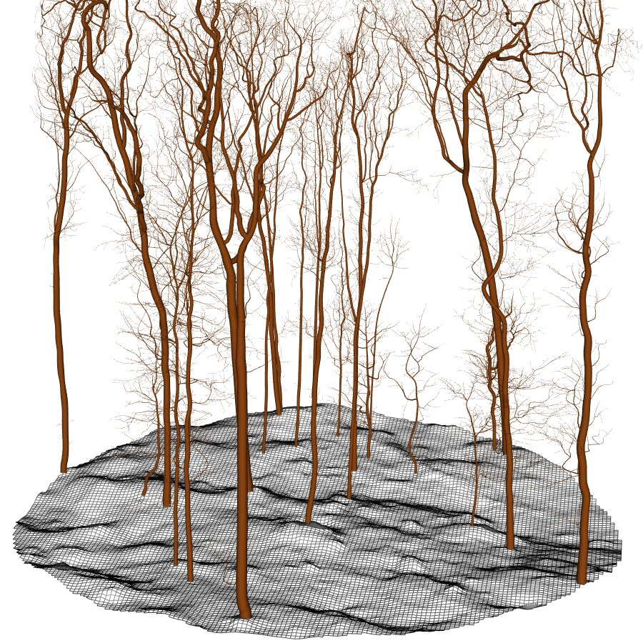
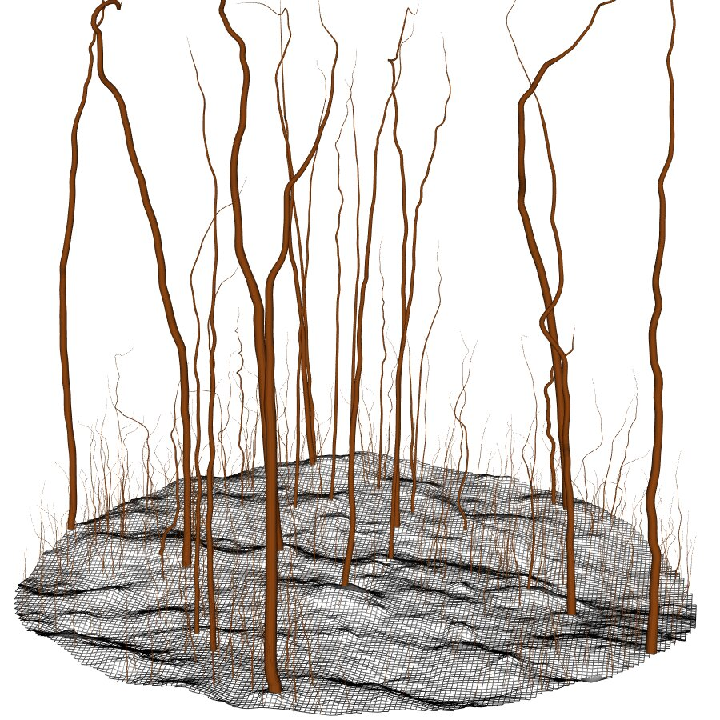
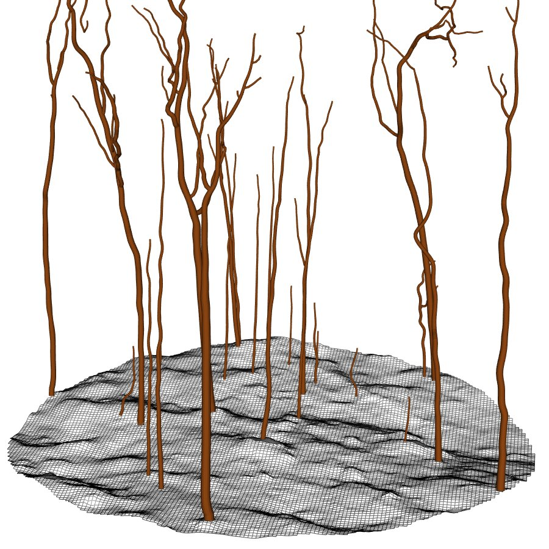

# Operational Forestry-Oriented Tools {#sec-opforestry}

QSMs provide estimates of total tree volume. This is useful for applications such as total biomass or carbon stock assessment, but it is not always the most relevant output for forestry practitioners. This chapter introduces operational forestry tools designed to manipulate QSFs and QSMs by filtering, truncating, and transforming outputs to derive harvesting-oriented metrics.

## Nomenclature

Functions starting with `qsf_` operate at the QSF level. They filter the set of QSMs contained in a QSF but do not modify the QSMs themselves.

Functions starting with `qsm_` operate on both QSMs and QSFs. They modify the QSMs. When applied to a QSF, they are internally looped over all QSMs in the collection.

Initial QSF containing all trees taller than 2 m:

{width=400px}

## Filter Merchantable Trees

Remove trees with a DBH below a given threshold.

```r
qsf_merch <- qsf_merchantable(qsf)
```

{width=400px}

## Filter Stem and Merchantable Volume

Retain stem segments only.

```r
qsf_stem <- qsm_stem(qsf)
```

{width=400px}

Retain only merchantable parts of the QSMs, i.e., the stem and branches above a specified radius threshold. This operation does more than simple radius-based trimming: it also ensures that the resulting QSM remains a valid connected graph without gaps.

```r
qsf_merch <- qsm_merchantable(qsf)
```

{width=400px}

These operations can be chained. For example, to retain only the merchantable portion of the stem:

```r
qsm_stem_merch <- qsm |> qsm_stem() |> qsm_merchantable()
```

## Remove Stump

Remove the stump portion from a QSM. For graph validity reasons the skeleton and cylinder are never physically subsetted by this function. Instead radii are zeroed which is equivalent in term of volume while ensuring the QSMs remain a valid graph with a single root in all cases.

```r
qsm_harvested <- qsm_nostump(qsm)
```
