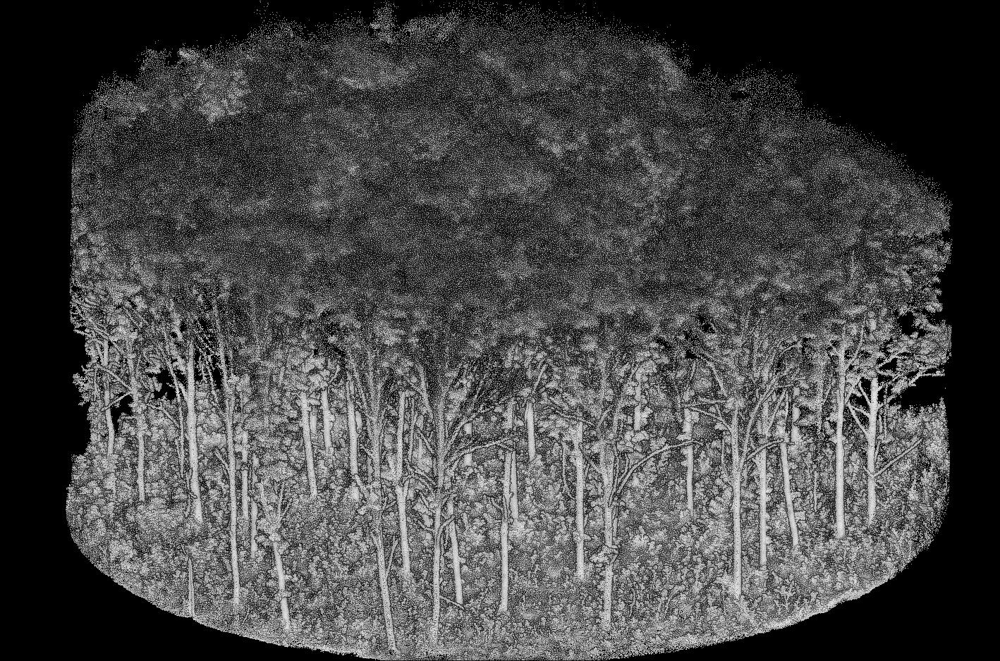
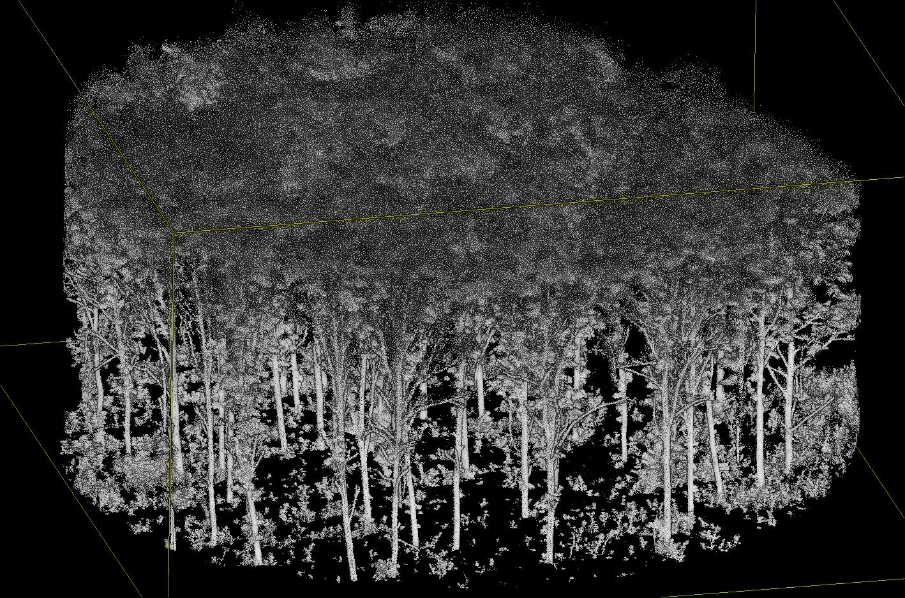

# Ground Segmentation

## Ground and Height Above Ground

As with ALS data processing, the first step in MLS data processing is **ground classification**. This book will not cover ground classification in depth; readers can refer to the [lidR book](https://r-lidar.github.io/lidRbook/gnd.html) for a comprehensive explanation.

Unlike ALS data processing, MLS/TLS datasets **must NOT** be normalized. Normalization distorts the geometry of the objects. While ALS processing relies on statistical approaches rather than geometry, MLS/TLS processing depends on computational geometry. Preserving the geometry is therefore critical!  

With ground classification it becomes possible to compute the height above ground (hag) of each point and `arbor` relies heavily on hag in addition to the undistorded true z coordinates. 

::: {.callout-caution}
Accurate ground point classification is critical, as all subsequent steps rely on the assumption that Height Above Ground values are reliable. In particular, **users should pay close attention to low outlier points**, which can significantly affect DTM quality.
:::

### Using arbor

`Arbor` is providing a fast an memory optimized option that we are recommending to use. It classifies ground points and computes hag.

```r
las <- segment_ground(las)
dtm <- lidR::rasterize_terrain(las, 0.1, lidR::tin())
```

### Using lidR

User can use any method from the `lidR` package or from other third party software to classify ground points and compute the hag. The following code snippet uses a multi-pass pipepline based on the `CSF` + `PTD` algorithm with additional steps to classify outliers. This pipeline tends to be more robust to low outliers below the ground.  We are using it for some datasets.


```r
ground <- lidR::decimate_points(las, lidR::lowest(0.05))
ground <- lidR::classify_noise(ground, lidR::sor(10, 2))
ground <- lidR::remove_noise(ground)
algo   <- lidR::csf(rigidness = 1, class_threshold = 0.1, cloth_resolution = 0.1)
ground <- lidR::classify_ground(ground, algo, last_returns = FALSE)
ground <- lidR::filter_ground(ground)
ground <- lidR::classify_noise(ground, lidR::ivf(0.5, 2))
algo   <- lidR::ptd()
ground <- lidR::classify_ground(ground, algo, last_returns = FALSE)
ground <- lidR::filter_ground(ground)

dtm    <- lidR::rasterize_terrain(ground, 0.1, lidR::tin())
las    <- lidR::height_above_ground(las, algorithm = dtm)
```

## Low Point Removal {#sec-lowpoints}

Performing the segmentation on all the points can be risky. Typically the ground points (including low grass), constitute a continuity between the trees. This is not necessarily an issue but we recommend to do not work with point just above the ground.

Arbor does not perform any processing of the points a few centimeters above the ground. The pipeline is robust, and we typically remove 15 cm to 25 cm. In cases where the ground is very messy and dense, removing up to 50 cm may be sometime necessary.


```r
params = arbor_parameters_default
params$global$cut_above_ground = 0.25
```

{group="ground"}


{group="ground"}


In addition to removing points where segmentation is complex, this also eliminates a significant number of points that do not need to be processed, thereby speeding up computation time.


::: {.callout-tip}
Low points are not actually removed like in the previous image. All points are retained in the point cloud but those low points won't be processed at all (saving time and memory) and will be assigned `NA` values in future steps.
:::

## Code

### Function List

- `segment_ground()`: classifies ground points and computes height above ground

### Full Code

```r
library(lidR)
library(arbor)

params <- arbor_parameters_default
params$global$cut_above_ground = 0.25
filter <- "-keep_random_fraction 0.25"

las <- readTLS(file, select = "xyz", filter = filter)

las <- hybrid_homogeneization(las)
las <- segment_ground(las)
```
