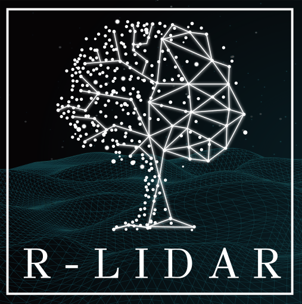

```{r}
#| label: setup
#| include: false
library(rgl)
options(rgl.useNULL = TRUE) # Suppress the separate rgl window during knitting
```

# Preface {.unnumbered}

In less than 10 minutes, on a laptop, Arbor turns 2500 m² of raw forest point cloud into a 3D model of every tree it contains. This book presents Arbor, the open source workflow developed by [r-lidar inc](https://www.r-lidar.com/) for processing mobile laser scanning point clouds, from raw data to QSM (Quantitative Structure Models).

Arbor is a production-grade C++ library for large-scale processing of mobile laser scanning data of forests, with an R package API. It introduces a new generation of algorithms for tree segmentation and modeling capable of processing hectares of data within minutes, significantly advancing the state of the art in forest point-cloud analysis.

In this book the reader will find an in-depth explanation of the pipeline, how it works, and how to use it in R. By reading this book, the reader will gain insight into the internal workings of the pipeline as well as a step-by-step tutorial on how to use it effectively.

## What do we mean by *production-grade*?

To be considered production-grade, a pipeline must:

- **Work under leaf-on conditions**.
- **Be fast**: practitioners should obtain valuable outputs within minutes of computation. Slow workflows do not scale to real large inventories.
- **Be parameterless**: software with an overwhelming number of parameters is impractical. It should work out of the box without adjustment.
- **Be easy to install**: a production-grade tool should be straightforward to install for everyone.

To demonstrate the performance of the pipeline, the following sections present a gallery of outputs produced by Arbor.

## Showcase

### Petawawa Research Forest

75 seconds end-to-end on a laptop. 900 m².



### Ontario

1 minute end-to-end on a laptop. 900 m².



### Québec - Oak Plantation

8 minutes end-to-end on a laptop. 3,000 m².



### Tropical Rain Forest

15 minutes end-to-end on a laptop. 5,000 m².



### QSM Showcase



<!-- ### QSM showcase 3D

Interactive 3D display-->

```{r renderqsm, eval=FALSE, echo=FALSE, cache=TRUE}
library(arbor)
qsm = qsm_read("data/chap_qsm/qsm_848.csv")
plot(qsm)
rgl::rglwidget()
rgl::clear3d()
rgl::close3d()
```

```{r renderqsm2, eval=FALSE, echo=FALSE, cache=TRUE}
library(arbor)
qsm = qsm_read("data/chap_qsm/qsm_949.csv")
plot(qsm)
rgl::rglwidget()
rgl::clear3d()
rgl::close3d()
```

## Installation

Arbor is an R package and can be installed just like any other R package.

```r
install.packages('arbor', repos = c('https://r-lidar.r-universe.dev', 'https://cloud.r-project.org'))
```

## Minimum Requirements

- **Laptop with at least 32 GB of RAM and 6 cores**:  
  This workflow is computationally demanding and requires significant memory. On a laptop with 32 GB of RAM, it is possible to process 5,000–6,000 m² in one batch smoothly. Beyond that, the RAM capacity may be exceeded.

- **High-quality data**:  
  The point cloud must be collected using a state-of-the-art walking pattern to ensure proper SLAM alignment and homogeneous sampling. Trees should be scanned from all sides, not just one. Following established best practices will ensure optimal results.

- **Reasonably low noise levels**:  
  Mobile laser scanners naturally produce A LOT of noise, and that's perfectly fine. However, we occasionally encounter datasets where the noise level is stratospheric, to the point of being unusable. While we understand that not everyone can afford top-tier sensors, there is a reasonable limit. The point cloud should look clean and well-defined, which is achievable even without the most expensive equipment (see @sec-dataquality).
  
- **Operating System**:  
Linux or Windows. R packages built under MacOS don't support parallelization with `OpenMP`. Without parallelization Arbor will be much slower. We do not recommend using Arbor on a Mac.

## Economic Model

Arbor is free and open source. At [r-lidar](www.r-lidar.com/), we don't believe in locking users behind black boxes. Everybody should be able to figure out how a software is working under the hood. However, free does not mean it's free to produce. We still have real-world bills to pay. To keep the lights on while keeping our code open, we've built our business around a value-driven model:

- **Consulting, training, and workshops**: Sharing expert knowledge to help users integrate the technology effectively.
- **Custom paid development**: Building specific features or optimizations tailored to individual client needs.
- **Donations to sponsor open source tools**: Relying on the community and partners to fund the ongoing maintenance of the projects.
- **R&D for Universities & Companies**: We partner with academic institutions and private firms on research projects, helping turn theoretical lidar concepts into functional, open-source realities.

## Contributors

While Arbor has been developed independently by [r-lidar inc.](www.r-lidar.com/), we would like to thank contributors who placed their trust in our economic model.

* [Sherbrooke University](https://www.usherbrooke.ca/) (Richard Fournier) contributed financially to the open source release of Arbor by providing the necessary funding to finalize the Arbor's R API, this documentation and the practitioner oriented tools.
* [Natural Resources Canada](https://natural-resources.canada.ca/) (Bastien Vandendaele), who had early access to Arbor prior to its release, performed initial testing, identified bugs, and shared valuable improvement ideas, literature, and expertise regarding MLS, TLS and practitioners needs. He also conducted an independent validation study: Vandendaele et al. 2026 (in prep)
* [IRD Montpellier](https://www.ird.fr/occitanie) (Olivier Martin) contributed financially toward several improvements in Arbor as well as ongoing R&D on tropical rainforest data.
* [Ministère des Ressources naturelles et des Forêts du Québec](https://www.quebec.ca/gouvernement/ministeres-organismes/ressources-naturelles-forets) contributed financially to improving Arbor’s computational efficiency prior to its public release by requesting a large-scale inventory project (5 ha, 15,000 QSMs). This was made as part of a project funded by the Ministère de l’Environnement, de la Lutte contre les changements climatiques, de la Faune et des Parcs (Plan pour une économie verte 2030, project no. 112959356, led by Julie Godbout).
* [Ontario Forestry Futures Trust-Knowledge Transfer and Tool Development (KTTD)](https://www.forestryfutures.ca/forest-resource-inventory) funded project with Murray Woods and Margaret Penner who shared early validation data to help test Arbor during its early versions.
