# Instance Segmentation

Instance segmentation is the process of assigning a label to individual objects within a dataset. In our case, the objective is to assign a unique ID to each tree.

The entire pipeline can be summarized in just two lines of code.

```r
seeds <- find_seeds(las, params)
las   <- segment_instance(las, seeds, params)
```

Below a gallery of semantic segmentation for various datasets

<div class="gallery">
```{r, results='asis', echo=FALSE}
# List images in the folder
img_files <- list.files("figures/chap_instance/", full.names = TRUE, pattern = "instance")

# Generate markdown: thumbnail + link to full-size
for (img in img_files) {
  cat(sprintf('<p><a href="%s" data-gallery="semantic" class="lightbox"></a></p>', img, img))
}
```
</div>

## Seeds

```r
seeds = find_seeds(las, params)
```

In order to segment each tree individually, we first need to locate every tree. This step is the most critical, sensitive, and improvable stage of the entire pipeline. Detecting every tree, sapling, and bush accurately, without a single error, is highly challenging, especially in complex contexts, but it is essential for proper semantic segmentation.

Segmenting individual bushes, for example, is necessary to isolate them and ensure they are not mistakenly assigned to a nearby tree.

The method relies on the pathfinder used in the semantic segmentation process described in the previous chapter. As we saw before, we were tracking passage points to reach the ground. The current pipeline uses these passage points along with the wood/foliage semantic segmentation to isolate each tree, sapling, or bush.

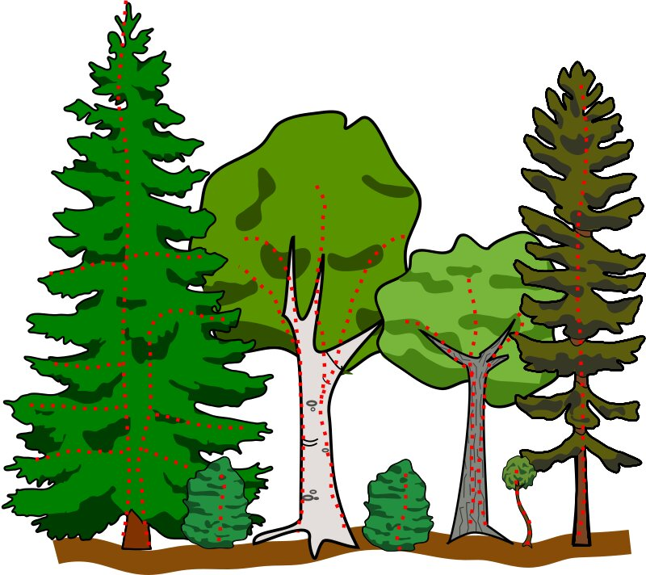{width=400px}

It is possible to have multiple passages for a given tree. The pathfinder cannot pass through the centerline of the trunk because there are no points there. Instead, it follows the shortest path, and depending on the starting points, multiple paths may be created. Typically, there are three or four hotspots per big tree and many more for massive tropical trees.

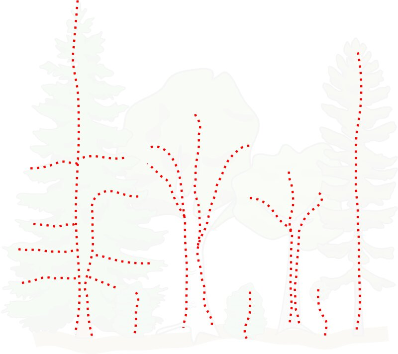{width=400px}

These passage points are connected and assigned an ID. However, since a tree can often have two or more passage paths, it may end up with multiple IDs.

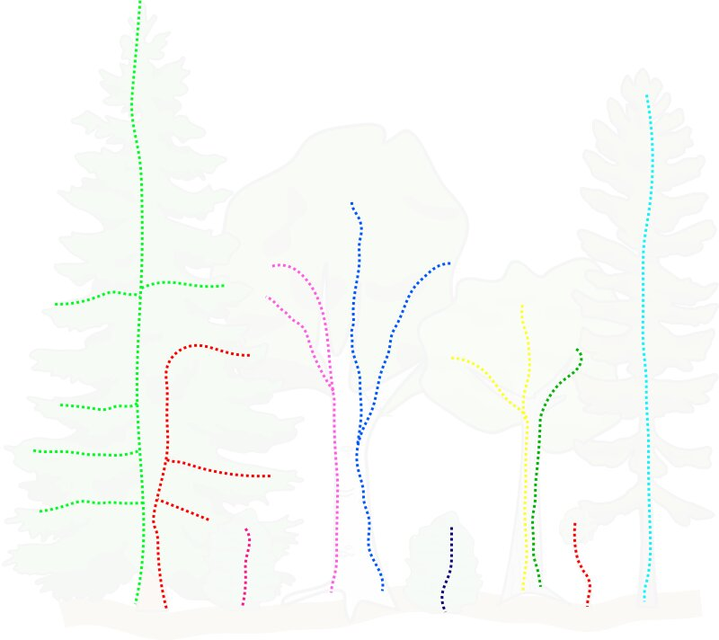{width=400px}

To merge the different paths for each tree, we use the semantic segmentation. The paths are expected to be connected by wood, and since we have wood classification, we can extract wood points from the lower layers and apply a connected component analysis. This merges paths that are physically connected by wood.

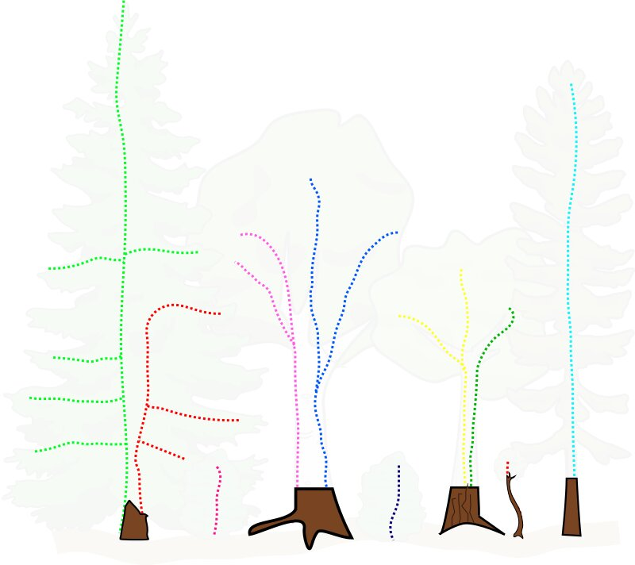{width=400px}

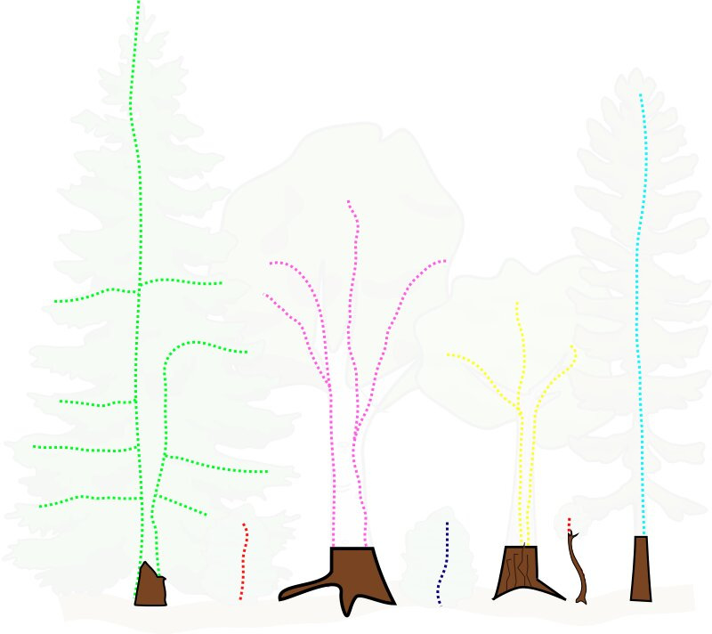{width=400px}

Finally, we keep only the passage points that are close to the ground to avoid complications in more complex forest contexts. 

While the previous sketches may make the process seem straightforward, in practice, passage points are often interleaved among branches. False positives and false negatives in wood points can occur. Real scenes are far more complex than these sketches, requiring careful analysis and additional constraints. Nevertheless, the sketches convey the main idea, despite the full algorithm being more intricate. An example of a real scene is shown in the next sections.

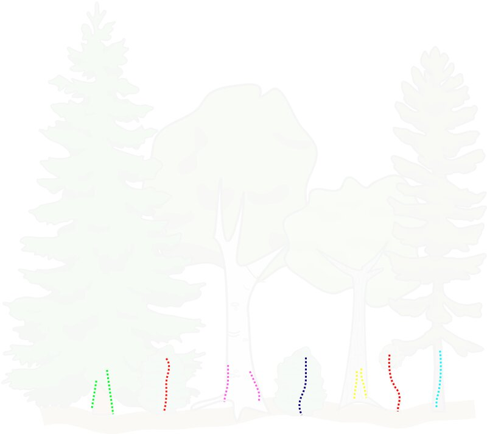{width=400px}

## Pathfinder

```r
las <- segment_instance(las, seeds, params)
```

To assign an ID to each tree, the pipeline uses a pathfinder to locate the closest seed. We won't dive deeply into the pathfinder here, but four key principles are essential to remember:

1. **Shortest path:** For each point, we search for the shortest path to a seed and retain the tree ID of that seed.  
2. **Cost function:** The path cost is based on the *cube of the distance* between neighboring points, which favors traversal through dense areas and avoids low-density gaps.  
3. **Angle penalty:** The cost is penalized based on the angle between points, encouraging vertical, downward paths.  
4. **Semantic penalty:** The cost is penalized according to the wood/foliage segmentation. Moving from wood to foliage is extremely expensive; moving from foliage to foliage incurs a significant extra cost. Moving from foliage to wood is favored, while moving from wood to wood has the regular cost.  

These mechanisms ensure that the pathfinder primarily travels *through wood* and almost never moves from wood to foliage, protecting against incorrect tree ID assignments.

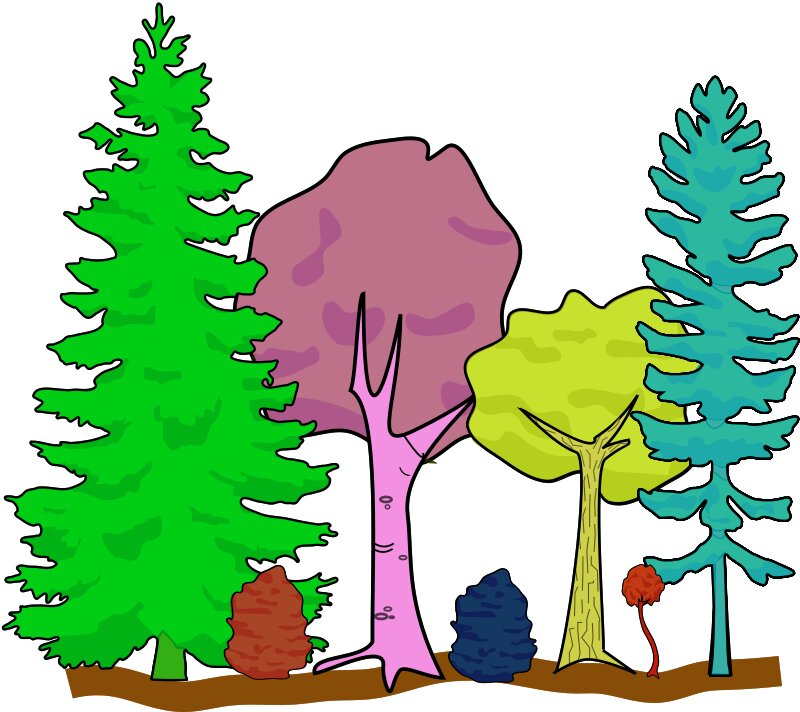{width=400px}

## Real Rendering

While sketches are useful for understanding and demonstrating the workflow, they do not capture the true complexity of real scenes. In particular, the workflow description presented so far is simplified. The following images show real data.

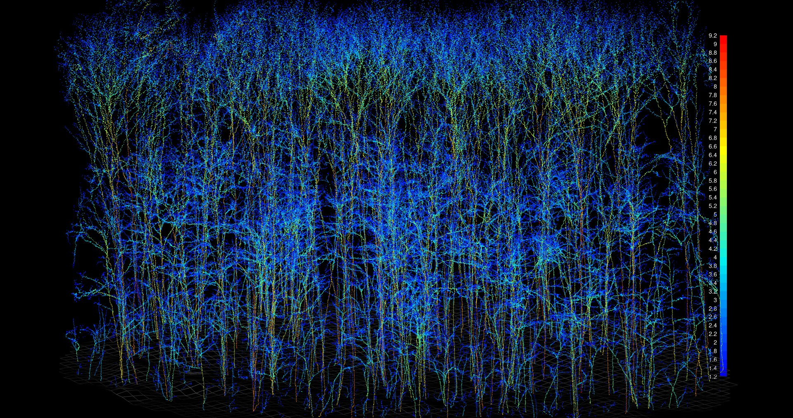{width=400px}

{width=400px}

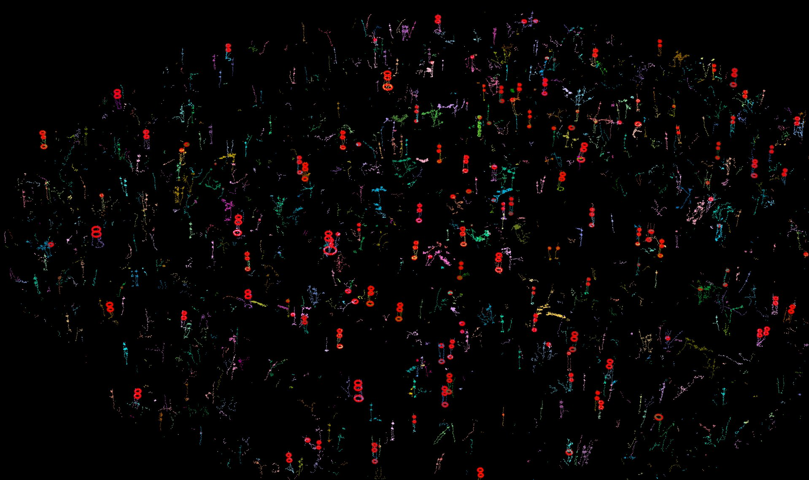{width=400px}

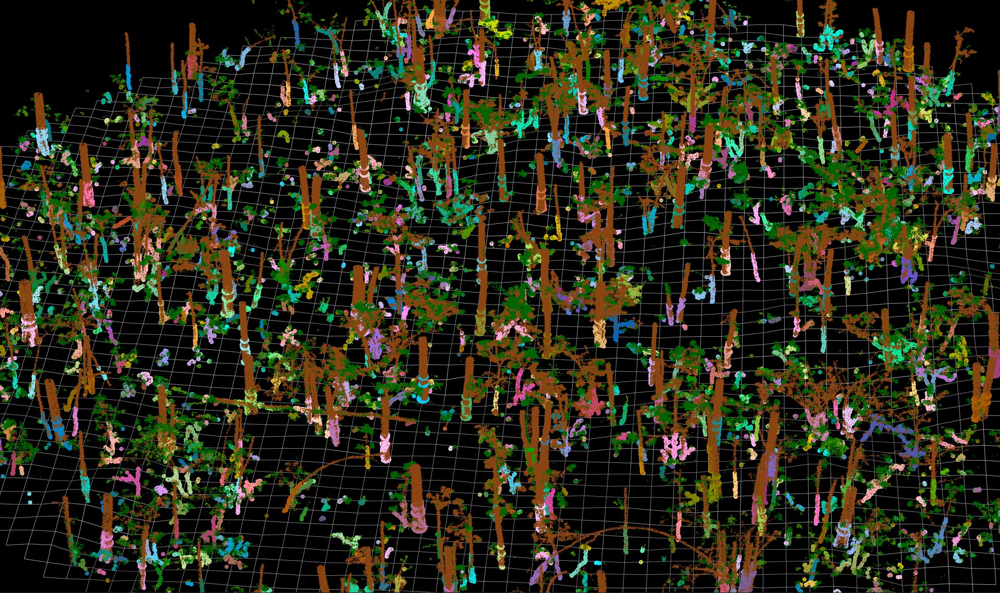{width=400px}

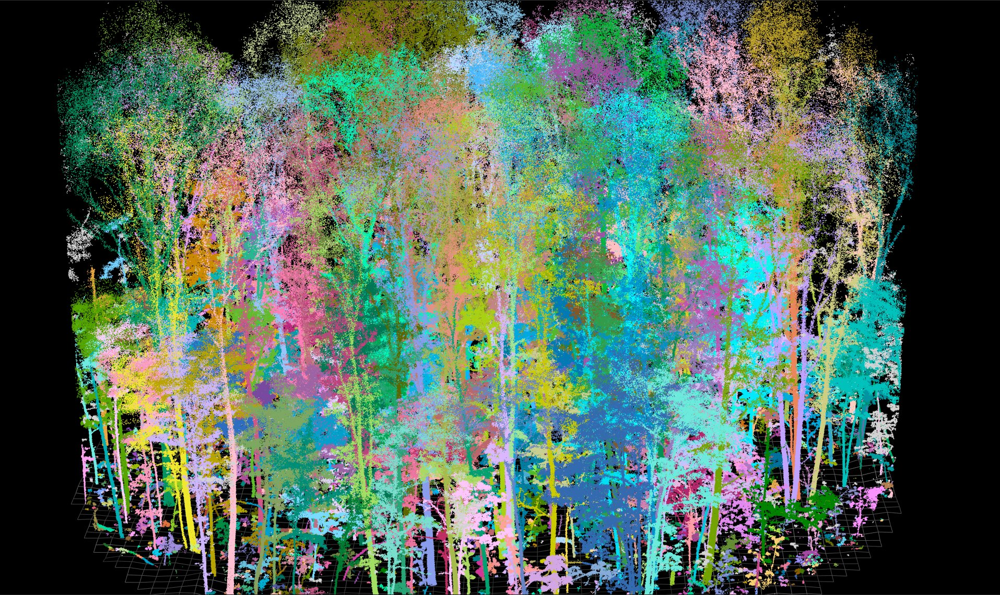{width=400px}

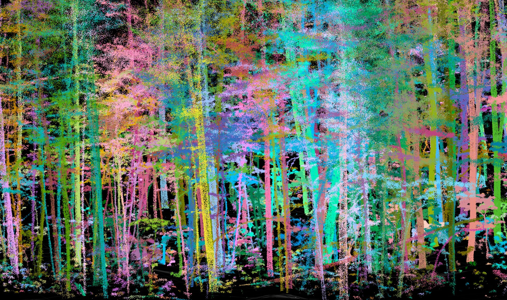{width=400px}


## Cleaning understory

At this stage, the scene is largely segmented. If everything went well, every tree, sapling, and bush has been segmented and assigned an ID. However, in practice, it is unrealistic to expect every tiny feature, such as small bushes or saplings, to be perfectly segmented. These features are extremely complex, interleaved, and noisy.  

Moreover, they have virtually no significance in terms of carbon stock and are not harvested. Consequently, we suggest flagging all instances below a certain size threshold, typically 2 or 4 meters. The flagged trees won't be processed in next steps.


Cleaning the understory is **optional**. You may keep all vegetation if desired.

```r
las <- flag_small_trees(las, max_height = 2)
```

::: {.callout-note}
Be careful, `flag_small_trees()` does not removes points. It assigns all small instances a `UserData` attribute value equal to the constant `ARBORUNDERSTORY` value. This saves memory and allows to easily revert the operation by calling again `flag_small_trees()` with another `max_height` parameter. To actually remove those points users can use `las <- lidR::filter_poi(las, UserData != ARBORUNDERSTORY)` but this is not necessary in Arbor.
:::

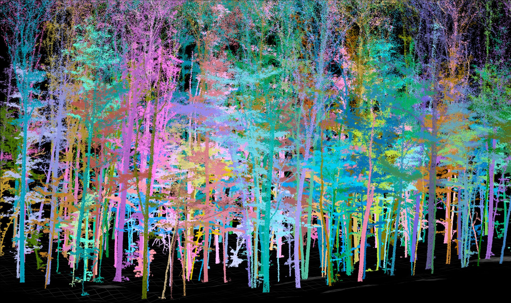{width=400px}

## Buffer Clipping and Edge Artifacts

::: {.callout-important}
This section is of major importance. Please read it carefully.
:::

A common issue with pathfinding is that we need to find a path to the ground. This becomes problematic at the edges of a dataset when the dataset has been clipped. At the edges, we alway have *floating* branches and trunks that are not connected to the ground. Consequently, the only path to reach the ground or a seed may be through a nearby tree.

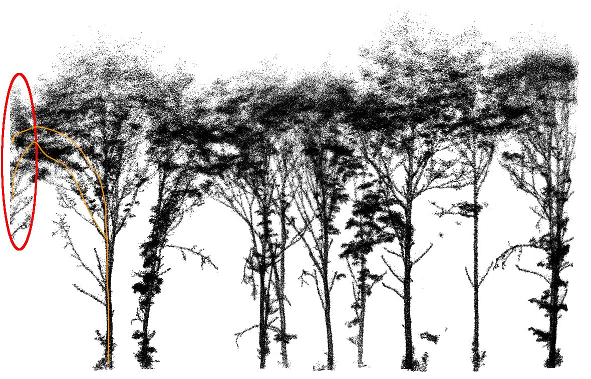{width=600px}

This produces invalid results, especially with large trees. Sometimes, for tilted trees, we may even see half of a trunk floating.

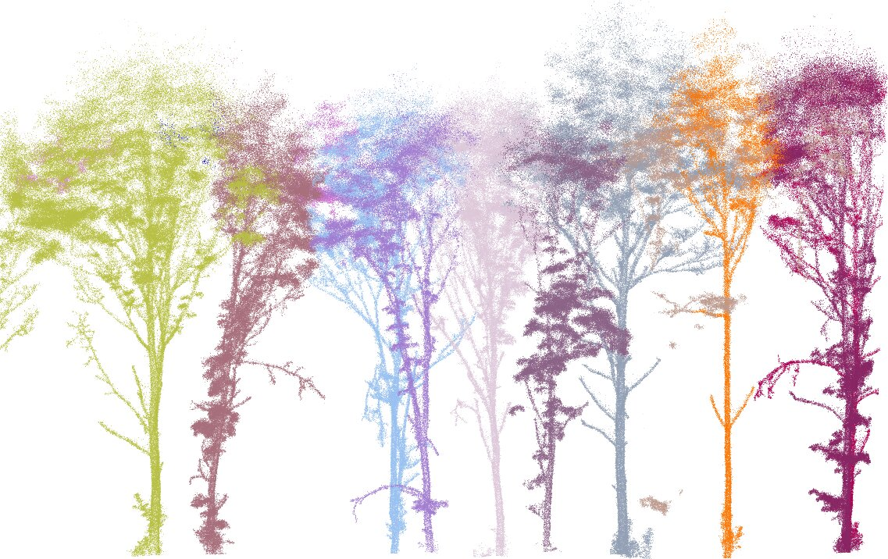{width=600px}

To avoid these issues, it is important to work with a scene larger than the area of interest, so that boundary trees can be removed (see also @sec-pcselection). In the images above, the green tree on the left and the reddish tree on the right should be removed. While the reddish tree may appear fine, this is merely coincidental: the scene happened to be cut just between two trees.

This can be achieved by flagging a buffer around the point cloud. The buffer size should correspond to the extent of the largest possible tree. Typically, we recommend a buffer of at least 10 meters, although this may vary depending on forest type and tree sizes. The flagged trees won't be processed in next steps.


```r
las <- flag_buffer(las, seeds, -10)
```

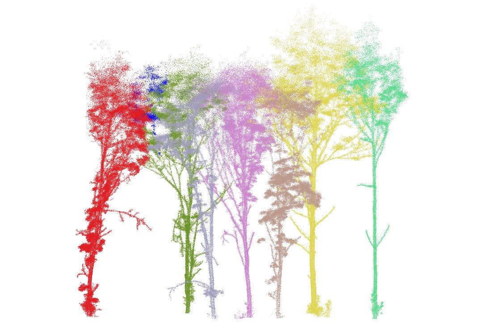{width=600px}

::: {.callout-note}
Be careful, `flag_buffer()` does not actually remove points. It assigns all instances in the buffer an attribute `UserData` with a constant equal to `ARBORBUFFER`. This saves memory and allows users to easily revert the operation by calling `flag_buffer()` a second time with another `buffer` value. To actually remove those points users can use `las <- lidR::filter_poi(las, UserData != ARBORBUFFER)` but this is not necessary in Arbor.
::::

Visualization on real data:

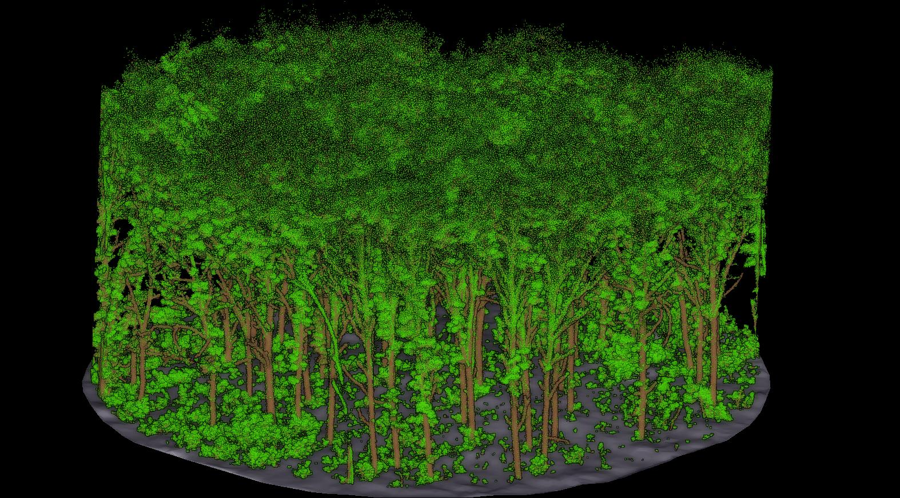{width=400px} 

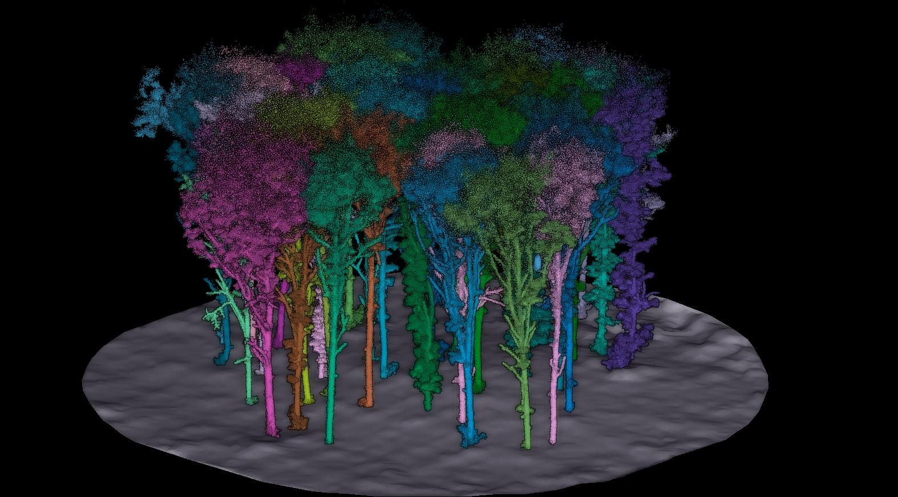{width=400px}

## Rendering & Filtering

The function `plot_instance()` renders the instance segmentation. All points have an attribute `treeID`. A `treeID = 0` is equivalent to `NA`. Valid instances are guaranteed to not have a treeID equal to 0. Only strictly positive ID are valid. 

Users can filter out valid tree with `las <- lidR::filter_poi(las, UserData == ARBORTREE)`. 

The function `colorize_tree()` adds RGB colors to the point cloud for rendering in external softwares.

## Parameters

`Arbor` is designed to be **parameter-free**. Most internal parameters are intentionally undocumented, as they require a deep understanding of the internal pathfinder and are not meant for routine tuning.

Two parameters, however, can be safely adjusted to improve connectivity in sparse point clouds:

```r
params$path_finder$k_neighborhood_connectivity
params$path_finder$max_gap
```

- `k_neighborhood_connectivity` defines the number of neighbors used to build the graph (default: 10).
- `max_gap` defines the maximum allowed distance between connected points (default: 1 m).

In sparse canopies, especially near tree tops, default values may fail to connect upper part or apexes to lower sections. Increasing these values can improve graph connectivity. However, this is rarely necessary, as internal safeguard routines are already implemented to maintain good connectivity in sparse regions.

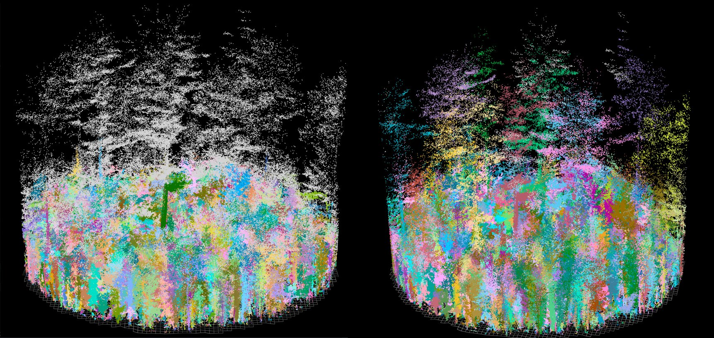

::: {.callout-important}
Changing these parameters also requires recomputing semantic segmentation, since it relies on the same pathfinder.
:::

## Point-wise Classification Accuracy

Is the instance semantic classification accurate? In practice, the answer here mirrors the case of semantic segmentation, and for the same reasons.

Point-wise classification accuracy is not a meaningful indicator of overall system performance. Even if our algorithm achieves 95–99% accuracy at the point level, this tells us very little about the practical quality of the final output. The remaining 1% of points, especially if they occur on tree boundaries or in areas critical for mensuration, can significantly distort measurements. Even a model that is 99.9% accurate could still produce unacceptable results if the remaining 0.1% introduces systematic or structurally important errors.

What truly matters is not how many points are classified correctly, but whether the segmentation produces coherent, reliable instances. For our application, this means accurately identifying individual trees and correctly estimating their position, DBH, height, and volume. These are the metrics that matter, and these are the ones we validate and discuss later.

For this reason, point-wise classification accuracy provides almost no practical insight.

## Code

### Function List

- `find_seeds()`
- `segment_instance()`
- `plot_instance()` : render the instance segmentation
- `flag_small_trees()`
- `flag_buffer()`
- `plot_semantic_instance()` : render the instance + semantic segmentation
- `colorize_tree()`: adds RGB colors to the point cloud for rendering in external softwares
  
### Full Code

```r
library(lidR)
library(arbor)

params <- arbor_parameters_default
params$global$cut_above_ground = 0.25
filter <- "-keep_random_fraction 0.25"

las <- readTLS(file, select = "xyz", filter = filter)

las <- hybrid_homogeneization(las)
las <- segment_ground(las)
las <- wood_likelihood(las, params)
las <- segment_semantic(las, params)
see <- find_seeds(las, params)
las <- segment_instance(las, see, params)
las <- flag_small_trees(las, max_height = 2)
las <- flag_buffer(las, see, -10)
```
