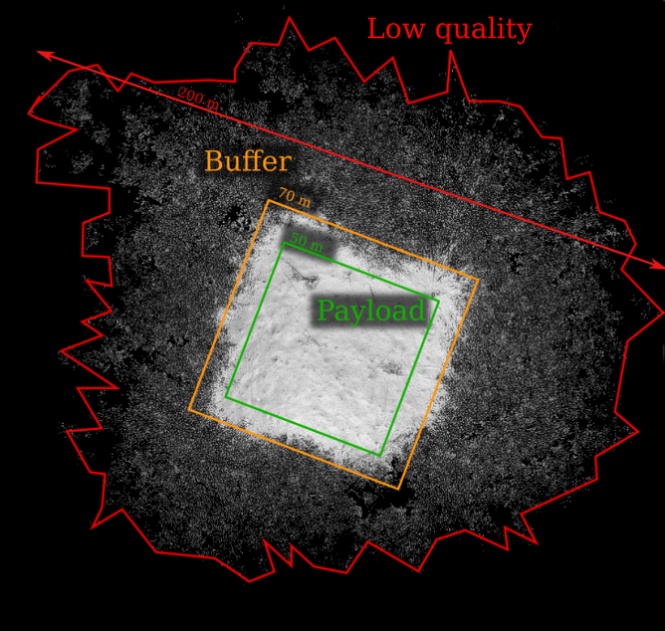
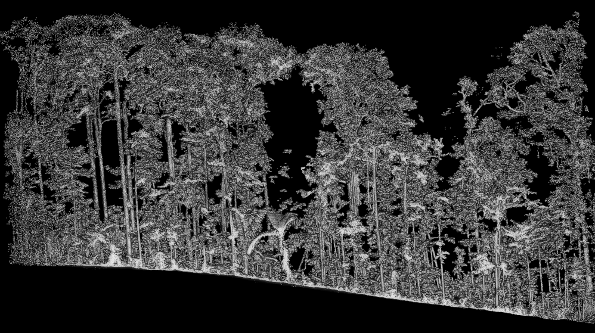
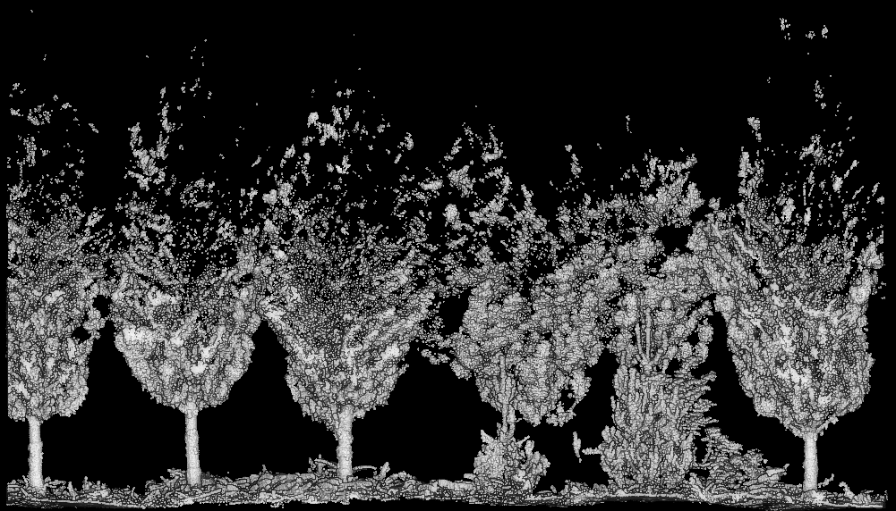
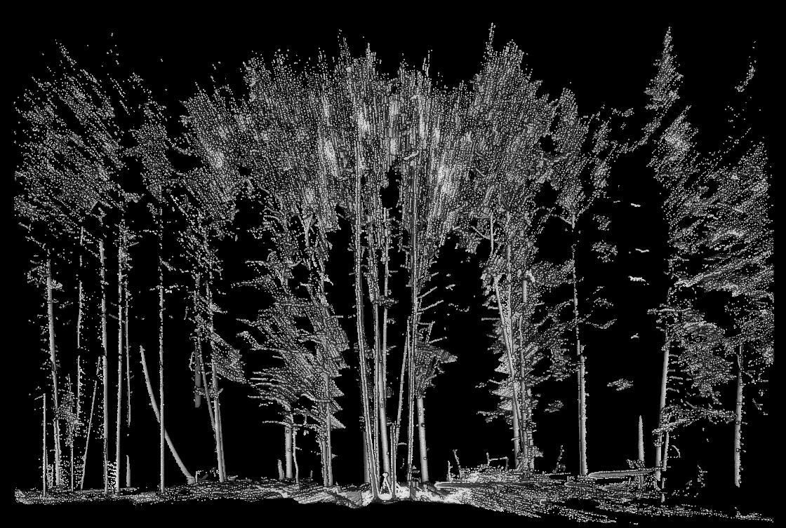
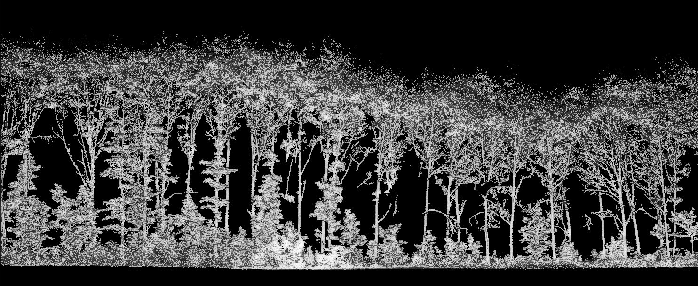
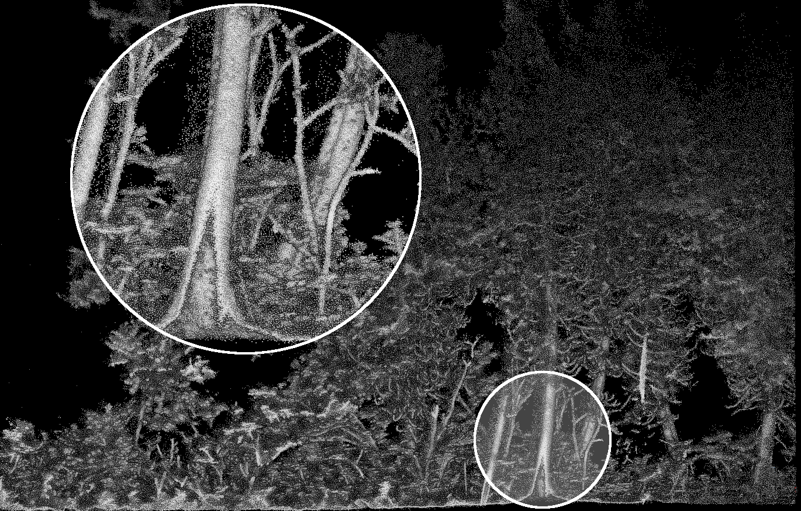

# Data Preparation & Quality

Production-grade software requires production-grade data. This chapter discusses what constitutes a quality dataset.

## Point Cloud Selection {#sec-pcselection}

### Three Areas of Interest

A typical Mobile Laser Scanning (MLS) point cloud is generally composed of three distinct zones: the **Payload**, the **Buffer**, and the **Low quality area**. Understanding these zones is critical for efficient processing.



#### The Payload

The payload represents the area intentionally sampled in the field. This is the highest quality portion of the data, typically covering 400 m² or 0.25 ha (the two most common sampling sizes). In this zone, trees are fully captured and provide the detail necessary for accurate analysis.

#### The Buffer

The buffer is the area immediately surrounding the payload where data quality remains "good enough" for contextual use. While we may still find dense ground points and visible tree structures, trees in this zone are often partially captured because they are sampled from one side only with more occlusion. 

* **Purpose:** This zone acts as a safety margin to ensure clean results during processing of the payload area.
* **Extent:** It typically extends 5 to 10 meters beyond the payload boundary.

#### The Low Quality Area

The low quality area consists of all remaining data, often extending 50 to 100 meters beyond the buffer. These points should be removed prior to processing for two main reasons:

* **Performance:** The sheer volume of points over such a large area consumes significant RAM and increases computation time.
* **Geometry:** These points often form irregular, random shapes that interfere with clean boundary definitions and buffer removal. From the contour of the low quality area it is impossible to retrieve the payload area automatically.

### Clipping the Point Cloud

The first step before using Arbor is to clip the point cloud to isolate only the payload and the buffer. 

* **Manual Clipping:** For individual files or visual inspection, [CloudCompare](https://www.cloudcompare.org/) is our preferred tool for manual extraction.
* **Automated Clipping:** If the point cloud is already georeferenced or centered at (0,0), the clipping process can be automated using the `lidR` package to extract a precise square or circular area. More complex polygon shapes are also supported.


```r
library(lidR)
ctg <- readTLSLAScatalog("myfile.laz")
las <- clip_circle(ctg, 0, 0, 11.28+10)
```

### Data Processing Assumptions

In the following chapters, we operate under the consistent assumption that all point clouds have been properly preprocessed. Specifically, the data has been clipped to retain only the payload and buffer, while low-quality areas have been entirely removed.

By focusing strictly on these two zones, we ensure that Arbor’s algorithms operate with optimal computational efficiency and that the structural analysis remains centered on high-fidelity data.

## Point Cloud Quality {#sec-dataquality}

Once a point cloud has been acquired, there is no turning back: the quality is either sufficient or it is not. Arbor operates under the following assumptions regarding data quality.

### Coverage

Trees in the payload area must be sampled at 360 degrees. To achieve this, sampling must also be performed in the exterior area surrounding the payload, as well as by following a valid walking pattern inside the plot. A good coverage is not hard to achieve with MLS. **However it is rarely achieved with TLS**.

### Noise

The level of noise must be acceptable. While this is difficult to quantify precisely, the core requirement is that the data is not overwhelmed by artifacts. Some sensors produce scattered noise points resembling a blizzard; Arbor is not designed to process datasets of that nature. Standard operational noise is already challenging enough. See @sec-examples

### Occlusion

Trees are assumed to be sampled up to their tops. Naturally, higher sections of the tree contain fewer points, more occlusion, and lower accuracy; this is an inherent trade-off when using laser scanners in forest environments. However, Arbor is designed to measure trees, not invent them. See @sec-examples

While reconstructing missing parts of a tree is possible to some extent, Arbor is not intended to fabricate geometry. If the physical structure of a tree is inaccessible because of extreme occlusion, Arbor may still perform well for instance segmentation, but it will produce poor results for Quantitative Structure Models (QSMs).

### Accuracy

Arbor assumes the use of accurate sensors. Not all sensors are created equal.

The Howevermap ST-X has an accuracy of 2 cm, which is currently among the best available on the market as of 2026, though it is also very expensive. Arbor performs exceptionally well with ST-X point clouds.

The Faro Orbis has an accuracy of 4 cm. Although the degradation in quality is noticeable, Arbor still performs well at this level of accuracy.

Based on our observations, the GeoSLAM system has an accuracy ranging from 4 to 6 cm and is more noisy. An accuracy of 6 cm starts to be problematic. At this level, trunks and foliage are no longer statistically or geometrically distinct; everything becomes a sparse blob of points. Arbor can still produce usable results in some cases, but this falls below production-grade quality requirements.

The LiGrip is far below the required standard.

The easiest way to assess accuracy is to slice through a few trunks (or a wall), measure the thickness, and examine how smudged the edges are.

{width=400px}

### Examples {#sec-examples}

Below are five commented screenshots of good and bad quality datasets:












## First Lines of Code

These three lines of code load the `lidR` and `arbor` packages. The final line assigns the `params` variable with the default `Arbor` parameters, which we will keep as default throughout this book.


```r
library(lidR)
library(arbor)
params <- arbor_parameters_default
```
