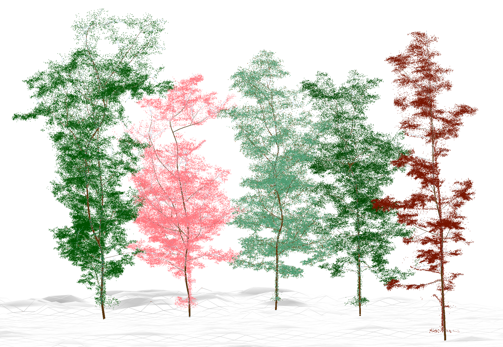
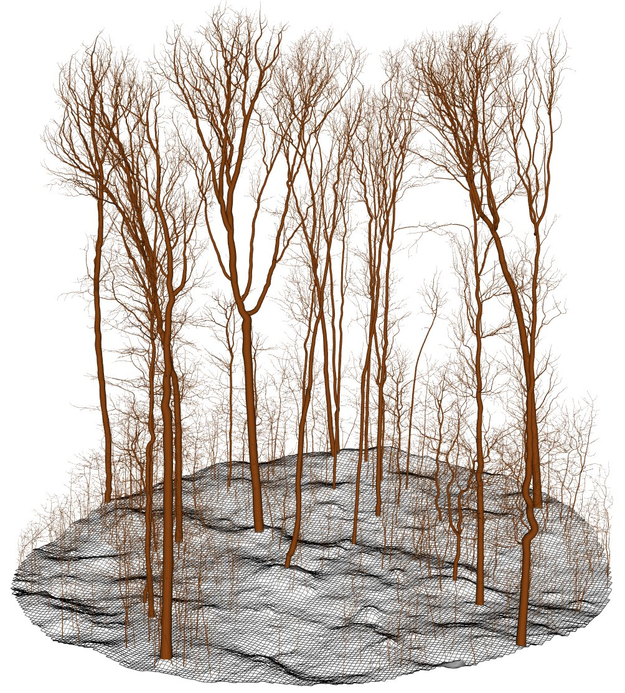
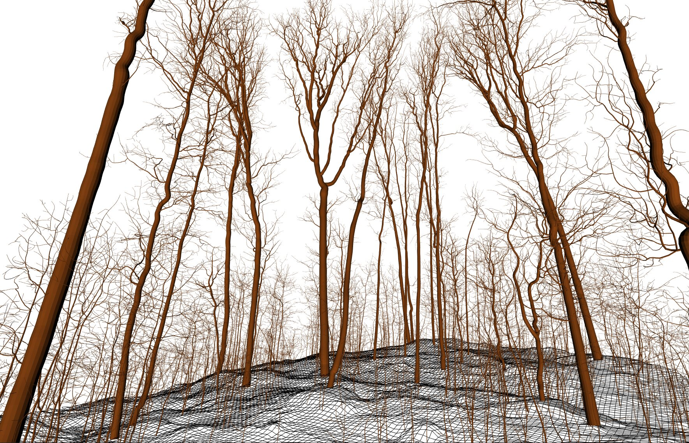
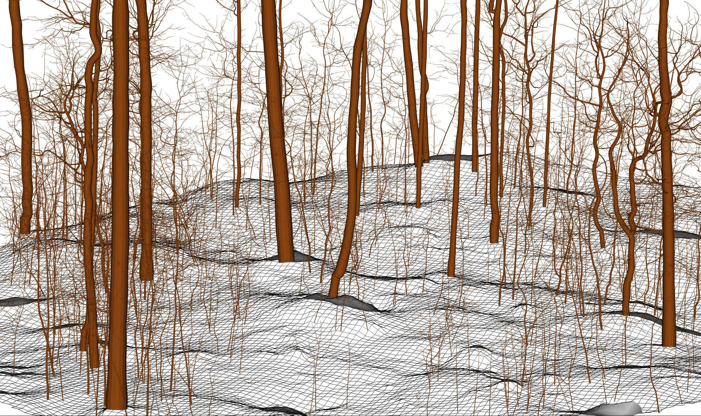
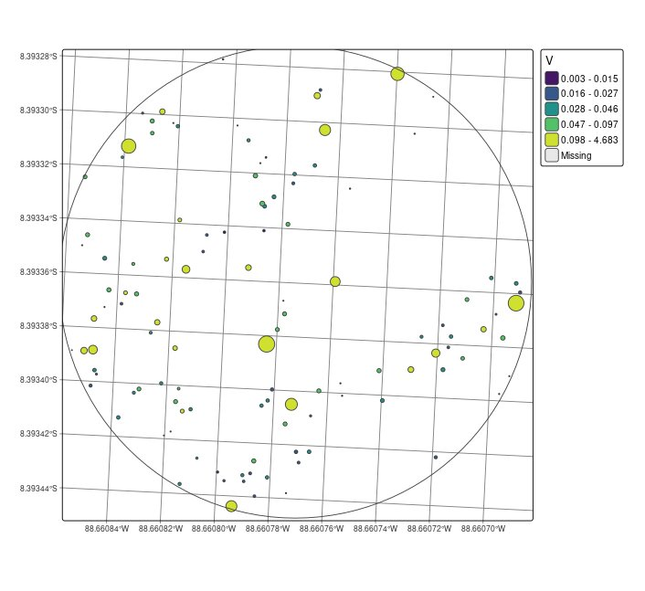
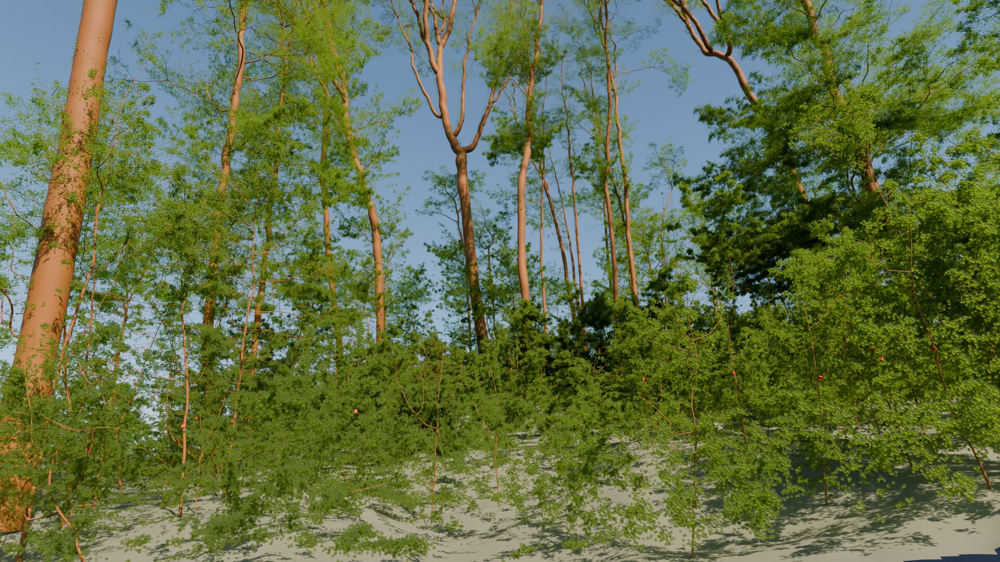
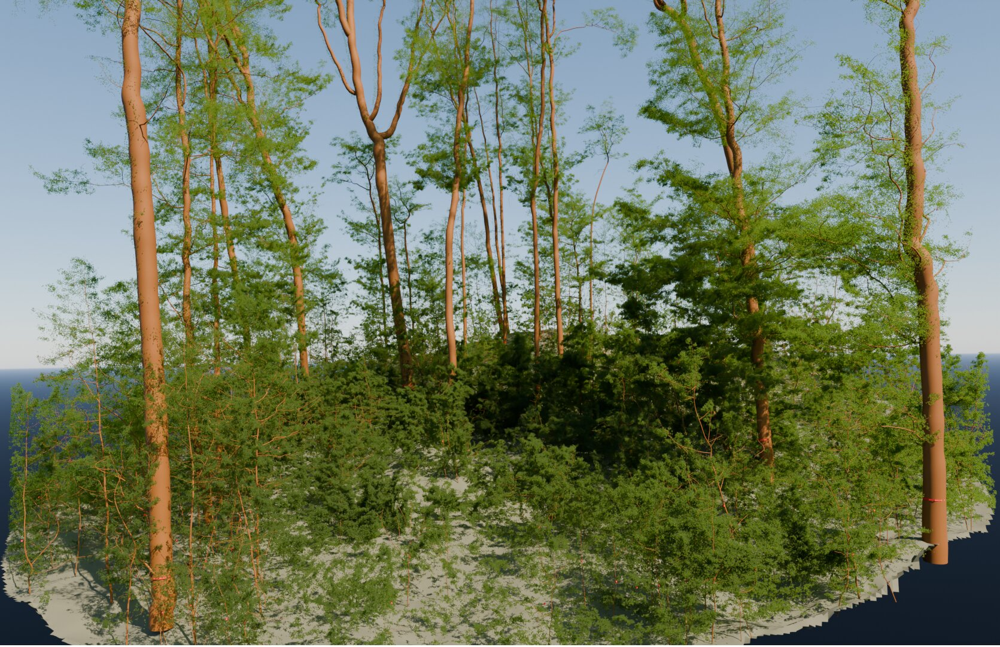
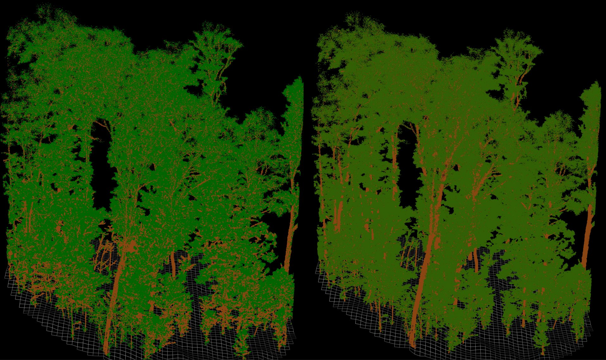

# Quantitative Structure Forest {#sec-qsf}

```{r, echo=FALSE}
knitr::opts_chunk$set(comment = "#>", collapse = TRUE)
```

A **Quantitative Structure Model (QSM)** is a three-dimensional representation of a single individual tree that explicitly describes its geometry and topology (stems, branches, radii, volumes). QSMs provide a physically meaningful model, rather than a purely statistical description.

In this book, we extend this concept from individual trees to entire forests by introducing the **Quantitative Structure Forest (QSF)**. A QSF is a coherent collection of QSMs that together reconstruct the three-dimensional structure of all trees within a forested area.

This conceptual extension is made possible by our advances in QSM algorithms that are fast and robust enough to reconstruct tens of thousands of trees, enabling full 3D modelling of forests spanning several hectares. The QSF concept bridges the gap between tree-level and forest-level analysis, providing a unified framework to study tree architecture, stand structure, competition, biomass distribution, and canopy organisation within a single 3D representation.

## Building a QSF

Building a QSF is relatively straightforward. Users could simply loop over all trees and compute a QSM for each one. Arbor includes a function, `qsf()`, that performs this task in parallel and in an optimized manner.

As described in previous chapters, the variable `las` contains the segmented scene.

```r
qsf = qsf(las)
```

The `qsf` function is blazingly fast and can produce several hundred QSMs per minute! `qsf()` computes one QSM per tree but **excludes** trees that are in the buffer zone (see `flag_buffer()` in @sec-buffer) or that are flagged as low understory (see `flag_small_trees()` in @sec-understory). This makes sense since `flag_*` functions are designed to exclude trees for which we cannot obtain good results.

::: {.callout-tip}
A `qsf` object is simply a `list` with an additional class to enable convenient printing and plotting methods. Thus, `qsf[[1]]` contains a `qsm` object.
:::

Be careful: by default, `qsf()` produces a QSM for every instance taller than 2 m. This can create a large number of QSMs with negligible volume, which is not always desirable. The function provides a parameter to control this threshold e.g. `qsf(las, min_height = 4)`.

## QSF Log Analysis {#sec-log}

As mentioned earlier, arbor's QSM module is not built like other QSM software on the market. It does not process one tree fed by a user but instead processes thousands of tree instances fed by a machine, including (among others) small saplings that are not measurable considering the accuracy of MLS sensors. In these cases, arbor's function `qsm()` creates allometry-based QSMs with a warning (see section @sec-edgecases).

However, `qsf()` does not throw any warnings. Indeed, on a plot with e.g. 400 saplings and 200 young trees, this would generate at least 600 warnings. This is unmanageable for users. Instead, all QSMs record a message. Users can call `qsf_log()` to obtain a troubleshooting summary.

```{r, echo=FALSE}
library(arbor)
f <- system.file("extdata", "oak-plantation.qsf", package="arbor")
qsf <- qsf_read(f)
```

In the example below, we have 11 trees too short to be measurable according to allometry. These QSMs are purely allometry-based. We also have 7 trees without any measurement. Those trees are tall enough to be measured (in theory), but for some reason the QSM module found 0 valid measurements. Those trees should be inspected (spoiler: they are short trees with low foliage and indistinct trunks).

```{r}
logs <- qsf_log(qsf)
logs
```

Users can query the logs. It is just a nested `list`. E.g.:

```r
logs$W2
```

The function `qsf_filter()` and its user-friendly derivatives allow the QSF object to be subset to retain only the trees of interest, without querying the log manually.

```{r}
saplings  <- qsf_filter_sapling(qsf)
nomeasure <- qsf_filter_nomeasure(qsf)
goodtrees <- qsf_filter_ok(qsf)
```

The function `qsm_treeid()` allows the user to retrieve the tree ID of a QSM. It also applies to a QSF and thus allows the corresponding trees to be extracted from the point cloud. For example:

```r
ids <- qsm_treeid(nomeasure)
cloud <- filter_poi(las, treeID %in% ids)

x <- plot_instance(cloud)
plot(nomeasure, add = x, pal = "chocolate4")
```

:::{.callout-tip}
It is also posible to use `cloud = las %in% nomeasure` as shortcut.
:::




## What To Do With a QSF?

### 3D Rendering

The first thing we can do with a QSF is render it in 3D within R.

```{r, echo=F, eval=F}
library(rgl)
library(arbor)
#options(rgl.useNULL = TRUE) # Suppress separate window
#setupKnitr(autoprint = TRUE) # Automatically print rgl plots
qsf = readRDS("data/chap_qsf/PRF193_qsf.rds")
dtm = terra::rast("data/chap_qsf/PRF193_dtm.tif")
plot(qsf, pal = "chocolate4") |> lidR::add_dtm3d(dtm)
```

```r
plot(qsf, pal = "chocolate4") |> lidR::add_dtm3d(dtm)
```

{width=400px}

{width=400px}

{width=400px}

### Tree Map & Volume Inventory

A QSF can also be used to perform complete forest inventories, producing a tree map with detailed information for each tree, such as basal area, volume, height, and other structural attributes.

```r
tm <- qsf_treemap(qsf)
```

{width=500px}

### Export to 3D Software

The `qsf()` function includes an option to export all trees into separate folders. Users can also use `qsf_write()` to export individual trees to formats such as `.qsm`, `.obj`, `.stl`, `.ply`, `.csv` or other formats supported by 3D software. For example, Blender can be used as an open-source solution for realistic rendering while CloudCompare can be use for casual rendering.

{width=500px}

{width=500px}

### Reclassifying Wood and Foliage

:::{.callout-warning}
This feature is experimental; it may or may not be removed in future versions.
:::

Our semantic segmentation is not perfect. It intentionally over-segments in order to ensure that the entire tree branching structure is captured. As a result, this approach produces numerous false positives in foliage (by design) and some false negatives (not by design). The semantic segmentation is therefore not intended for direct scientific use; it is primarily designed to support QSM reconstruction.

With a QSF, it becomes possible to reclassify points based on each individual QSM. This reclassification can be useful for downstream analyses such as estimating Plant Area Index (PAI) or Leaf Area Index (LAI), where a more accurate separation between wood and foliage is required.


```r
las <- qsf_segment_semantic(las, qsf)
```

{width=800px}

### Merchandable Volume

See @sec-opforestry for more information about forestry operations.

## Code

### Function list

- `qsf()` to build a QSF
- `qsf_write()` for saving the QSMs in `.obj`, `.ply` `.csv` or `.qsm` for analyzing or for rendering in 3D software.
- `qsf_treemap()` for saving forest in GIS vector files
- `qsf_log()` to get a overview of troubleshooting
- `qsf_segment_semantic()` for more accurate semantic segmentation
- `qsf_merchantable()` (see @sec-opforestry)
- `qsf_filter()` to select QSMs of interest.
- `plot()` for 3D rendering
- `qsm_stat()` works with a QSF


### Full Code

```r
library(lidR)
library(arbor)

params <- arbor_parameters_default
params$global$cut_above_ground = 0.25
filter <- "-keep_random_fraction 0.25"
buffer <- 5

las <- readTLS(file, select = "xyz", filter = filter)

las <- hybrid_homogeneization(las)
las <- segment_ground(las)
las <- wood_likelihood(las, params)
las <- segment_semantic(las, params)
see <- find_seeds(las, params)
las <- segment_instance(las, see, params)
las <- flag_small_trees(las, max_height = 2)
las <- flag_buffer(las, see, -buffer)
qsf <- qsf(las, params = params)
log <- qsf_log(qsf)
plot(qsf)
```
