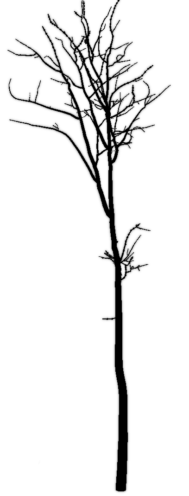
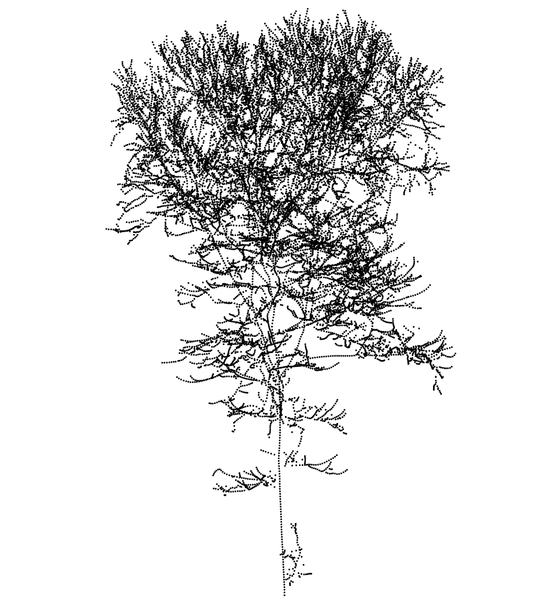
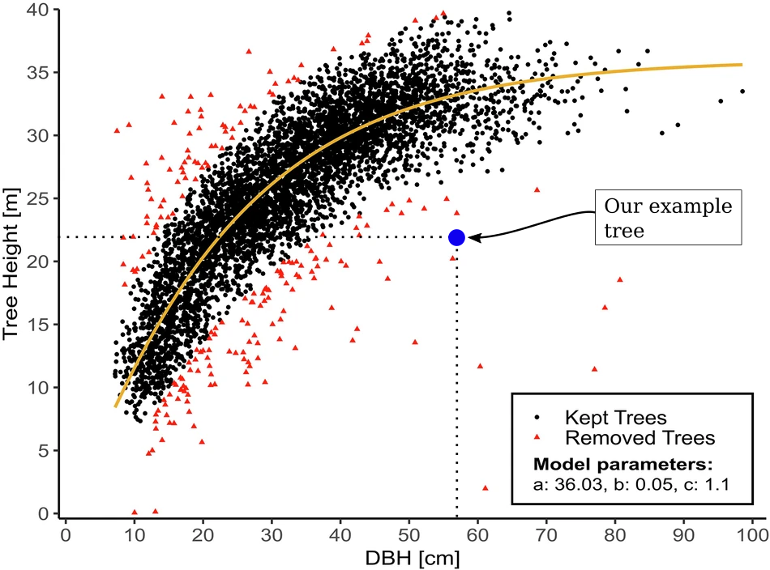
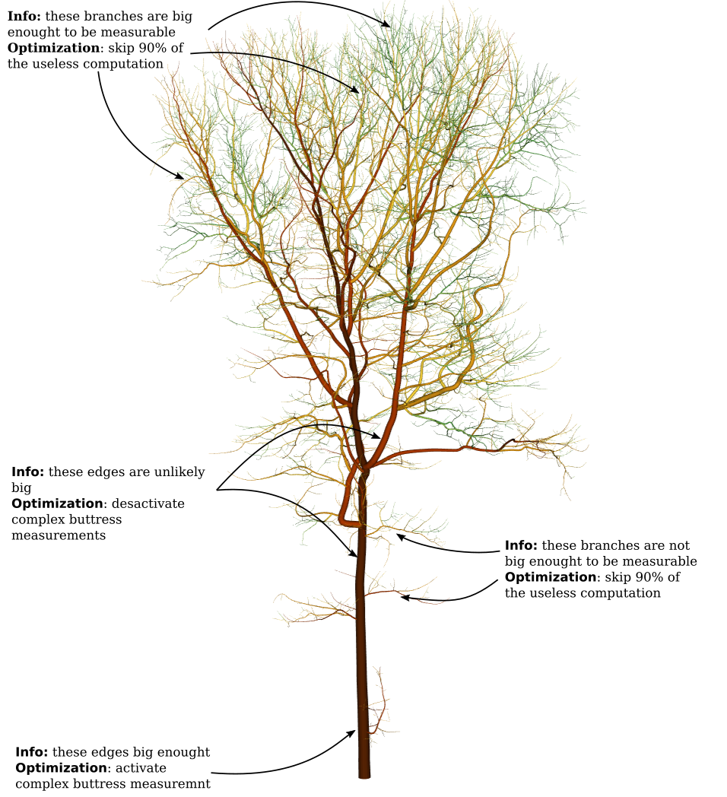
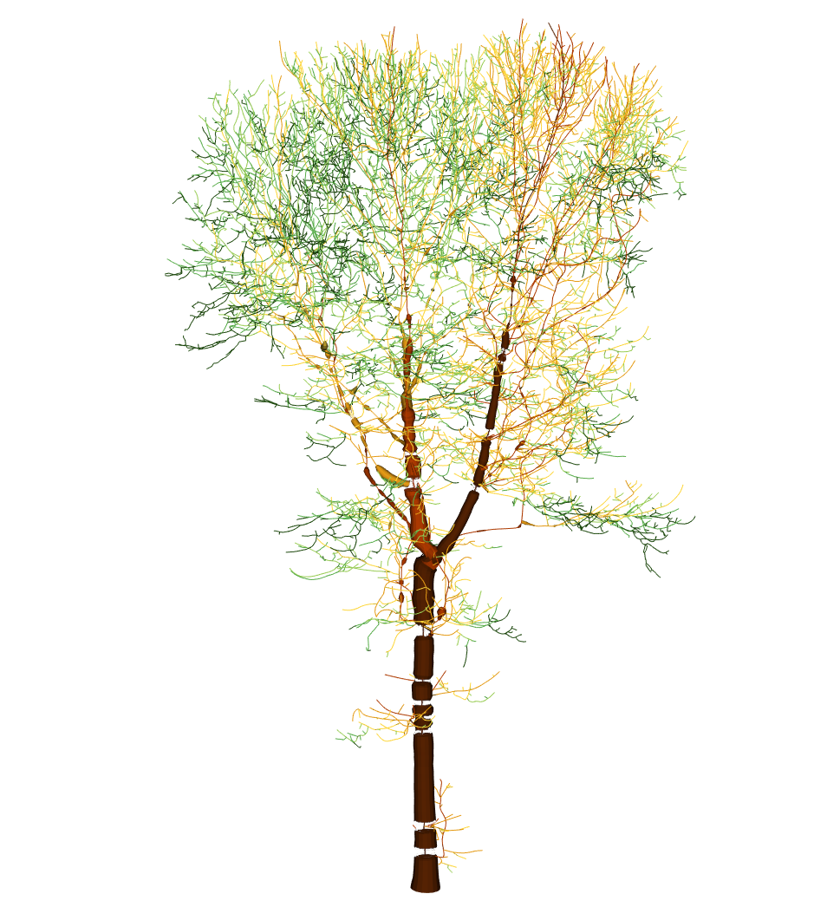
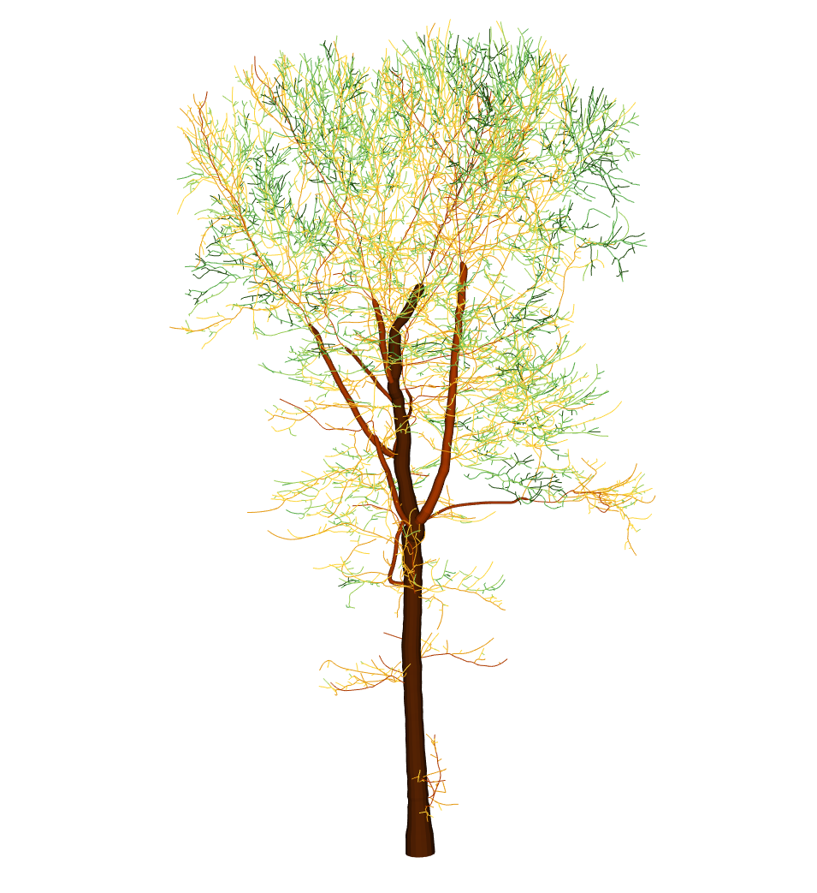
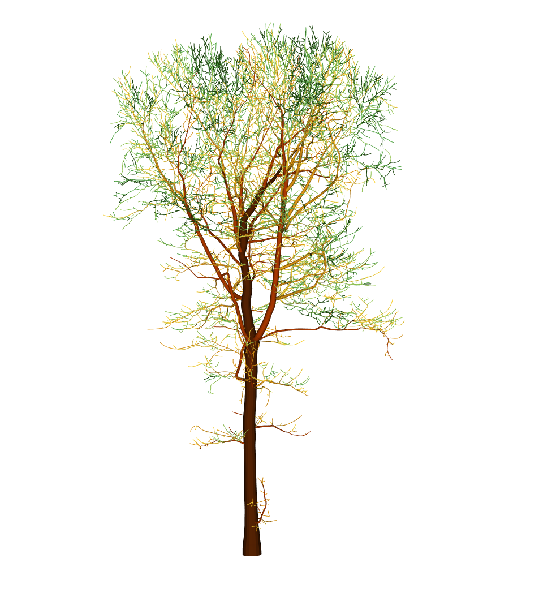
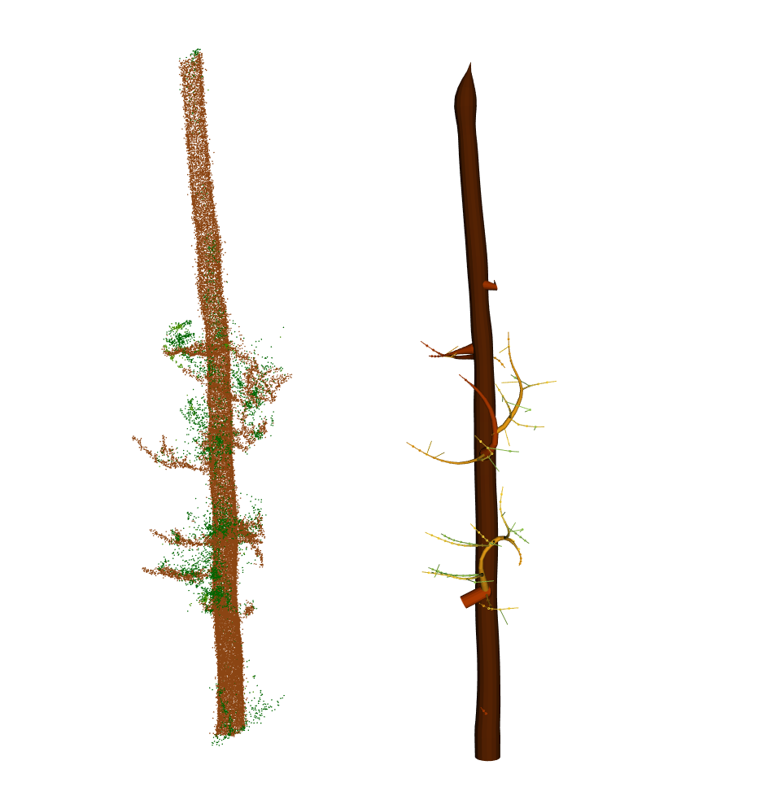
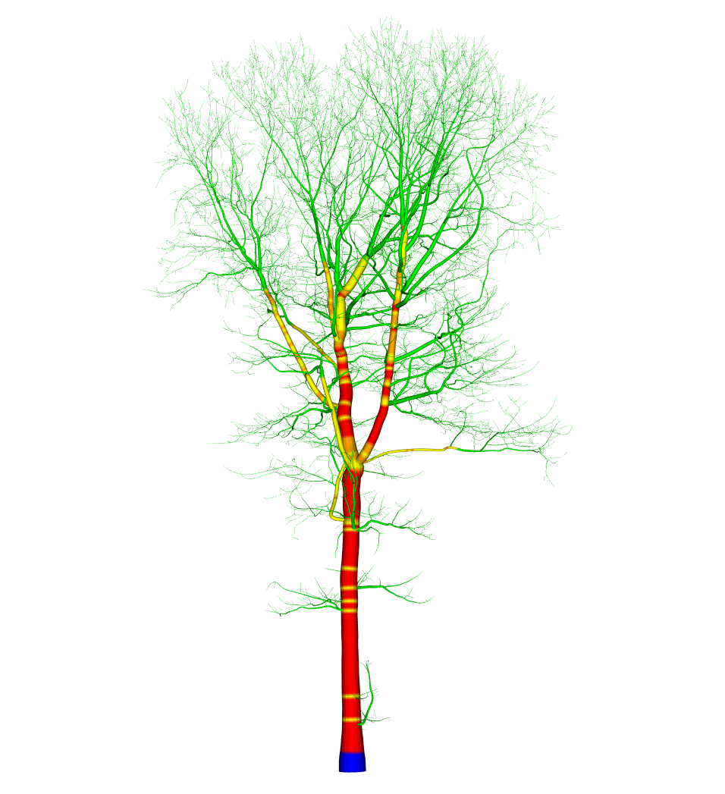
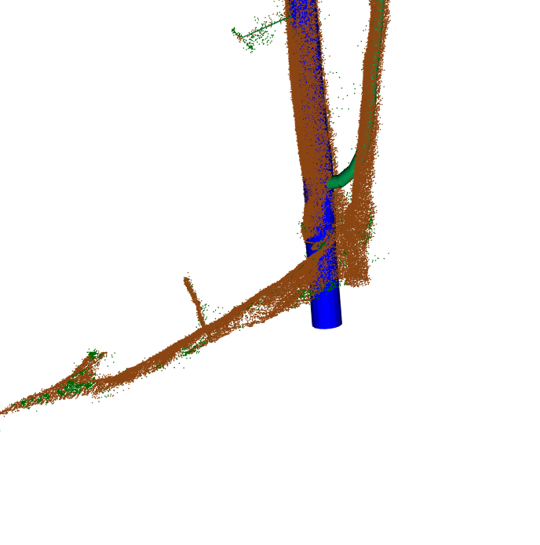

# Quantitative Structure Model

Arbor's QSM engine was designed with one objective in mind: processing large-scale forest datasets automatically and reliably.

Unlike traditional workflows, where a handful of trees are manually extracted, cleaned, and reconstructed one by one, Arbor operates at a completely different scale. Its goal is to generate tens of thousands of QSMs at a pace of roughly 10 3D models per second, with no human intervention, even when segmentation is imperfect and many detected trees are small, leaf-on, or otherwise difficult to measure.

This chapter presents the principles, algorithms, and design choices behind Arbor's QSM engine. Understanding these internals helps explain both the strengths of the approach and the data requirements needed to achieve reliable measurements at scale.


<div class="gallery">
```{r, results='asis', echo=FALSE}
# List images in the folder
img_files <- list.files("figures/chap_qsm/", full.names = TRUE, pattern = "qsm")

# Generate markdown: thumbnail + link to full-size
for (img in img_files) {
  cat(sprintf('<p><a class="lightbox" href="%s" data-gallery="semantic"></a></p>', img, img))
}
```
</div>

<!--
## TreeQSM and AdTree

### TreeQSM

[TreeQSM](https://github.com/InverseTampere/TreeQSM) remains the most accurate and reliable QSM tools available praised by the community. It works particularly well because TreeQSM was designed for (1) point clouds acquired with Terrestrial Laser Scanners (`TLS`), which are much more accurate than Mobile Laser Scanners (`MLS`) and (2) it was designed to work on individual trees that were segmented manually, and therefore are assumed to be perfectly segmented, either leaf-off or with manually performed wood/foliage segmentation.

However, these 2 points do not scale in production. In a production-ready context, we work with MLS and automatic segmentation, which may contain segmentation errors and more noise and more residual foliage and more issue overall. We need tools that are more robust.

[With MLS sampling, the level of detail we can achieve on small objects is physically limited. Each white line is the same size, showing that objects that are too small end up being approximately the same size, even in a perfectly segmented tree.](figures/chap_qsm/measure.png){width=500px}

Moreover, TreeQSM is extremely slow. Processing a single tree can easily take over five minutes. This does not scale: five minutes per tree times 20,000 trees equals roughly a solid month of computation. Processing 20,000 trees is not uncommon in production and we did it in some projects.

So, while TreeQSM was a game-changer when released in 2015 and is still top most accurate tool:

- It is very slow
- It is not designed to handle high levels of noise
- It is not designed to handle misclassifications and incorrect segmentations

It does not scale to production environments.

### AdTree {#sec-adtree}

The advantage of [AdTree](https://www.mdpi.com/2072-4292/11/18/2074) lies in its ability to compute visually convincing QSMs in less than five seconds, an impressive speed that makes it highly scalable in production.  

However, literature has repeatedly shown that AdTree is not accurate. Studying the source code of AdTree helps us understand its strengths and weaknesses.

The strategy of AdTree is to **NOT** measure the tree. This may sound bold, but it is essentially what AdTree does if you read the source code.

::: {.callout-important}
The academic paper describing AdTree presents a slightly different approach. However, the paper does not match the source code or the output produced by AdTree. The explanation below reflects the actual implementation more accurately.
:::

AdTree builds a skeleton of the tree and measures **only the root diameter**. It then reconstructs the tree using simple rules: the end of a branch always has a 0 cm diameter and the stem taper is linear.

It starts with the main axis, measuring its root diameter:

{width=200px}

The tree is essentially a cone that starts with the measured root diameter and tapers to 0 at the tip. In this book we call it **conic allometric model**.

{width=200px}

Stem taper specialists may disagree, but as a first approximation, this makes sense. The same rule is applied to each branch based on its length. For example, a branch that is half the length of the main trunk inherit the trunk diameter at half its length.

{width=200px}

This is applied globally to reconstruct the full tree:

{width=200px}
{width=200px}

This approach is clever: it produces **very realistic trees** with **a single measurement** (plus skeleton computation). Using more realistic tree proportions, the method generates plausible trees very quickly. Below using a real skeleton:

{width=200px}

The idea is sound, but the implementation is highly sensitive to minor variability near the root. Trees that are not perfectly straight, noise, minor misclassifications, or non-circular trunks, all can very easily lead to incorrect measurements. AdTree can very easily get its unique measurement wrong! And when we have a single measurement to build an entire tree we can't afford an error.

A second and third sources of inaccuracy come from its simple reconstruction rules (conic allometric model). While it generally produce realistic trees, it overestimates branch diameters if branches deviate from the *all-equal branch* assumption which is actually often the case in real trees. In fact conic allometric model does not correspond to realistic assumption in grown trees.

## Arbor QSM

What if we could build a hybrid approach? Measure what can be measured robustly, and reconstruct what cannot be measured using simple rules. This is the approach used by Arbor.-->

## RANSAC Orbicular Fitting

Trees do not have the decency to be perfectly circular, that would be too simple. Circle fitting can underperform because trees deviate from perfect shapes. To better measure tree sizes, we designed an Orbicular Fitting (OF) method. The word *orbicular* refers to biological shapes that are circular-ish, which is precisely the shape of trunks and branches.

For a given cross section of a trunk or branch, we attempt at least three fitting methods and retain the best result:

- **RANSAC circle fitting.** Circle fitting MUST be RANSAC-based. Least-squares
  fitting is unreliable under noisy conditions.
- **RANSAC ellipse fitting.** Ellipse fitting MUST also be RANSAC-based.
- **Complex closed polygon fitting** based on Fourier Harmonic Decomposition (FHD).

Ultimately, our QSMs are cylinder-based, so all fitted shapes are converted into area-equivalent circles. This is demonstrated in the figure below, where OF is applied to various shapes and identifies the best fit. The fitted shape is shown in red; the area-equivalent circle used to build the QSM is shown in purple. Using area-equivalent circles ensures that volumes are preserved while simplifying the shapes.

```{r, echo = F, fig.show='hold', fig.height=5, fig.width=7}
#| fig-cap: "Various cross sections. The fitted shape is shown in red; the area-equivalent circle used to build the QSM is shown in purple. "
fit = arbor:::fit_circloid_cpp

show = function(pt, res)
{
  inliers = pt[res$inliers,]
  plot(pt, asp = 1, main = "", axes = FALSE, xlab = "", ylab = "", cex = 0.25)
  points(res$center_x, res$center_y, pch = 3, cex = 2)
  points(inliers, col = "blue", pch = 18)
  lines(res$nodes, lwd = 2, col = "red")
  symbols(res$center_x, res$center_y, circles = res$radius, inches = FALSE, add = T, fg = "purple", lwd = 3)
  box()
}

set.seed(123)
n = 400
theta <- seq(0, 2 * pi, length.out = n)
xc = 12
yc = 18.5
r = 2
a <- 2.5
b <- 1.5

theta_rot <- pi / 4  # 45 degrees
Rx <- matrix(c(
  1, 0, 0,
  0, cos(theta_rot), -sin(theta_rot),
  0, sin(theta_rot),  cos(theta_rot)
), ncol = 3, byrow = TRUE)

set.seed(123)
ex = rnorm(n, 0, 0.2)
set.seed(321)
ey = rnorm(n, 0, 0.2)

circle_points <- matrix(c(xc + r * cos(theta) + ex,
                          yc + r * sin(theta) + ey,
                          runif(n, 0, 2)), ncol = 3, byrow = FALSE)


ellipse_points <- matrix(c(xc + a * cos(theta) + ex,
                           yc + b * sin(theta) + ey,
                           runif(n, 0, 2)), ncol = 3, byrow = FALSE)

theta = seq(0, pi, length.out = n)

hcircle_points <- matrix(c(xc + r * cos(theta) + ex,
                           yc + r * sin(theta) + ey,
                           runif(n, 0, 2)), ncol = 3, byrow = FALSE)


hellipse_points <- matrix(c(xc + a * cos(theta) + ex,
                            yc + b * sin(theta) + ey,
                            runif(n, 0, 2)), ncol = 3, byrow = FALSE)

rcircle_points <- circle_points %*% t(Rx)


theta <- seq(0, 2 * pi, length.out = n)
set.seed(42)
R = 3+0.5*cos(theta)+sin(2*theta) + runif(n, -0.25, 0.25)
x = xc + R*cos(theta)
y = yc + R*sin(theta)
z = runif(n, 0, 2)
circloid_points = cbind(x,y,z )

rcircloid_points <- circloid_points %*% t(Rx)

theta = seq(0, pi, length.out = n)
set.seed(314)
R = 3+0.5*cos(theta)+sin(2*theta) + runif(n, -0.25, 0.25)
x = xc + R*cos(theta)
y = yc + R*sin(theta)
z = 0
hcircloid_points = cbind(x,y,z )


opar = par(mfrow = c(2, 3), mar = c(1,1,1,1))

# ================
# Check circle
# ================

pt = circle_points
tol = 0.15
res <- fit(pt, tolerance = tol)

show(pt, res)

# ================
# Check ellipse
# ================

pt = ellipse_points
tol = 0.15
res <- fit(pt, tolerance = tol)
show(pt, res)

# ================
# Check circloid
# ================

#pt = circloid_points
f <- system.file("extdata", "complex_slice0.las", package="arbor")
las = lidR::readLAS(f)
pt = sf::st_coordinates(las)

res <- fit(pt, tolerance = 0.03, complexity = 3)

show(pt, res)


# ================
# Check real
# ================

f <- system.file("extdata", "complex_slice2.las", package="arbor")
las = lidR::readLAS(f)
pt = sf::st_coordinates(las)

res <- fit(pt, tolerance = 0.03, complexity = 3)

show(pt, res)

# ================
# Check real
# ================

f <- system.file("extdata", "complex_slice1.las", package="arbor")
las = lidR::readLAS(f)
pt = sf::st_coordinates(las)

res <- fit(pt, tolerance = 0.03, complexity = 3)

show(pt, res)

# ================
# Check real
# ================

f <- system.file("extdata", "double_ring_slice0.las", package="arbor")
las = lidR::readLAS(f)
pt = sf::st_coordinates(las)

res <- fit(pt, tolerance = 0.03, complexity = 3)

show(pt, res)
par(opar)


```

The reader may wonder: if any shape can be fitted with FHD, then circles and ellipses are merely special cases of FHD and therefore redundant.

This is technically true, and some studies have relied exclusively on FHD. However, Arbor is a production tool that must be robust to real-world data, not just benchmark data. FHD is really weak when data is incomplete (trees not fully sampled, classification errors). It is also sensitive to noise, and underperforms in general unless the input data is **really** clean. RANSAC circle fitting, on the other hand, is extraordinarily robust when well-designed, though less accurate when shapes deviate significantly from circular.

OF finds the most robust fit available. When a clean, arbitrary shape can be reliably fitted, OF retains it, but it falls back to a more robust alternative when necessary, as illustrated below where an ellipse was selected as the best fit.

```{r, echo=FALSE, fig.height=3, fig.width=3}
pt = hcircloid_points
tol = 0.2
res <- fit(pt, tolerance = tol, complexity = 3)
opar = par(mar = c(1,1,1,1))
show(pt, res)
par(opar)
```

## Skeleton

For the skeleton reconstruction, Arbor draws inspiration from the [aRchi R package](https://besjournals.onlinelibrary.wiley.com/doi/10.1111/1365-2435.13678) (Martin-Ducup et al., 2020). We reimplemented the core idea in C++ for scalability and introduced several improvements to enhance branch-tracking capabilities.

Like `aRchi`, the point cloud is first clustered into layers. Unlike `aRchi`, which uses horizontal layers, we instead create layers based on the geodesic distance to the ground. Compared with horizontal layering, this approach naturally aligns with branch orientation, significantly improving the second processing step.

As in the original `aRchi` method, each layer is then analyzed and subdivided into clusters using `dbscan`. 


For each cluster, the centroid is estimated using either Orbicular Fitting or the barycenter, depending on whether a reliable Orbicular Fitting solution can be obtained. This yields all the nodes of the QSM skeleton.

{width=400px}

Finally, nodes are connected using a greedy chain-growing strategy, which is the original `aRchi` connection method and is arguably more robust than classical state-of-the-art graph-based approaches such as Minimun Spanning Tree (MST) or PST, often found in the literature. This is not to say that MST or PST are poor methods; rather, globally optimal solutions do not scale robustly to real data because they are highly sensitive to gaps and other imperfections commonly found in point clouds. In contrast, the `aRchi` method is a locally optimal solution that reconstructs trees based on growth logic, making it inherently more suitable for tree structures. We did not modify the method itself; we simply reimplemented it efficiently.

 growth-based strategy.](figures/chap_qsm/skel.png){width=400px}

## Preshot QSM

The QSM algorithm first computes a *preshot* QSM. This preshot QSM is generated virtually instantaneously without taking any measurements. Using the height of the tree, the routine estimates a plausible DBH from allometric relationships and linear stem tapper decrease to the tip.

The goal of the preshot QSM is **not** to be accurate. Virtually any reasonable allometric relationship between height and DBH could work. The objective is simply to obtain a plausible tree model without performing any expensive computations. By default, Arbor uses the equation from [Griese N. et al. (2025)](https://doi.org/10.1038/s41597-025-06421-7) to estimate DBH from tree height. 

For the example shown below, this relationship substantially underestimates the true size of the tree.

{width=400px}

However, this is not an issue. The preshot QSM is used only as a computational optimization tool. Despite being volumetrically inaccurate, it contains valuable information that can dramatically reduce processing time.

Among other things, it provides an estimate of the large proportion of nodes that are too small to be measured reliably. There is no need to spend computational resources attempting to measure structures that are, in practice, below the measurable limit of the sensor. In this example, the preshot QSM predicts that 26,000 out of 29,000 nodes (90%) are likely smaller than 2 cm in diameter. As a result, more than 90% of the measurement effort can be skipped. Even if the allometric prediction is inaccurate and the actual cross-sections are somewhat larger, the impact on the optimization strategy remains gigantic. We can roughly bypass 90% to 95% of the CPU effort initially required.

The preshot QSM also indicates whether complex buttress detection should be activated, or whether computation time can be saved by desactivating it. Restricting Orbicular Fitting to simpler geometric shapes reduces computation time.

{width=400px}

::: {.callout-warning}
We are aware that many readers may be reluctant to use allometry, especially curves that may not fit their country or specific local context. It is true that generic equations are not representative of local conditions.

For this reason, we want to emphasize once again that this is only a **preliminary QSM**, which is **not used in the computation of the final QSM**. It is only used as a computational trick to optimize processing. And we carefully chose a tree to illustrate the book that if completely off prediction to demonstrate that the allometry has little importance.
:::

## Diameters

Using the Orbicular Fitting approach and the skeleton's cylinder orientations, we measure diameters **wherever possible**. Cylinders with poor fitting, insufficient points, or diameters too small to measure reliably are skipped or discarded. In the example used in this book, 257 valid measurements (v0.14.0) were retained along the main axis and major branches. Other measurements were considered too weak to be retained.

{width=400px}

The gaps are then interpolated. These interpolated gaps provide highly reliable estimates.

{width=400px}

Branches that cannot be measured are reconstructed hierarchically using a pipe model. This ensures that unmeasurable sections, which are entirely speculative, are grounded in biological theory.

While there is much to be said about pipe models and their biological validity, in practice, the pipe model helps to reconstruct a small volumetric fraction of the tree in a highly realistic way and based on strong upstream measurement. Pipe model is virtually instantaneous to compute.

This approach avoids attempting to measure what cannot be reliably captured, thereby saving time and increasing robustness by eliminating erroneous data points. The reconstructed sections rely on multiple reliable anchor measurements, making the entire process both robust and accurate.

{width=400px}


|      | Nodes (%) | Volume (m³) (%) | Cumulative (m³) (%) |
| :--- | :--- | :--- | :--- |
| **Measured** | 257 (0.8%) | 3.55 (72%) | 3.55 (72%) |
| **Interpolated** | 102 (0.3%) | 0.25 (6%) | 3.82 (78%) |
| **Pipe Model** | 28,661 (98%) | 1.09 (22%) | 4.91 (100%) |

## Extension to the Ground {#sec-prologation}

The QSM initially misses 15 to 50 cm because the point cloud was cut above the ground during data preparation (@sec-lowpoints). Arbor uses the recorded Height Above Ground (HAG) from the point cloud and the skeleton orientation to extend the QSM realistically to the ground, even for bent or non-straight trees.

## Non-measurable Trees {#sec-tinytree}

Arbor segments and builds QSMs for saplings and small trees whose sizes fall below the measurable limits of point clouds. Typically, a 4 m tree is expected to have a diameter of approximately 3 cm. It may be slightly smaller or slightly larger, but in all cases, accurate measurement with MLS is physically infeasible. Worse, it is dangerous.

With thousands of tiny, highly intricate saplings covered in foliage, attempting manual measurements would inevitably lead to false measurements and poor 3D reconstructions in many cases.

::: {.callout-note}
In this sense, Arbor differs from other QSM software such as AdTree, TreeQSM or Computree. Other software expects a single input tree that has already been verified by the user as a valid and well-segmented tree. They produce few errors because no user in the world feeds them with noisy, intricate, 3 meters saplings. 

Arbor, on the other hand, batch-processes hectares of forest and is automatically fed with all saplings, segmentation errors, and noise, at a pace of 10 QSMs per second for thousands of QSMs, with no guarantee that the input is perfectly segmented. Arbor must therefore remain robust in all cases.
:::

In such cases, we rely on allometry. By default, Arbor uses the equation from [Griese N. et al. (2025)](https://doi.org/10.1038/s41597-025-06421-7) to estimate DBH from tree height. If the predicted DBH falls below a given threshold, the standard QSM algorithm is not applied. Instead, an *had oc* QSMs is built from the theoric DBH and the skeleton.

The default threshold is 6 cm, which ensures that saplings and other non-measurable trees are modeled realistically. Forcing a direct measurement would lead to significantly worse results. Although the relationship between height and diameter is species- and biome-specific, inter-species variation within this size range is assumed to be limited.

 with annotations for the book. Scatter plot showing the relationship between DBH and tree height. Blue annotations were added to highlight the range of trees not actually measured by Arbor.](figures/chap_qsm/griese_annoted.png){width=400px}

::: {.callout-important}
The allometry is **NOT** used to build standard QSMs. It is used only to discriminate between trees that can be measured and those that cannot, in order to build a plausible 3D model in these specific cases. 

The accuracy of the allometric model is therefore not critical. Trees that are measurable will still be reconstructed properly even with an inadequate allometric model. Purely allometric QSMs are flagged and generate a warning so users can easily identify them.
:::

## Non-measurable Trees - edge cases {#sec-edgecases}

In some very specific cases, however, this approach reaches its limits. For example, we modeled a cacao plantation in Cameroon where trees are heavily managed and differ substantially from the Griese et al. model. Typically, a 5 m tree may have a diameter of 12 cm, whereas the Griese et al. model predicts approximately 4.5 cm, an underestimation by a factor of about 2.5 tp 3 and all tree are around 5 meters height. As a consequence, most trees are incorrectly flagged as non-measurable and are therefore not measured using the standard QSM pipeline.

Overall the approach described in previous section may fall short in non-forested areas such as plantations of fruit trees, urban areas, heavily managed trees where small trees can become particularly big compared to typical forest trees of the same height that compete differently for ressources.

In such cases, parameter tuning becomes mandatory. Users can select an alternative allometric model, lower the minimum detectable DBH or scale one existing model. For the cacao plantation we scaled Griese's model by a factor of 2.5. Again, the accuracy of the model is **NOT** critical. We simply scaled the Griese et al. model to ensure that measurable trees are no longer excluded.

```r
params$qsm$allometry_name = "Griese2025"
params$qsm$allometry_scale = 2.5
params$qsm$min_measurable_dbh = 0.04

available_allometries()
```

## Broken Trees {#sec-broketree}

Broken trees do not follow the typical rules. They are often small in height but can still have a large diameter, and they do not terminate with a near-zero radius. Under the previous rules (@sec-tinytree), a broken tree may be classified as small in height, leading to a predicted DBH below the measurement threshold. As a result, the tree is not measured, allometry is applied, and the tree is consequently severely under-sized.

In practice, the internal routine includes safeguards. Without going into implementation details, the general idea is to detect enough valid and sufficiently large measurements to bypass the regular algorithm and instead use an alternative approach that is less sensitive to missing tips.

::: {.callout-caution}
Broken tree detection is experimental because of the lack of a large dataset of broken trees for validation. It can be disabled with `params$qsm$broken_detection_enabled = FALSE`.
:::

{width=300px}

<!--
### Safeguards {#sec-safeguards}

In some rare edge cases, which nonetheless occur when computing tens of thousands of QSMs — as Arbor is designed to do — some trees may be very poorly measured. This happens because Arbor is capable of fully unsupervised processing, including the ability to handle non-measurable trees. Real-world data contain virtually infinite pitfalls, and some of them will inevitably arise on one tree or another.

As a production tool, Arbor includes safeguards. We prefer a realistic and plausible tree that is not directly measured (100% inferred) over a completely incorrect reconstruction. To achieve this, we again rely on [Griese N. et al. (2025)](https://doi.org/10.1038/s41597-025-06421-7). If a measured tree is more than three times larger than expected (which is far beyond the $2\sigma$ threshold used by the authors to trim outliers and thus allows large inter- and intra- specicies variation) the measurement is discarded and conic allometry is used instead.

This is illustrated in an extreme case in the figure below. In this 10 m; 8 cm tree, everything that could go wrong did go wrong. The semantic segmentation is poor, the skeleton reconstruction is unreliable, and although the diameter measurements are not too bad (not visible in the figure), they fall into an unfortunate configuration. The small number of valid measurements, combined with improbable outliers, leads to a completely irrelevant polynomial fit.

Arbor detects such cases and replaces them with a conic allometry. The resulting tree is still imperfect, but at least it is volumetrically consistent with a real tree.

![Example of an extreme failure case handled by Arbor’s safeguards. This 10 m tree illustrates a worst-case scenario where semantic segmentation and skeleton reconstruction are poor, and a limited number of valid diameter measurements—combined with outliers—lead to an unrealistic polynomial fit. Because the measured dimensions exceed plausible limits, Arbor discards the measurements and replaces them with a conic allometry. Although the resulting reconstruction remains imperfect, it is volumetrically consistent with a real tree.](figures/chap_qsm/gards.png){width=500px}


::: {.callout-note}
This type of problem occurs rarely and only in young trees, small and branchy enough to provide too few reliably measurable diameters.
:::
-->

## Fitting Quality Assessment

The QSM records a `quality` attribute (accessible via `qsm$quality`) that indicates the quality of radius fitting. The codes are defined as follows. The associated colors are arbitrary and correspond only to the figure below; the default color scheme may change in future versions.

- **0 – Unknown**: Undefined state. This is a bug, it should never occur.
- **1 – Prolongation**: (blue) The segment belongs to the prolongation region (see @sec-prologation). No points are available in this region, therefore no measurements can be performed.
- **2 – Reconstruction**: (green) No measurements are available. Radii are reconstructed purely from architectural assumptions based on pipe model. Equivalent to poor quality.
- **3 – Interpolation**: (yellow) No direct measurements are available, but we are between valid measurements. Interpolation provides serious plausible radius estimates. Equivalent to medium quality.
- **4 – Good Orbicular Fitting**: (orange) A valid measurement is available, but it does not meet the criteria for top-quality fitting. This typically occurs when either full 360° coverage is missing or the inlier-to-outlier ratio is insufficient. Equivalent to good quality.
- **5 – Excellent Orbicular Fitting**: (red) Full high-quality orbicular fitting. Few outliers. Equivalent to excellent quality.

```r
plot(qsm, color = "quality")
```

{width=500px}

## Message {#sec-warnings}

In version 0.14.0, the function `qsm()` can throw four warnings:

- For non-measurable trees because they are too small and therefore not reliably measurable (@sec-tinytree).
- For insufficient measurements.
- For measured root diameters more than 3 times greater than the expected DBH based on allometry assumption. We are so far from expectation that a manual check may be required.
- For broken tree detection.

It is possible to retrieve the warning emitted by a QSM with `qsm_message()`. This section written in June 2026 may become out of sync when the reader is reading these pages but `qsm_message()` will remain a valid command.

## Other Details

We have not gone into depth about how the architecture is recomputed, how the quality of the RANSAC Orbicular Fitting is assessed, how errors near the base of the tree are handled for robustness, or how unnecessary computations are skipped. Throughout this book, many such details are intentionally omitted. Otherwise, the book would be endless, and the effort required to explain and illustrate every single step would be colossal. Our goal here is to present the overarching concepts to provide a clear overall understanding.

One interesting feature is the ability to handle problematic situations at the base of trees. Semantic segmentation is not perfect, and even when it is perfect, the forest does not have the courtesy to conform to our reconstruction rules. In the example below, a tree has fallen between a forked tree. The wood classification is correct, the irregular structure at the bottom is indeed wood, and it is technically connected to the tree of interest. From a segmentation standpoint, this is valid. However, such a structure would break the QSM reconstruction.

As shown in the image, our QSMs remain robust in these situations and are extended to the ground without following the fallen trunk.

{width=300px}

## Final Note

Arbor’s QSMs are designed to be fast and robust. We are no longer dealing with single trees manually extracted and carefully inspected before generating one QSM at a time. Instead, Arbor is built to process tens of thousands of QSMs automatically, in contexts where semantic and instance segmentation are imperfect, and where 90% of instances may be leaf-on, non-measurable saplings.

To achieve this, Arbor’s QSM module is intentionally strict and highly conservative in what it considers a valid measurement. As a rule of thumb, if a tree is only partially sampled and Arbor fits a valid circle to a half cross-section, the measurement may still be rejected, even if the fit itself is correct (RANSAC is highly robust). For this reason, trees should be sampled over 360 degrees.

Partially scanned trees, such as those commonly obtained from TLS data, may be technically measurable, but Arbor will generally fail to measure them reliably. A warning should be issued when Arbor detects poor overall measurement quality.

As stated in previous chapters: production-grade software requires production-grade data.

## Code

### Minimal snippet

If readers have followed the book so far, they should now have a variable `las` in which every tree has been segmented, each with its own unique ID. The following code sample selects a random tree, computes its QSM, and plots the result. Loop over all trees is done via the `qsf()` function (@sec-qsf).

```r
# Sample a random tree
id   <- sample(unique(las$treeID), 1)
tree <- lidR::filter_poi(trees, treeID == id)

qsm  <- qsm(tree)
x <- plot_semantic(tree)
plot_qsm(qsm, add = x)
```

::: {.callout-tip}
A `qsm` object is simply a `data.frame` with an additional class to enable convenient printing and plotting methods. Use `as.data.frame(qsm)` to manipulate a QSM as a `data.frame`. 
:::

### Function list

- `qsm()` to build a QSM
- `qsm_dbh()`, `qsm_volume()` to extract DBH and Volume
- `qsm_stats()` to extract various useful informations from the QSM.
- `qsm_write()` for saving the QSM in `.qsm`, `.obj`, `.ply`, `stl`, `.csv` for analyzing or for rendering in 3D software. We recommend `.qsm` for storing and `.obj` for rendering in third-party 3D software.
- `qsm_read()` to read `.qsm` or `.csv`.
- `qsm_message()` for logs.
- `qsm_merchandable()`, `qsm_stem()` (see @sec-opforestry)
- `plot_qsm()` or `plot()` for 3D rendering

### Full Code


```r
library(lidR)
library(arbor)

params <- arbor_parameters_default
params$global$cut_above_ground = 0.25
filter <- "-keep_random_fraction 0.25"

las <- readTLS(file, select = "xyz", filter = filter)

las <- hybrid_homogeneization(las)
las <- segment_ground(las)
las <- wood_likelihood(las, params)
las <- segment_semantic(las, params)
see <- find_seeds(las, params)
las <- segment_instance(las, see, params)
las <- flag_small_trees(las, max_height = 2)
las <- flag_buffer(las, see, -buffer)

# Sample a random tree
id   <- sample(unique(las$treeID), 1)
tree <- lidR::filter_poi(las, treeID == id)

qsm  <- qsm(tree, params)
x <- plot_semantic(tree)
plot_qsm(qsm, add = x)
```
