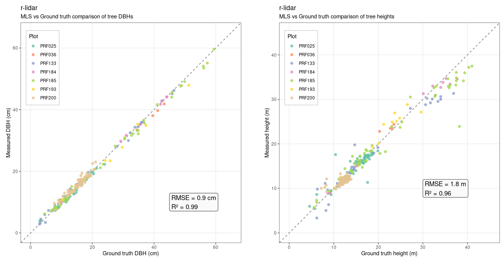
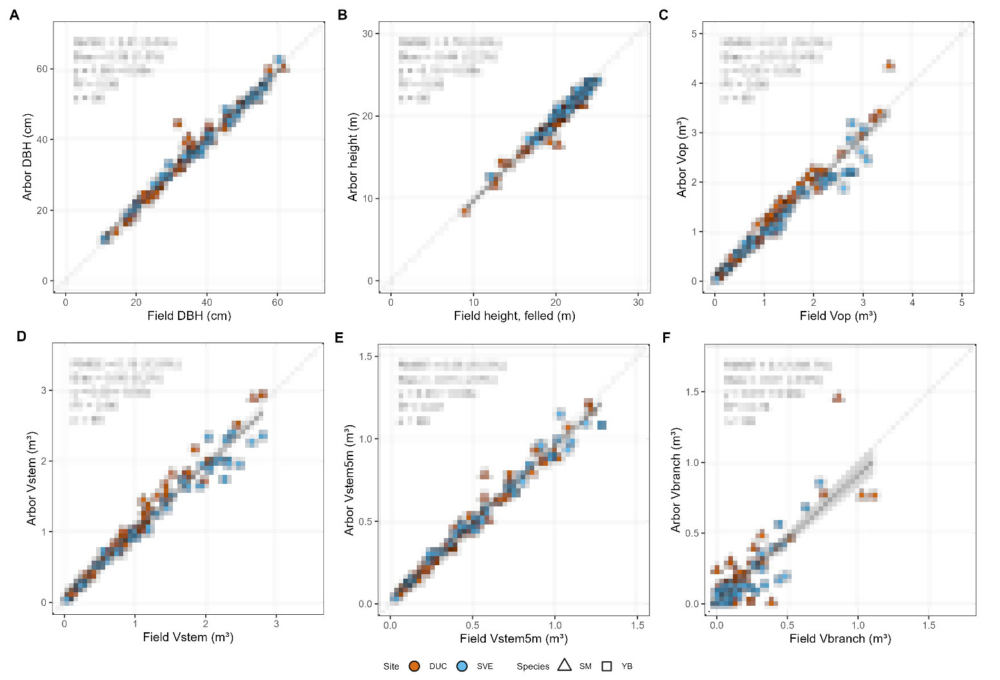
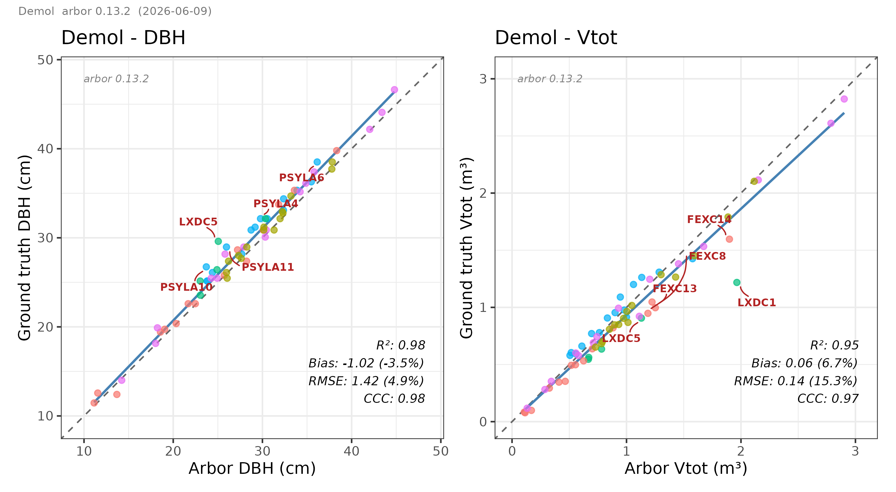
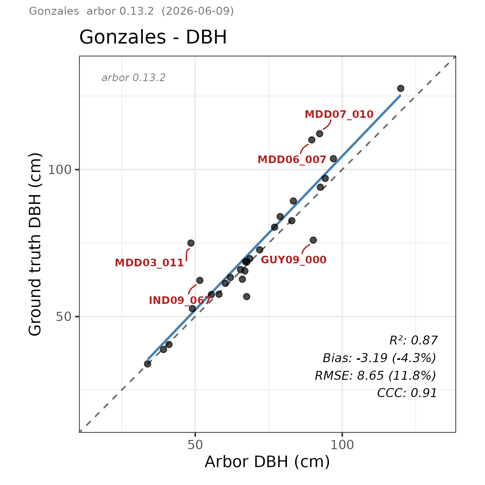
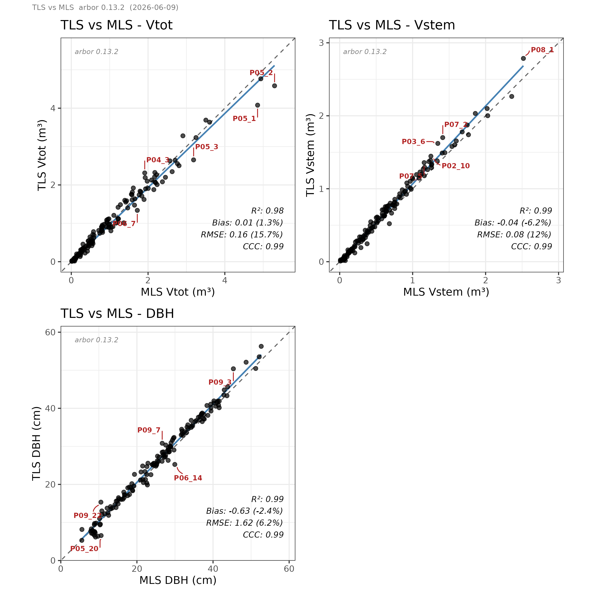
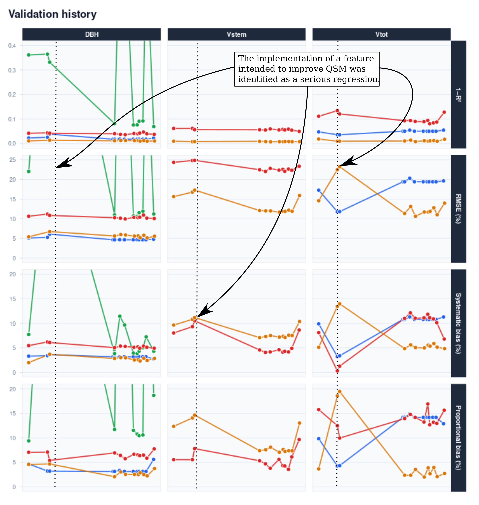

# Benchmarks - Results

In this book, we have walked through all the steps of MLS and TLS processing. It is now time for benchmarking. Arbor has been tested on numerous datasets; however, only a few actually include validation data. This chapter summarizes the results.

**In all cases, data were processed without supervision using the default parameters, which is one of Arbor's promises: to be parameterless.**

## PRF

In collaboration with [Ontario Forestry Futures Trust-Knowledge Transfer and Tool Development (KTTD)](https://www.forestryfutures.ca/forest-resource-inventory) funded project with Murray Woods and Margaret Penner at Petawawa Research Forest (Ontario, Canada), the validation dataset contains seven 900 m² plots, including the DBH and height of merchantable trees (totaling 300 trees). These results come from a fully automated process without supervision. This represents a real production test.

- DBH validates the QSM's ability to measure the bottom of the tree.
- Height validates that the instance segmentation is correct. Ground truth was measured using a vertex. The reference measurements have actually higher uncertainty than Arbor's estimates, which inflates RMSE.

## Vandendaele (2026)

An independent validation conducted by Natural Resources Canada ([Laurentian Forestry Centre](https://ressources-naturelles.canada.ca/science-donnees/science-recherche/centre-recherche/centre-foresterie-laurentides), Québec) was used to assess the performance of the methodology. The dataset consists of 98 destructively sampled trees from eight 1/4-hectare plots in Québec, Canada, for which reference measurements of DBH, height, operational volume (Vop), and stem volume (Vstem) were obtained. The validation was conducted using a pre-release version of Arbor, without involvement of the r-lidar company in the data collection or reference measurements, ensuring an independent assessment under real-world conditions.

All results were produced using a fully automated, unsupervised processing pipeline. This constitutes a real-world production test, as it reflects end-to-end processing with Arbor on field data without manual intervention.

::: {.callout-caution}
This independent validation study has been submitted to a peer-reviewed journal and is currently under review for publication. In accordance with the authors of the study, the detailed validation results are not disclosed in this book at this stage. The results will be made publicly available once the manuscript has been accepted for publication and are consequently blurred in the image below.
:::

## Demol (2021)

Using the open-access dataset from [Demol et al. (2021)](https://link.springer.com/article/10.1007/s00468-020-02067-7), which contains 66 TLS trees that were already manually segmented, we evaluated QSM accuracy under benchmark conditions. In this dataset, each tree is provided as an individual point cloud with foliage removed, making it well suited for controlled QSM validation.  

The shared files include reference measurements for both DBH and total volume, allowing direct validation of QSM estimates for these two key metrics.  

However, this should not be interpreted as a real production test. Because the trees were already manually isolated and cleaned, the workflow bypasses both instance segmentation and semantic segmentation steps that would normally be required when processing raw point clouds in practical applications.  

Data are available [here](https://zenodo.org/records/4557401) and [here](https://zenodo.org/records/5131717).

## Gonzales (2017)

Using the open-access dataset from [Gonzales et al. (2017)](https://doi.org/10.1111/2041-210X.12904), which contains 38 TLS trees that were already manually segmented, we evaluated QSM performance on isolated trees. In this dataset, each tree is provided as an individual point cloud, but foliage was not removed prior to exportation.  

The shared files include DBH measurements, allowing validation of QSM DBH accuracy. However, no reference volume data were available, so QSM volume estimates could not be assessed. As a result, this benchmark is limited to DBH validation only.  

This should not be interpreted as a true production test. Since the trees were already manually isolated, the workflow bypasses the instance segmentation step normally required in practical applications. In addition, although semantic segmentation is still applied for QSM reconstruction, its impact on volume estimation cannot be evaluated because no ground-truth volumes are available.

Data are available [here](https://data.4tu.nl/articles/_/21552084/1).

{width=400px}

<!-- ## (unpublished)

This dataset was developed in partnership with a Belgian team and has never been made publicly available. Consequently, no further details about the dataset are provided here.

This section is included as part of the private beta release of Arbor shared with the Belgian team and may or may not be made public, depending on the partners' agreement.

{width=600px}
-->

## MLS vs TLS

For this test, we used the dataset from  [Vandendaele et al. (2024)](https://cdnsciencepub.com/doi/10.1139/cjfr-2023-0202?utm_source=researchgate.net&utm_medium=article), comprising 150 trees sampled using both terrestrial laser scanning (TLS) and mobile laser scanning (MLS). Readers are referred to the original publication for a detailed description of the dataset and acquisition protocols. In this analysis, we used the $MLS_{15}$ dataset (see original article).

We generated QSMs for each of the 150 TLS–MLS tree pairs and evaluated agreement between the two acquisition modalities. In the original study, TreeQSM showed a proportional bias of approximately 30% for total volume and −10% for stem volume when MLS-derived estimates were compared with their TLS counterparts (see Figure 5 of the original study).

In contrast, arbor showed substantially smaller differences between MLS- and TLS-derived estimates, with proportional biases of approximately 3% and 6% respectively . These results indicate that arbor is less sensitive to differences in point-cloud acquisition modality and provides more consistent volume estimates across TLS and MLS.

## Other

Arbor has also been evaluated on additional datasets provided by international research teams. Due to the lack of authorization for public disclosure, the corresponding results cannot be shared. Nevertheless, these independent evaluations produced results generally consistent with those presented in this document.

## Continuous Quality Validation

Arbor is continuously developed and improved to enhance functionality while maintaining the reliability of its existing features. 

Experience shows that improving complex Quantitative Structure Model (QSM) algorithms is challenging. Seemingly beneficial modifications can introduce unintended regressions. Long-term QSM software users are familiar with new releases producing lower-quality results than older versions, forcing a return to previous processing pipelines.

To deliver a highly reliable product, every modification to the Arbor source code is systematically validated against an extensive benchmark dataset before being integrated into a release.

### Comprehensive Validation Framework  {.unnumbered}

Our framework utilizes approximately 1,000 trees for quality assurance and regression testing:

* 300 trees with reference measurements for Diameter at Breast Height (DBH) and stem volume.
* 150 TLS–MLS tree pairs used to assess consistency across acquisition modalities.
* 500+ additional trees representing a wide range of challenging conditions (including saplings, damaged trees, and tropical species) with visually assessed QSM quality.

### Continuous Regression Testing  {.unnumbered}

We monitor **18 quality-control metrics** across **10 benchmark datasets**, tracking **180 validation values** for every update. Any code change affecting performance is detected immediately. 

This continuous validation process ensures that code modifications genuinely improve Arbor's performance and robustness while **preserving the quality standards established by previous releases**.

<!--
-->
