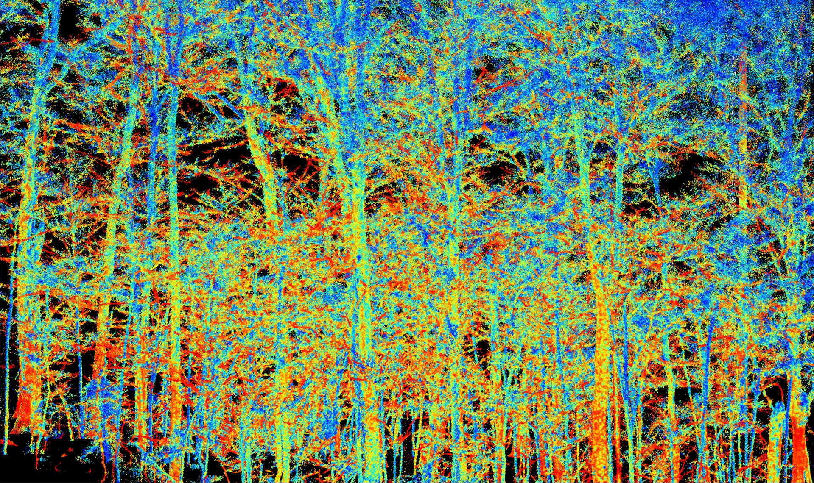
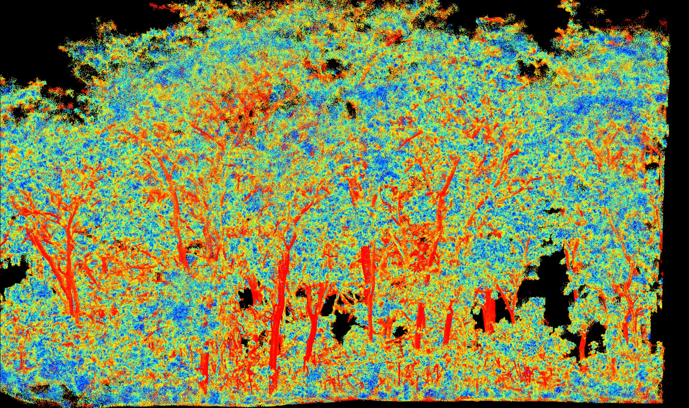
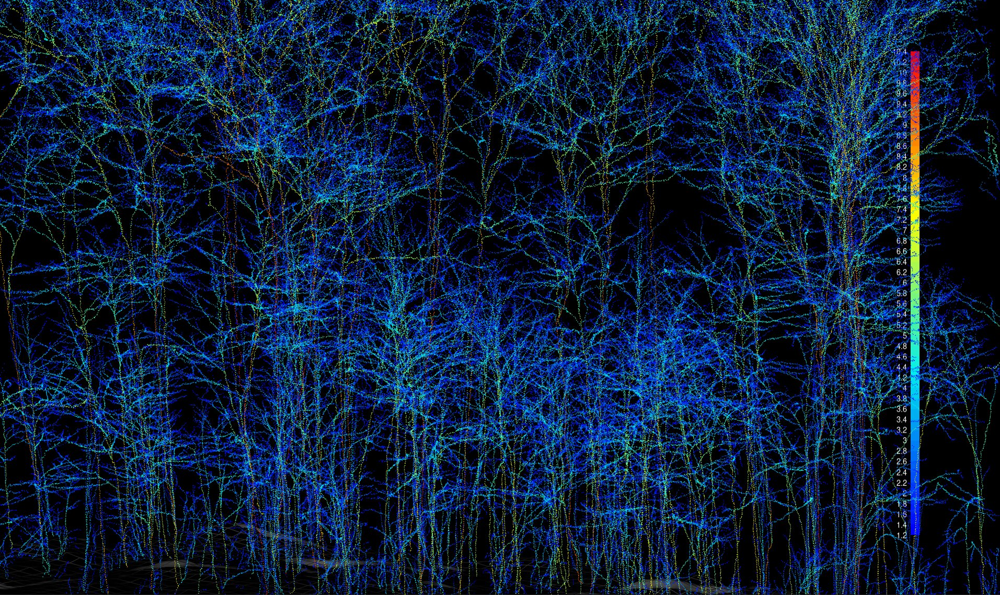
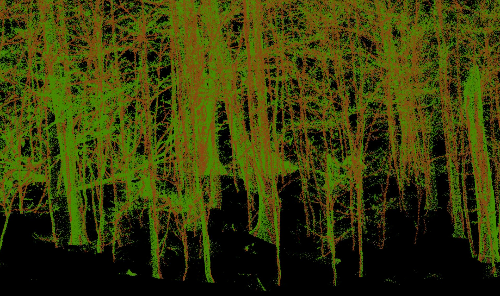
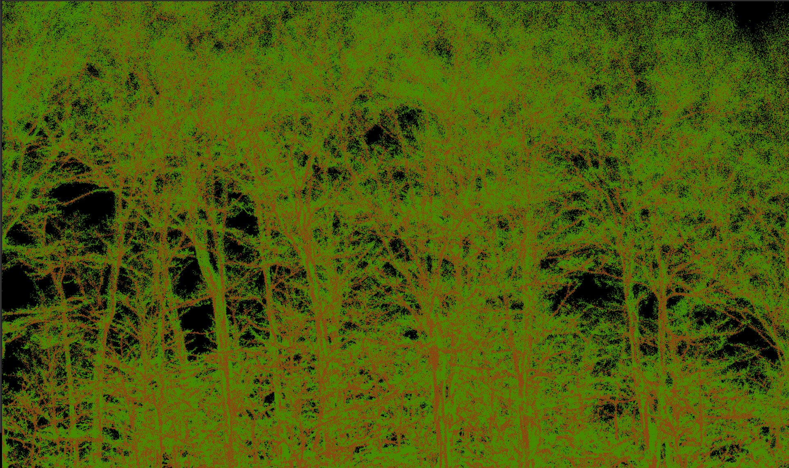
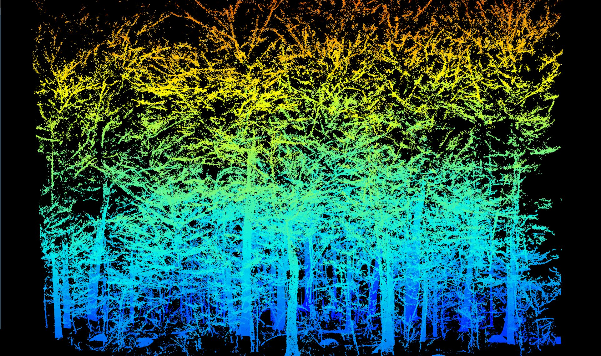
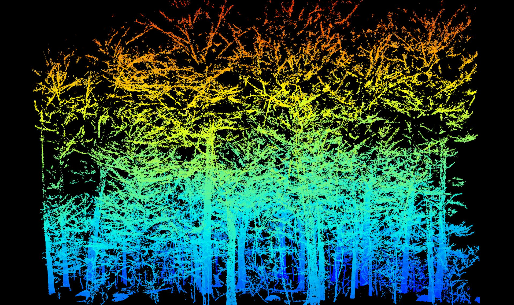
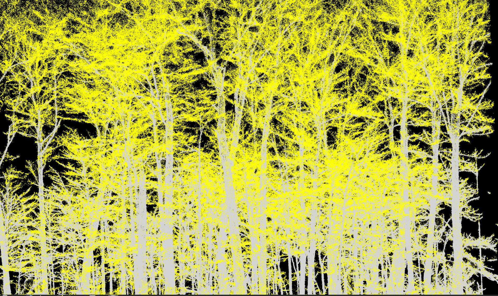
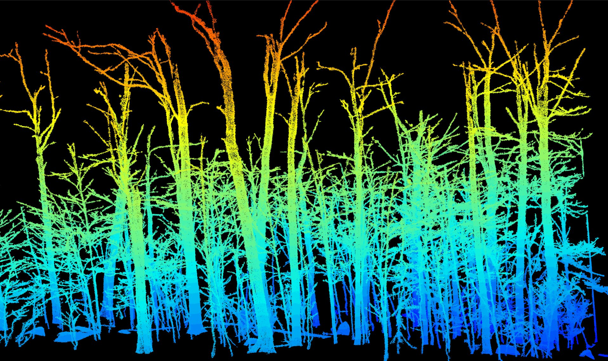

# Semantic Segmentation

Semantic segmentation is the process of assigning a meaningful label to each point in a dataset. In our case, the objective is to classify every point as either *wood* or *foliage*.  

At first glance, the entire pipeline can be summarized in just two lines of code, simple enough to write in seconds.  However, understanding the reasoning, design, and processing steps behind these few lines requires a long and detailed chapter. In the following sections, we'll unpack each of these steps, exploring the ideas and methods that make this possible.

```r
las <- wood_likelihood(las, params)
las <- segment_semantic(las, params)
```

Below a gallery of semantic segmentation for various datasets

<div class="gallery">
```{r, results='asis', echo=FALSE}
# List images in the folder
img_files <- list.files("figures/chap_semantic/", full.names = TRUE, pattern = "semantic")

# Generate markdown: thumbnail + link to full-size
for (img in img_files) {
  cat(sprintf('<p><a href="%s" data-gallery="semantic" class="lightbox"></a></p>', img, img))
}
```
</div>

## Wood likelihood

Computing the wood likelihood can be seen as a kind of *pre-semantic segmentation*.  The core idea is simple: assign a decent probability to each point before to enter the actual segmentation function.

In arbor the wood likelihood is based on the computation of the local anisotropy. Foliage forms noisy clusters of points that are locally *very isotropic*, while wood structures, such as trunks and large branches, tend to be composed of harder, smoother surfaces that are locally planar and therefore *more anisotropic*.

Branches, of course, are not planar, but they are elongated. This elongation also makes them strongly isotropic as well.

At first glance, segmenting wood from foliage might seem straightforward: **foliage = isotropic**, **wood = anisotropic**. End of the chapter, right?

Sadly, no!  Not even close! This simple rule breaks down as soon as noise enters the picture. And there is **a lot** of noise. Mobile laser scanners are prolific noise producers, and forest environments, with their dense and uneven foliage, amplify that noise even further.

<!--In reality, branches are messy and noisy structures entangled in a sea of other noisy points. Trunks, though seemingly stable and isotropic, often appear blurred, fragmented, or partially hidden behind noisy foliage. Add interference from overlapping returns from nearby objects, and you have the perfect recipe for a challenging, noisy nightmare. Most of the difficulties you'll encounter ultimately come down to one thing: **noise!!**.

::: {.callout-note}
From the preface to this chapter, we have discussed "noise" *ad nauseam*, and we will continue to do so. Noise is the critical factor that makes everything complex. TLS is generally better than MLS in this regard, but both have advantages and disadvantages, and unfortunately, some of the disadvantages of TLS are serious enough to not use TLS in production.
:::
-->

Anyway, let's compute wood likelihood based on local anisotropy:


```r
las <- wood_likelihood(las, params)
```

This function inspects the k-nearest neighbors of each point and performs a Singular Value Decomposition (SVD) on each local neighborhood to estimate anisotropy.

The goal here isn't perfection, it's to get a result that looks **good enough**. Ideally, trunks and branches should appear in yellow-red hues, while foliage should appear in blue. This is still an early step in the pipeline, but a clear and consistent visual separation between wood and foliage at this stage will make the following stages far more robust.

In practice, the quality of this step depends heavily on the sensor's accuracy. With a sensor accurate to around 2 cm, hard surfaces are well defined, producing excellent results, it's easy to distinguish wood from foliage. As precision decreases, trunks and branches appear fluffier, and you'll need larger neighborhoods to detect the local isotropy. At 4 cm, results remain quite acceptable; 6 cm can still work in simple conditions. Beyond that, it might be time to retire your device, at that level, you're essentially trying to tell noise apart from more noise.

Let's take a look at some renderings: low anisotropy appears blue, high anisotropy appears red.

```r
plot_likelihood(las)
```



This result is acceptable. The sensor accuracy  here is 4 cm. Small saplings often appear blue, whereas we would expect them to be red, but that's acceptable for small trees, since we have other ways to distinguish wood from foliage. 

Large trees generally appear yellow to red, which is good, even if we would prefer a stronger shift toward red. Medium-sized branches, however, often appear blue, and this remains the most frustrating issue. Small trunks and twigs can reasonably show low likelihood, but medium to large structures should clearly appear yellow to red. Overall, while not perfect, the result is decent and serves its purpose well.

In the following render, the output looks noticeably different. The sensor used is **more precise**, resulting in cleaner, more coherent wood structures that are less "fluffy". The pre-segmentation is significantly improved, but such sensors are still quite expensive at the time of writing (end of 2025).



::: {.callout-tip}
The interest of having an independent and standalone `wood_likelihood()` function is that it can easily be replaced in the processing pipeline by alternative user-defined methods.

For example, in a TLS dataset of cacao trees, we found that anisotropy-based likelihoods were weak because cacao trees leaves can be very large and appear isotropic in TLS data. In this case, we used an alternative method based on the reflectance recorded by the sensor hardware. We observed that wood points typically have reflectance values between −5 and −4.

```r
reflectance_wood_likelihood <- function(las, refl_min = -5, refl_max = -4)
{
  pwood <- (las$Reflectance - refl_min) / (refl_max - refl_min) # Linearly rescale reflectance to [0, 1]
  pwood <- pmin(pmax(pwood, 0), 1)  # Clamp to [0, 1]
  pwood <- pwood + runif(lidR::npoints(las), 0, 0.001) # Add small jitter to avoid identical values
  las <- lidR::add_lasattribute(las, pwood, "pwood", "wood likelihood")
  return(las)
}
```
:::

## Semantic Segmentation

At this stage, each point is assigned an probability value.  

This value becomes a important input for the semantic segmentation function, which leverages it to separate wood from foliage. However, at the heart of the arbor pipeline lies one core concept: the **pathfinder**.

```r
las <- segment_semantic(las, params)
```

### Pathfinder

In practice, achieving a fully continuous segmentation of wood and foliage is extremely challenging. In most cases, and within reasonable computation time, the best we can hope for is a set of **locally consistent patches** regions that are mostly wood or mostly foliage. Branches may appear correctly segmented in some areas (true positives) but may be missed elsewhere (false negatives).  

However, a tree is a *continuous* biological structure, and our segmentation should reflect that continuity. This is precisely where **pathfinders** come to our rescue, they guarantee a continuous segmentation by enforcing structural coherence throughout the trees.

To put it simply, for every point in space, we compute the **shortest path to the ground**. When properly configured (and slightly "tricked"), these paths naturally follow the wood, tracing through branches that might not even be clearly detectable in the point cloud.

We won't dive deeply into the pathfinder here, but three key principles are essential to remember:

1. **Shortest path:** For each point of the space, we search for the shortest path to reach the ground.  
2. **Cost function:** The path cost is based on the *cube of the distance* between neighboring points, which favors traversal through dense areas and avoids low-density gaps.  
3. **Angle penalty:** The cost is penalized by the angle between points, encouraging vertical, downward paths.

These mechanisms ensure that the pathfinder primarily travels *through wood*. We then count, for each point, how many times it served as a passage point. The structure of the tree naturally emerges from these accumulated paths.



All points located within a 5 cm radius of these paths are classified as wood. This can produce some visually odd results, but it ensures a **continuous segmentation**, correctly identifying even faint or partially hidden branches.






### High Probabilty Filtering

Next, we classify as wood all major structures with **high probability**. Points showing strong likelihood are retained, resulting in a noisy but informative subset in which most points correspond to wood.



To clean this subset, we compute connected components and keep only the largest, most coherent structures. Points belonging to these components are then classified as wood. 



### Medium Likelihood Filtering

The **medium likelihood** range is more challenging: it contains both wood and foliage points in significant proportions. This is why accurate likelihood computation is so important, it makes this step easier and minimizes misclassification.

We start by extracting points with medium likelihood values and applying an **aggressive noise filtering** procedure to remove as much foliage as possible.



Next, we perform connected component analysis to retain only the largest, most coherent structures and remove small, isolated clusters. The remaining points are primarily wood, usually concentrated around major trunks.  

In this specific case, most of the wood points are found within this likelihood range.



::: {.callout-note}
We can observe that the likelihood-based filter often isolates some disconnected sections of the trees, leading to a fragmented wood/foliage classification.  

The pathfinder classification comes to the rescue, reconnecting these elements into a single, continuous wood–foliage segmentation.
:::


### Cleaning and Enhancing

The final step consists of **wood dilation**, which fills small gaps and slightly expands wood regions.  

Afterward, **clustering** is applied to remove small, isolated wood clusters and reassign them to foliage for a cleaner, more coherent result.  

The final segmentation is generally quite robust and visually convincing.

## Parameters

There are numerous parameters controlling thresholds for low, medium, and high likelihoods, as well as those governing clustering, noise filtering, and pathfinder configuration.  

If users had to adjust and understand all of them, the software would quickly become unusable. While every parameter *can* be configured, we deliberately avoid documenting them. This prevents endless tweaking. The pipeline MUST works reliably **out of the box**.

## Point-wise Classification Accuracy

Is the wood/foliage semantic classification accurate? The answer might surprise you:

<blockquote>
We don't know! And we don't mind!
</blockquote>

This may sound bold, but it has a clear rationale.

### Point-wise classification is not the goal

Point-wise classification is **not the goal**; it's just one step toward producing **QSMs**. The main objective is to build accurate QSMs to measure biomass, carbon stock, tree shape, volume, architecture, and other meaningful metrics.  

If the QSMs show the correct number of trees, accurate positions, and accurate volumes, then the classification is doing its job.

Our classification makes mistakes, but the pipeline is built to be **robust**. Instance segmentation is robust. QSM construction is robust. Each stage is designed to balance the strengths and weaknesses of the previous ones. Nothing is perfect, nor does it need to be. What matters is that the **final outputs** (DBH, height, volume) are correct, not that every intermediate label is flawless.

Of course, better classification improves overall robustness, but measuring point-wise accuracy isn't particularly helpful because:

### Point-wise classification is not meaningful

Beyond not being the goal, point-wise validation gives **very little insight** into the quality of the results. For example:

- One algorithm could have zero false positives but fail to capture branches, producing broken or incoherent wood segments. This would be dramatic for QSMs.
- Another, with good F-score, might make critical mistakes that ruin QSM construction while a method with a lower F-score might yield better QSMs.  
- Yet another algorithm could have excellent point-wise accuracy but take hours to compute, making it impractical in real-world use.

Point-wise scores tell us **almost nothing about the practical quality** of the final output. What matters is whether the segmentation produces **coherent instances** and **realistic QSMs**, that's the metric that truly counts.

Our classification does not have the highest point-wise accuracy, but it:

- Runs on a laptop in a reasonable time (seconds to minutes)  
- Produces continuous, coherent segments  
- Is accurate enough to generate robust QSMs
- Can be installed easily on any computer

It has some known weaknesses by design (for example, it has a strong tendency to over-classify foliage at the ends of branches as wood). However, since we know and understand it we can manage these weaknesses, they are not a major issue. In fact we take advantage of this by design.  `Arbor` is not composed of independent modules, each module is aware of the strengths and weaknesses of the others.

::: {.callout-tip}
Accurate wood–foliage segmentation may not be mandatory for QSMs, but for scientific studies focusing on foliage, such as estimating PAI or LAI, accurate semantic segmentation is essential. At this stage, our classification is not yet good enough for scientific use. However, in the following chapters, the reader will discover post-processing options.
:::

## Code

### Function List

- `wood_likelihood()`
- `segment_semantic()`
- `plot_likelihood()`
- `plot_semantic()`
- `plot_passage()`

### Full Code

```r
library(lidR)
library(arbor)

params <- arbor_parameters_default
params$global$cut_above_ground = 0.25
filter <- "-keep_random_fraction 0.25"

las <- readTLS(file, select = "xyz", filter = filter)

las <- hybrid_homogeneization(las)
las <- segment_ground(las)
las <- wood_likelihood(las, params)
las <- segment_semantic(las, params)
```
